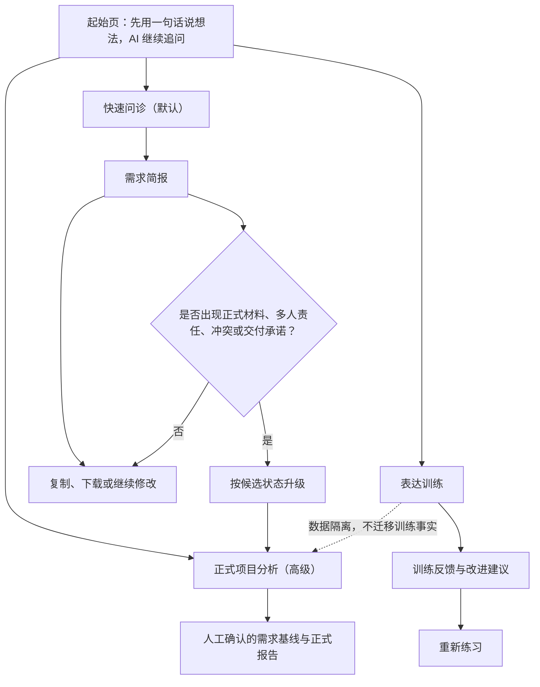
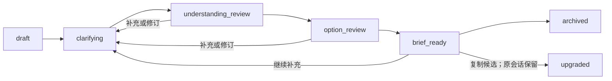
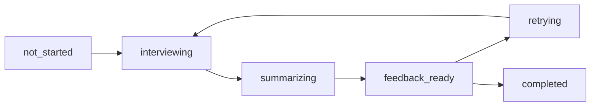
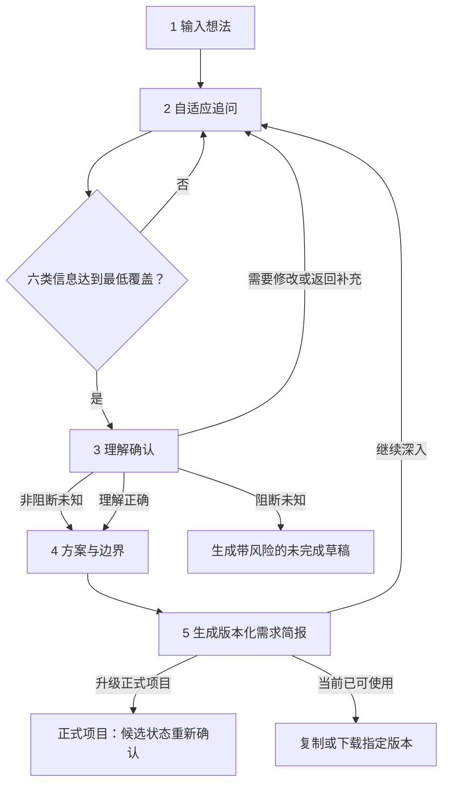
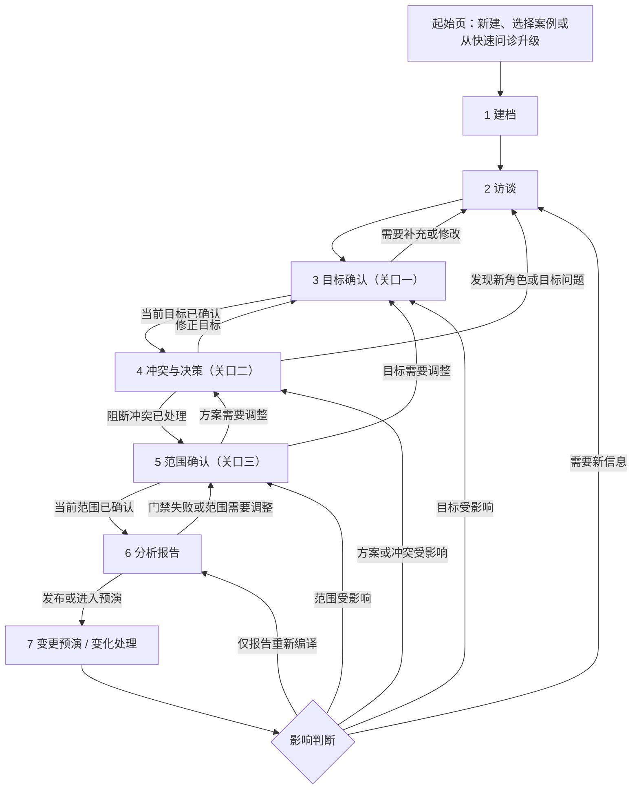
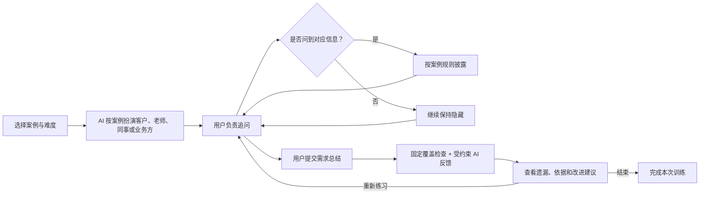
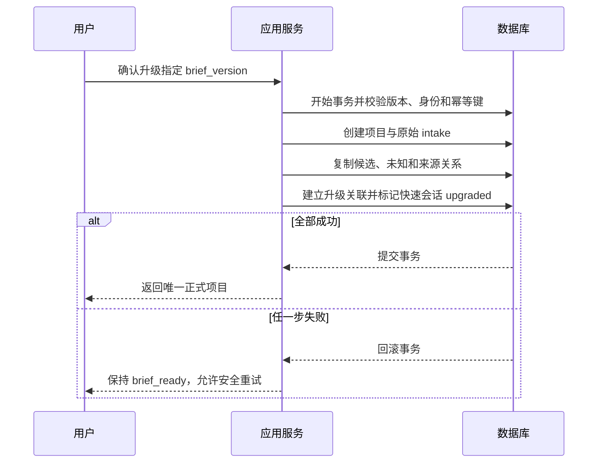

# 需求问诊室 · 产品需求文档（PRD）

> 文档状态：产品需求基线（Product Requirements Baseline v2.3，已冻结供下游设计；当前实现对齐补充 v2.4）  
> 产品正式名称：需求问诊室  
> 创意标题 / 宣传语：需求分析 Is All You Need——需求问诊室  
> 更新日期：2026-07-05  
> 说明：本版本冻结“模糊想法澄清”的产品范围、身份、协议、数据生命周期和非功能目标；ADD、API 与数据库设计已按本版本同步；FSD v2.2 已完成本轮一致性复核，发现的上游接口阻断记录于 FSD §0.3  
> 当前实现对齐：快速问诊、正式项目首期和表达训练首期均已接入真实 HTTP 后端、持久化 Job、单 Orchestrator + Skill Runtime 与服务端模型调用；案例演示和 MockTransport 仍保留为演示/回归手段。表达训练真实链路、训练回合恢复和浏览器验收标准见 [08-expression-training-development-plan.md](./08-expression-training-development-plan.md)。该补充不改变 v2.3 的产品范围和业务规则。  
> 关联文档：[文档索引](./00-index.md)、[架构设计文档 ADD](./02-architecture.md)、[API 设计](./03-api-design.md)、[OpenAPI](./03-api-openapi.yaml)、[数据库设计](./04-database-design.md)、[前端设计规格 FSD](./05-fsd.md)

---

## 1. 产品定位

### 1.1 一句话定义

**需求问诊室是一款面向“只有初步想法、尚不需要先组织完整需求”的用户的 AI 需求问诊、需求分析与表达训练产品。它由 AI 负责通过自适应追问引导用户补齐关键信息，帮助用户把模糊想法转化为清晰、可沟通、可执行、可验证的需求；对正式项目，可进一步升级为具有证据追踪、人工确认、版本管理和变化分析能力的专业需求工程流程。**

### 1.2 要解决的核心问题

很多用户并不是没有想法，而是不知道如何把想法表达成完整需求：

- 不清楚真正想解决的问题和期望结果；
- 容易把某个具体功能或技术方案误当成最终需求；
- 不知道需要补充哪些用户、场景、边界、约束和验收条件；
- 非技术用户难以判断不同方案的实现难度、资源影响和效果边界；
- 与客户、老师、同事、开发者或 AI 工具沟通时，需要反复补充和返工；
- 即使得到一份需求文档，也未必学会下一次如何在提问引导下澄清需求，并逐渐掌握追问、表达和检查的方法。

### 1.3 产品目标

产品首先帮助用户完成一次真实任务，其次帮助用户形成可迁移的表达能力：

1. **澄清**：从一句模糊想法中识别目标、用户、场景、边界、未知和约束；
2. **比较**：把用户提出的方案与替代方案分开，说明收益、难度、风险和适用条件；
3. **表达**：形成可直接用于沟通、协作或交给 AI 工具的需求说明；
4. **验证**：为关键要求补充可观察的完成条件；
5. **学习**：解释为什么需要追问、遗漏在哪里以及怎样改进表达；
6. **升级**：当项目具有真实材料、多人责任、冲突或正式交付需求时，进入可审计的正式项目流程。

### 1.4 产品不是

需求问诊室不是：

- 把一句话自动扩写成长文档的生成器；
- 自动替用户决定目标、预算、范围或技术方案的“全能顾问”；
- 用专业术语和复杂流程证明自己专业的项目管理系统；
- 仅面向软件开发项目的 PRD 生成器；
- 用 AI 评分替代老师、客户、产品负责人或领域专家判断的考试系统；
- 在没有材料、访谈和责任人确认时生成“已批准需求基线”的工具。

### 1.5 产品价值层级

| 层级 | 用户获得的价值 | 对应模式 |
|---|---|---|
| 任务完成 | 把当前想法整理成可使用的需求说明 | 快速问诊 |
| 项目可靠性 | 让正式项目中的证据、冲突、范围和变化可追踪 | 正式项目 |
| 能力成长 | 学会如何追问、总结和检查需求 | 表达训练 |

### 1.6 过程承诺

产品可以承诺的过程约束：

- 保留用户最初表达，不用 AI 改写结果覆盖原文；
- 用户没有明确说出的内容必须标记为推断、假设、候选或待核实；
- AI 提出的方案不得伪装成用户已经提出或批准的需求；
- 技术难度、成本和周期只能在给定假设下提供分级判断或估算区间，不能伪装成报价；
- 普通问诊输出与正式项目基线明确区分；
- 正式项目中的事实、人工确认、版本和报告可以追踪；
- 不适合当前能力或缺少专业校验时，明确说明边界和所需专家角色。

### 1.7 不可承诺事项

本产品不能保证：

- AI 能发现所有隐含需求；
- 用户回答很少时仍能形成完整、正确的需求；
- 软件之外所有领域都能得到专业级结论；
- 自动给出的技术、成本或周期判断等同于专业报价和可行性论证；
- 两个模型得出相同结论就代表事实正确；
- 训练评分能够完全代表用户的真实需求分析能力；
- 无任何责任人确认仍能形成可靠业务承诺。

### 1.8 证据和假设边界

- `[R]` 研究支持的原则：需求工程应围绕真实目标、利益相关者、获取、分析、协商、验证和持续变化，并按项目情境裁剪；
- `[E]` 当前工程选择：三种产品模式、模块化单体、SQLite、服务端模型调用和编译式正式报告；
- `[H]` 待验证产品假设：普通用户是否理解“想法—目标—需求—方案”的区别，快速问诊是否减少返工，七阶段和三关口是否适合正式项目，训练模式是否促进能力迁移；
- `[D]` Demo 叙事：预置案例中的人物、材料、目标、指标、确认记录和 AI 输出均为虚构内容。

---

## 2. 目标用户与使用场景

### 2.1 主要用户

| 用户群体 | 典型任务 | 主要困难 | 首选模式 |
|---|---|---|---|
| 学生与职场新人 | 课程项目、比赛、方案、汇报 | 不知道需求说明应包含什么 | 快速问诊 / 表达训练 |
| 非技术创业者和业务人员 | 向开发者或 AI 编程工具说明产品想法 | 不懂实现边界、成本差异和替代方案 | 快速问诊 |
| 自由职业者、设计师和开发者 | 与客户确认目标和范围 | 客户只给出功能想法，反复返工 | 快速问诊 / 正式项目 |
| 产品、项目和业务负责人 | 组织多人需求、冲突和范围决策 | 事实、方案、责任和版本混在一起 | 正式项目 |
| 需要练习沟通的人 | 练习客户访谈、追问和总结 | 不知道自己漏问了什么 | 表达训练 |

上述是产品用户，不等同于某个被分析项目中的 Stakeholder。项目中的访客、员工、合规负责人等属于项目利益相关者；使用需求问诊室操作项目的人属于产品用户。

### 2.2 核心使用场景

- 用户准备开发网页、应用、自动化工具或 AI 产品；
- 用户准备课程项目、研究计划、活动方案或服务流程；
- 用户需要把想法交给 AI 编程、设计或写作工具；
- 自由职业者或乙方需要与客户确认交付边界；
- 团队需要对冲突、范围、责任和验收形成正式记录；
- 学生或新人希望练习如何访谈客户并总结需求。

### 2.3 核心用户任务（Jobs to be Done）

1. 当我只有一个模糊想法时，用问题一步步引导我补齐关键信息，而不是要求我先想清楚该说什么；
2. 当我要向别人说明需求时，帮助我形成对方能够理解和执行的表达；
3. 当我不懂技术时，帮助我理解方案差异、实现难点和更简单的替代路径；
4. 当多人看法不同或范围可能失控时，帮助我们记录取舍和责任；
5. 当我想提升沟通能力时，让我练习提问、总结并得到有依据的反馈。

### 2.4 非优先用户

当前版本不优先满足：

- 需要公开多租户、计费和组织级配置的大型 SaaS 客户；
- 需要安全关键、医疗诊断、法律意见或金融决策自动审批的场景；
- 期望系统直接替代资深业务分析师、领域专家或项目责任人的组织；
- 只需要传统需求仓库、工单管理或完整 ALM 集成的团队。

---

## 3. 产品模式与关系

### 3.1 三种模式

| 模式 | 定位 | 默认用户 | 输出是否正式 | 当前优先级 |
|---|---|---|---|---|
| 快速问诊 | 把模糊想法转化为清晰需求 | 普通用户和轻量项目 | 否；属于工作草稿 | P0，默认主路径 |
| 正式项目 | 对真实项目执行可追踪需求工程 | 项目负责人和团队 | 是；通过关口后形成基线/报告 | P1，高级模式 |
| 表达训练 | 通过角色扮演练习追问与总结 | 学生、新人和转岗人员 | 否；形成训练反馈 | P2，后续试验 |

### 3.2 模式关系



快速问诊升级为正式项目时：

- 保留原始输入、问答和简报版本；
- 快速问诊中的内容全部以候选状态进入正式项目；
- 不得因为用户在快速问诊中点击“完成”而自动获得正式事实、已确认需求或基线状态；
- 正式项目按证据、责任和人工关口重新确认。

### 3.3 渐进式复杂度

- 默认界面不向普通用户暴露 Baseline、Driver、EpistemicType 等内部术语；
- 用户先看到自然语言问题、当前理解、待补充信息和下一步；
- 只有进入正式项目模式后，才展示证据、版本、关口、追踪和发布状态；
- 用户可以查看“为什么问这个”，但解释不应打断主流程；
- 高级能力通过展开、升级或模式切换出现，不在起始页一次堆满。

### 3.4 跨模式业务流程不变量（v2.3 冻结）

以下规则是后续 ADD、API、数据库和 FSD 必须共同遵守的业务边界：

1. **快速问诊按信息覆盖推进，不按固定问题数或对话轮数完成。**
2. **快速问诊中的“理解正确”只表示当前摘要符合用户表达，不等于正式审批、已接受需求或需求基线。**
3. **未知项必须区分阻断与非阻断。**非阻断未知可以带标记继续；阻断未知不能被隐藏或绕过正式关口。
4. **概述和详细报告必须从同一份版本化需求简报投影。**任何视图不得单独生成新的事实、需求或决策。
5. **快速问诊升级为正式项目时，内容全部按来源迁移为候选。**快速模式的完成、确认和推荐状态不得升级为正式确认状态。
6. **自定义会话、快速示例、正式示例、训练案例和真实项目使用独立数据边界。**不得通过替换标题或原始输入复用其他案例结论。

上述规则只能通过修改 PRD 和重大产品决策记录调整，不能由页面文案、模型提示词或实现默认值放宽。

### 3.5 三种模式的业务状态

状态用于约束业务转换，不要求全部直接显示给用户。

#### 快速问诊状态



- `draft`：只有原始输入，尚未形成分析结论；
- `clarifying`：正在追问和补充覆盖槽位；
- `understanding_review`：等待用户检查当前理解；
- `option_review`：比较方案、难度和边界；
- `brief_ready`：已形成可使用或带缺口的需求简报；
- `upgraded`：已创建正式项目，但快速问诊记录仍可查看；
- `archived`：用户结束使用，不等同于删除。

#### 正式项目状态

正式项目继续使用 `Draft → Ingesting → Eliciting → Reviewing → Baselined → Reporting → Released → Changing → Reviewing`。末尾的 `Reviewing` 是同一评审状态在真实变化确认后的再次进入，表示需要重新处理受影响目标、冲突或范围，不是第二个独立状态。项目状态与七个用户章节不是一一对应关系；重开阶段不创建第二个项目。

#### 表达训练状态



训练状态不得映射为正式项目状态，也不得产生正式 Fact、Requirement、Decision 或 ReviewAction。

---

## 4. 起始页与入口规则

### 4.1 起始页任务

起始页承担一个任务：**让用户先用一句话说出当前想法，随后由 AI 通过追问引导澄清。**

页面提供三类入口：

1. **澄清一个想法**：默认主按钮，进入快速问诊；
2. **分析一个正式项目**：进入项目建档或加载正式项目示例；
3. **练习需求沟通**：进入训练模式；当前可体验案例练习和真实角色扮演/教练反馈链路，但训练结果只代表本轮练习反馈，不得伪装为正式项目结论或能力认证。

起始页不是快速问诊或正式项目中的业务阶段。

### 4.2 最小输入

| 字段 | 必填 | 说明 |
|---|---:|---|
| 原始想法、需求或当前问题 | 是 | 保留用户最初表达，1–10,000 字 |
| 希望用于什么 | 否 | 例如课程项目、与客户沟通、交给 AI、正式立项 |
| 希望最终作出什么决定 | 否 | 不清楚时允许进入问诊，由后续追问澄清 |
| 项目名称 | 否 | 可由用户填写或由系统提出候选名称 |

快速问诊不要求用户先理解“建档人”或内部数据处理术语。真实 HTTP 链路调用云端 AI 前，用户必须勾选“已阅读并同意服务与数据处理协议”；同意后，产品默认可以按协议调用云端 AI，不再要求用户选择数据处理方式。协议正文暂不在本 PRD 中定义，后续必须版本化并经过单独评审。

### 4.3 演示入口规则

当前项目同时保留真实链路和演示链路。演示链路用于案例体验、可用性测试和回归，不代表真实 AI 执行。页面业务组件必须继续使用与真实 HTTP 相同的 API Client 方法面；演示环境可以注入浏览器内 `MockTransport`，由它从独立的版本化 Fixture Store 返回契约兼容的模拟响应：

- “快速问诊示例”载入独立的预生成案例，例如“我想做一个 AI 海报生成网站”；
- “正式项目示例”载入 Aster 园区案例；
- Mock 路由的请求、响应、状态码和错误结构必须符合 API/OpenAPI；可模拟 `202 + job_id`、轮询、身份、协议、删除和失败状态，但这些状态只用于演示；
- 页面业务组件不得直接读取 Fixture JSON；Fixture 只能由 Mock 层按 API operation 读取，避免切换真实 HTTP 传输时重写页面流程；
- 演示链路的业务请求不得访问开发或生产 HTTP 域名；未注册 Mock 路由必须明确失败，不得静默回退到真实网络；
- 演示链路下，任意自定义输入只能保存为本地草稿，并明确提示“当前演示不会分析自定义内容”；
- 自定义输入不得进入 Aster 或其他案例的预生成结论；
- 自定义草稿使用独立的本地 Draft Store，不发送给 Mock 分析路由；
- 示例内容需要在自然位置标注来源，例如“demo 内容为预设案例结果，不代表在线模型实时分析”。

### 4.4 真实入口规则

- 用户可以从自定义输入创建快速问诊会话；
- 用户可以从正式项目入口创建正式项目，或从快速简报升级正式项目；快速问诊结论只作为候选来源；
- 只有需要多人、证据和正式承诺时才建议升级正式项目；
- 系统可以提出模式建议，但最终模式由用户选择；
- 模式建议属于候选，不得阻止用户保存草稿；
- 重复提交不产生重复会话或项目，失败保留全部输入。

---

## 5. 快速问诊模式（默认主路径）

### 5.1 流程总览

快速问诊采用五个轻量步骤；步骤可以前后返回，不是严格瀑布：



内部仍可使用统一 Driver、Requirement、Unknown 和 Decision 语义，但用户界面使用自然语言。

### 5.2 步骤一：输入想法

- 原样保存用户输入；
- 允许一句话开始，不要求用户先填写完整表单；
- 系统只能提出候选标题、可能用途和首批问题；
- 不得直接生成完整用户、场景、约束、预算、技术方案或验收结论。

### 5.3 步骤二：自适应追问

问题根据已有答案动态选择，优先澄清高价值缺口：

1. 希望改变什么现状或取得什么结果；
2. 谁会使用、受到影响或作出决定；
3. 在什么场景下使用；
4. 什么必须做到，什么可以以后再做；
5. 有哪些时间、资源、工具、规则或能力限制；
6. 怎样判断结果可接受；
7. 用户提出的是目标、功能、方案，还是尚不确定的想法。

规则：

- 一次优先询问一个主题，避免问卷式堆叠；
- 允许“不知道”，并解释该未知会影响什么；
- 对回答进行摘要时区分“用户明确说过”和“系统推测”；
- 软件项目可以追问技术与接口，非软件项目使用领域中性问题；
- 问题数量由信息缺口决定，不以固定轮数作为真实完成条件。

#### 信息覆盖槽位

快速问诊至少维护以下覆盖槽位：

| 槽位 | 已覆盖的最低条件 | 允许未知 |
|---|---|---:|
| 期望结果 | 能说明希望改变什么或获得什么结果 | 是 |
| 用户/相关对象 | 至少识别主要使用者、受影响者或决策者之一 | 是 |
| 核心场景 | 至少有一个具体使用或发生场景 | 是 |
| 范围边界 | 能区分至少一项本次要做与暂不做/以后做 | 是 |
| 完成判断 | 至少有一个可观察结果、示例或验收信号 | 是 |
| 约束与风险 | 已主动检查时间、资源、规则、依赖和高风险领域 | 是 |

进度显示覆盖情况，例如“目标已清楚、场景待补充”，不得显示虚假的完成百分比，也不得把“回答了第几题”当成需求完整度。

#### 问题选择顺序

下一问题优先考虑：

1. 是否会改变最终目标或方案选择；
2. 是否可能形成安全、合规、成本或交付阻断；
3. 是否能明显减少后续返工；
4. 用户回答负担是否与信息价值相称。

当六个槽位达到最低覆盖后，系统应优先允许用户生成简报，再提供“继续深入”，不为追求文档长度无限追问。

### 5.4 步骤三：理解确认

系统用易懂语言展示：

```text
我们目前理解：
你希望为……用户，在……场景下，解决……问题，达到……结果。
目前仍不确定的是……
```

用户可以：

- **理解正确**：进入方案与边界；
- **需要修改**：直接编辑或补充回答，形成新版本；
- **暂不确定**：保留未知并继续，但输出中必须显著标记其影响；
- **返回补充**：回到相关问题，不要求重新开始。

快速问诊的确认表示“当前摘要符合用户表达”，不等同于正式项目审批。

#### 未知项分级

| 类型 | 定义 | 快速问诊行为 | 正式项目行为 |
|---|---|---|---|
| 非阻断未知 | 不影响当前目标理解或下一步低风险验证 | 可以继续，简报显示影响和建议确认人 | 可以进入草稿分析，不得写成已确认事实 |
| 阻断未知 | 可能改变目标、合法性、安全性、核心方案、预算级别或交付承诺 | 只能输出带醒目风险的未完成草稿，不给出确定性推荐 | 阻止受影响关口、基线批准或报告发布 |

未知项至少记录：问题、影响、阻断性、建议责任人或确认对象、建议获得的信息，以及复查条件。AI 可以建议阻断性，确定性规则和正式项目责任人可以升级风险；AI 不得自行把阻断未知降级。

### 5.5 步骤四：方案、难度与边界

系统将目标与实现方式分开，至少展示：

- 用户最初提出的方案；
- 一个更简单或非建设替代方案；
- 必要时的其他候选方案；
- 每个方案的预期收益、主要工作、依赖、风险、可逆性和适用条件；
- 当前信息下无法判断的内容。

对于技术项目，可以提供：

- 实现难度等级及判断依据；
- 关键技术依赖；
- 影响工作量的主要变量；
- 可先验证的最小版本；
- 需要开发者、架构师、安全或合规人员确认的问题。

禁止：

- 在缺少范围和环境信息时给出精确工期或价格；
- 把 AI 推荐写成唯一正确方案；
- 因为用户不懂技术而隐藏关键取舍；
- 对医疗、法律、金融、安全关键等领域伪装完成专业审查。

#### 用户选择非推荐方案

- 用户可以选择与 AI 建议不同的方案；
- 快速问诊将其记录为“当前偏好”，同时保留其他方案、主要风险和取舍；
- AI 不得反复阻止用户，也不得把“当前偏好”写成已经获得正式批准的 Decision；
- 需求简报必须区分“AI 建议”“用户当前偏好”和“尚待正式决定”；
- 升级正式项目后，当前偏好只作为 Candidate Decision Option/偏好来源，必须重新经过冲突与决策关口。

### 5.6 步骤五：需求简报

快速问诊输出称为**需求简报**，不是“需求基线”或“正式项目报告”。完整内容契约：

1. 用户原始想法；
2. 当前希望取得的结果；
3. 目标用户、相关角色和使用场景；
4. 本次范围与明确不做；
5. 核心需求和优先顺序；
6. 可观察的完成条件；
7. 候选方案、取舍和推荐的验证路径；
8. 约束、风险、假设和待确认问题；
9. 建议下一步；
10. 可复制的沟通版本和完整详细报告正文。

输出视图：

- **概述**：适合向老师、同事、客户快速说明，使用普通用户能直接理解的措辞，不使用 FR、SC、基线、验收口径等专业标签；
- **详细报告**：适合交给开发者、设计师、执行人员或作为导出文档，可以使用专业需求分析文档结构和编号。

详细报告必须比概述更完整，并借鉴 Spec Kit 中适合需求分析报告的结构：用户场景、功能需求编号、关键对象、成功标准、边界情况、假设依赖和澄清记录。当前快速问诊详细报告至少覆盖报告摘要、原始诉求与分析目标、已确认理解、用户/场景/价值、用户场景与独立验证、范围定义、关键对象、功能需求清单、成功标准与验收口径、边界情况与异常处理、假设与依赖、方案比较与推荐、风险与待确认事项、追问依据、版本说明和后续动作。详细报告可以保持“快速问诊非正式基线”的说明，但不能只输出摘要或简略清单。


缺失内容必须显示为“待确认 / 尚未提供 / 不适用”，不得自动补成事实。

#### 单一简报源与版本

- 每次用户确认理解、保存重要修改或接受方案取舍时，生成新的 `brief_version`；
- 原始输入不可覆盖；问答、当前结构化简报和投影视图记录同一版本关联；
- 概述和详细报告只读取指定的 `brief_version`；
- 各投影视图可以改变篇幅、顺序和用词，不能改变事实、范围、未知、方案选择和完成条件；
- 导出物显示简报版本、生成时间、仍存在的阻断/非阻断未知及“非正式项目基线”说明；
- 用户继续补充后形成新版本，旧导出物不被静默改写。

### 5.7 快速问诊完成条件

满足以下条件即可生成简报，不要求达到正式项目标准：

- 用户确认当前目标摘要，或明确选择保留未确认目标；
- 至少知道预期结果、主要使用者/对象和一个使用场景；
- 核心范围与待确认项可以区分；
- 至少一项完成条件可以观察；
- 重大未知和高风险没有被隐藏。

若条件不足，仍允许导出“未完成草稿”，但必须说明缺口及其影响。

快速问诊不存在一个不可逆的“完成”终点。`brief_ready` 表示当前版本可以使用；用户可以继续补充并产生新版本。

### 5.8 暂停、恢复与主题变化

- 用户可以在任一步保存并退出，恢复时回到最后稳定版本和当前待回答问题；
- 用户长时间未响应不自动替其回答，也不自动把会话标为完成；
- 当新输入与当前目标明显不一致时，系统询问“这是当前想法的补充，还是一个新的需求？”；
- 选择“补充”时记录其影响并重新评估覆盖槽位；
- 选择“新的需求”时创建独立问诊会话，不复制当前简报结论；
- 无法判断时保留为待分类输入，不自动合并；
- 用户删除会话时按保留策略处理问答、简报、导出物和模型审计，不留下可继续显示的孤立输出。

---

## 6. 正式项目模式（高级路径）

### 6.1 适用条件

出现以下任一情况时，系统可以建议使用正式项目：

- 存在真实合同、采购、立项或交付承诺；
- 有多名利益相关者和明显冲突；
- 需要上传和引用正式材料；
- 需要确认责任人、范围版本和验收方式；
- 需求会持续变化并需要影响分析；
- 报告将用于管理、研发、测试、合规或外部沟通。

### 6.2 七阶段流程



起始页不是第八阶段。七阶段是 `[H]` 信息架构，不是所有需求工作的固定方法；完成表示当前版本满足退出条件，不表示阶段永久关闭。

### 6.3 阶段业务语义

#### 阶段 1：建档

- 保存原始输入、建档身份、协议同意记录和已附材料；
- 领域画像、风险和角色只能先显示为候选；
- 一句话不能生成正式利益相关者、As-Is、约束、目标、指标、失败条件和范围。

#### 阶段 2：访谈

- 收集材料和多角色信息；
- 整理事实、推断、假设、未知、角色、目标和约束；
- 正式事实必须定位到来源；
- 新角色、目标缺口或冲突可以重开相关任务。

#### 阶段 3：目标确认

- 区分用户提出的方案、真正希望改变的结果和衡量方式；
- 使用反事实问题检验方案是否必要；
- 有权限的责任人确认、修改或暂不确认目标；
- 修改和暂不确认创建新版本/待办并使受影响的后续确认失效。

#### 阶段 4：冲突与决策

- 处理证据解释、假设、冲突和方案；
- 比较收益、成本、风险、依赖和可逆性；
- 记录选择、理由、责任人和复查条件；
- 阻断冲突未处理时不能形成已确认范围。

#### 阶段 5：范围确认

- 形成 Now / Next / Later / Watch / 不做；
- Now / Next / Later / Watch 表示时间和投资意图，“不做”是范围处置；
- 确认本期责任、验收方式和版本化需求基线。

#### 阶段 6：分析报告

- 从指定的已批准基线快照编译报告；
- 按受众组合管理、业务、交付、合规和领域视图；
- 执行发布门禁，形成不可原地覆盖的快照。

#### 阶段 7：变更预演 / 变化处理

- 预演尚未发生的变化及其传播路径；
- 展示受影响证据、目标、需求、决策、验收和报告；
- 真实变化确认后返回必要阶段，重新确认受影响关口并产生新版本；
- 变更预演只是 Demo 叙事终点，不是生产业务终态。

### 6.4 三个人工关口

| 关口 | 确认内容 | 必须记录 | 不确定/修改后的行为 |
|---|---|---|---|
| 目标确认 | 真正结果、指标、失败条件 | 操作人、时间、版本、理由 | 保持待核实或创建新版本，重开必要访谈 |
| 证据、冲突与决策确认 | 证据解释、假设、冲突、方案和理由 | 单项处理、操作人、时间、理由 | 阻断项不能进入已确认范围 |
| 范围确认 | Now/Next/Later/Watch/不做、责任和验收 | 操作人、时间、范围版本 | 报告发布资格失效，重新确认 |

AI 不能执行这三个关口。三关口数量和位置属于 `[H]`，但正式承诺必须存在明确责任人。

正式关口应用统一的未知处理规则：

- 与当前关口无关的非阻断未知可以继续保留，但报告必须可见；
- 影响目标真实性的未知阻止目标确认；
- 影响合法性、安全性或核心方案可行性的未知阻止冲突与决策确认；
- 影响 Now 责任、验收、预算级别或交付承诺的未知阻止范围确认；
- 任一阻断未知均阻止报告进入 `released`；
- 责任人只能通过补充证据、明确接受风险或修改范围处理阻断项，不能只点击“继续”。

#### 风险接受权限

- 普通业务冲突可以由具备 Reviewer 或 Owner 能力的责任人处理；
- 涉及安全、隐私、合规、法律、财务重大影响或人身风险时，必须同时记录对应责任角色的确认；
- 小团队中同一人兼任 Owner、Reviewer 和专业责任角色时允许继续，但必须显著记录“单人兼任确认”，不得伪装为独立复核；
- 专业责任角色缺失时，只能修改范围、补充专家或保留阻断，不能由普通 Owner 代替接受高风险；
- 接受风险必须记录风险内容、影响、理由、责任人、复查条件和有效版本；AI 不能执行风险接受。

### 6.5 正式报告内容契约

正式报告保留 15 个完整性内容块：

1. 决策摘要；
2. 当前问题、As-Is 和分析边界；
3. Stakeholder—Driver；
4. 成功指标和失败条件；
5. Fact、Inference、Assumption、Unknown、Conflict；
6. 目标与能力地图；
7. Now 承诺、规则和例外；
8. Next/Later/Watch 与触发条件；
9. 候选方案和非建设替代方案；
10. 决策和取舍；
11. 验收/评价证据和持续观测；
12. 风险、依赖和责任；
13. 变化、兼容、迁移、回滚和退役；
14. 端到端追踪；
15. 证据、版本和审计附录。

15 项是内容检查清单，不要求固定 15 个物理章节。编译器按受众和领域组合为 8–15 章；Aster Demo 当前投影为 12 章。

### 6.6 正式报告编译规则

- 先执行确定性查询，再允许模型组织语言；
- 模型不得创建基线之外的新事实；
- 数字、引用、状态、责任人和时间从固定版本读取；
- 阻断冲突未解决时只能生成草稿；
- 报告记录数据、模板、领域画像、领域配置和编译器版本；
- 使用模型组织语言时记录 Prompt 和模型版本；
- 未启用适用专业校验时明确显示缺口；
- 更新生成差异和新快照，不覆盖旧文件。

---

## 7. 表达训练模式（后续试验）

### 7.1 目标

训练用户主动发现信息缺口、提出有效问题并形成准确摘要，而不是训练用户背诵固定术语。

### 7.2 训练流程



当前演示链路至少提供一个轻量可交互训练原型：用户完成一组有限追问、提交一次总结并看到基于固定案例答案的覆盖反馈。该原型用于验证训练价值，不等同于真实训练评分引擎。

### 7.3 训练案例

案例至少区分：

- 软件/网页项目；
- 学习或课程项目；
- 设计与内容任务；
- 服务流程或活动方案；
- 信息不足、目标冲突或方案先行的困难案例。

训练数据必须与真实项目隔离。AI 扮演角色时只使用案例允许披露的信息，用户问到关键问题后才逐步提供。

### 7.4 评价维度

| 维度 | 检查内容 |
|---|---|
| 目标澄清 | 是否追问真正要改变的结果 |
| 用户与场景 | 是否识别使用者、影响者和具体情境 |
| 方案分离 | 是否区分目标、功能和实现方式 |
| 范围与优先级 | 是否识别必须、可选、以后和不做 |
| 约束与风险 | 是否询问时间、资源、规则、依赖和例外 |
| 验证 | 是否提出可观察的完成条件 |
| 总结质量 | 是否忠实表达已知内容并标明未知 |
| 沟通质量 | 问题是否清楚、必要、不过度引导 |

评分由确定性覆盖检查和受约束的 AI 反馈共同形成。必须展示评分依据、遗漏项和改进示例；分数只用于本次训练反馈，不宣称是权威能力认证。

### 7.5 训练输出

- 本次提问路径；
- 已覆盖和遗漏的信息；
- 过早假设、诱导性问题或术语问题；
- 用户总结与案例事实的差异；
- 2–5 条最重要的改进建议；
- 可再次练习的同类变体。

---

## 8. 跨模式可靠性规则

### 8.1 认识状态与需求来源

描述当前世界的内容使用：

```text
Fact | Inference | Assumption | Proposal | Unknown | Conflict | Decision
```

规范性 Requirement 使用形成来源：

```text
explicitly_stated | derived | assumed | proposed
```

Requirement 本身不能标记为 Fact。快速问诊可以用“用户明确说过 / 系统推测 / 待确认”显示这些区别；正式模式保存完整内部类型。

### 8.2 跨领域规则

- 统一核心覆盖目标、用户/角色、场景、需求、方案、决策、验收、未知和变化；
- 默认使用 `general` 问诊，不强迫用户先选择行业；
- `software-delivery` 只在软件交付场景增加技术问题、质量属性、接口、测试和部署视图；
- 非软件主题使用领域中性表达，并明确尚未完成的专业校验；
- AI 不得为新主题临时发明数据库结构或正式专业包；
- 高风险专业问题必须提示需要的专家角色。

#### 高风险领域分支

当内容涉及医疗诊断或治疗、法律意见、金融决策、安全关键系统、人身安全、未成年人敏感数据或其他受监管高风险事项时：

- 产品仍可帮助用户澄清目标、角色、场景、已有信息和待确认问题；
- 输出只能使用“候选、一般性信息、待专业确认”的表达；
- 不生成确定性的专业结论、合规结论、诊断、法律意见、投资建议或安全批准；
- 必须形成阻断未知并说明所需专业责任角色；
- 缺少对应专业责任角色时，正式项目不能通过受影响关口或发布相关专业结论；
- 用户可以缩小范围至低风险内容后继续，原高风险内容及处理理由保留在记录中。

### 8.3 AI 与人工责任

- AI 可以提问、归纳、比较、指出缺口和生成候选；
- 普通问诊用户负责确认“是否符合自己的表达”；
- 正式项目责任人负责批准目标、决策、范围和发布；
- 训练模式由用户自行学习，AI 反馈不影响真实项目状态；
- 模型共识不能替代证据或责任人决策。

### 8.4 数据和模式隔离

- 每个 Demo 案例拥有独立数据包和 ID 空间；
- 自定义草稿不复用任何示例结论；
- 训练案例不进入真实项目证据；
- 封存评估集、回归测试集和专家标注答案不得进入运行时 Prompt、Few-shot 示例、用户可见提示、专业包生成输入或模型调优输入；只能用于离线评估和发布准入；
- 快速问诊升级正式项目时只复制候选及其来源，不复制确认状态；
- 已发布正式报告和历史基线不可原地覆盖。

#### 快速问诊升级映射

| 快速问诊内容 | 正式项目中的初始形态 |
|---|---|
| 原始输入 | 不可变 `project_intake` 原始记录 |
| 用户明确回答 | 带问答来源的候选陈述；满足证据条件前不自动成为正式 Fact |
| AI 当前理解 | `Inference` 或 `Proposal` |
| 阻断/非阻断未知 | `Unknown`，保留影响和阻断性 |
| 需求条目 | Candidate Requirement，保留 provenance |
| 方案比较 | Candidate Decision Options |
| 用户在快速模式选择的方案 | 偏好记录或候选选择，不是正式 Decision |
| 完成条件 | Candidate Acceptance Criteria |
| 需求简报 | 项目初始工作材料，不是已发布报告 |
| “理解正确”记录 | 来源审计，不是正式 ReviewAction |

升级操作必须显示将复制什么、不会复制什么，并由用户确认。升级成功后，快速问诊与正式项目通过只读来源关系关联，二者后续版本分别演化。

#### 升级原子性与失败处理

升级是一个不可部分成功的业务命令：



- 全部步骤成功后才向用户显示正式项目；
- 任一步失败都不得留下用户可见的半成品项目、重复候选或错误 `upgraded` 状态；
- 失败后快速会话保持 `brief_ready`，用户输入和简报不丢失，可以安全重试；
- 使用同一幂等键重试返回首次成功结果，不创建第二个项目；
- 若创建后发现业务错误，只能归档/纠正正式项目并保留审计，不能删除升级来源关系后伪装未发生。

---

## 9. 演示案例与内容要求

### 9.1 快速问诊示例（新增主案例）

建议原始输入：

> “我想做一个 AI 海报生成网站。”

该案例用于展示：

- 从一句功能想法开始；
- 追问目标用户、场景、生成内容、输入方式和使用目的；
- 区分“做一个网站”与“帮助某类用户快速完成某类海报”；
- 比较模板生成、AI 图像生成和人工辅助等方案；
- 说明影响难度的模型、版权、审核、成本和响应时间；
- 输出概述和详细报告需求简报。

所有答案均为 `[D]` 预生成虚构内容，页面不得暗示来自用户当前输入。

### 9.2 正式项目示例（保留 Aster）

案例名称：**Aster 科技园区访客预约与通行**。

原始请求：

> “我们需要一个支持人脸识别的访客预约系统，最好下个月上线。”

该案例继续用于展示七阶段、三个人工关口、证据与冲突、范围、12 章正式报告和变更预演。案例中的组织、人物、指标、政策、确认和 AI 输出均为虚构预生成内容。

### 9.3 表达训练示例

表达训练当前至少应提供一个信息逐步披露案例，并明确训练数据与快速问诊、正式项目隔离。当前真实链路已接入后端角色扮演、隐藏事实披露控制、总结反馈 Runtime 和训练回合恢复；页面仍必须清楚区分训练反馈与真实项目需求，不得把训练结果写入快速问诊或正式项目。

### 9.4 Demo 边界

示例内容需要在自然位置提示：

> demo 内容为预设案例结果，不代表在线模型实时结论。

Demo 只验证产品叙事、理解和交互，不验证模型真实质量。自定义输入、快速示例、Aster 正式示例和训练案例必须严格隔离。

---

## 10. 身份、权限与协议同意

### 10.1 演示链路：纯前端或 MockTransport Demo

- 只使用虚构数据和浏览器本地草稿；
- 不需要真实登录；
- 不调用外部模型；
- 不要求用户填写正式项目成员身份；
- 自定义草稿默认只保存在当前浏览器。

演示链路可以通过 MockTransport 演示游客、登录、协议同意、撤回、删除任务等界面状态，但它们只是本地模拟状态：不签发真实 Cookie 或访问令牌，不形成具有法律意义的协议记录，不执行服务器物理删除。界面必须清楚标注内容来源，不得暗示已经发生真实身份认证、协议留痕或云端数据处理。协议同意控件也可以不展示。

### 10.2 当前真实快速问诊链路

- 游客在同一浏览器中同意协议后，可以完成真实快速问诊、恢复当前会话、复制和下载当前简报，不要求先注册；
- 游客由不可直接识别个人的会话凭证标识；清除凭证、换浏览器或换设备后，系统不承诺恢复未绑定账户的游客数据；
- 跨设备历史、长期保存、升级正式项目和团队协作必须登录；正式项目不能归属于游客身份；
- 游客登录后可以认领当前会话。认领必须原子、幂等且保留原会话 ID、版本和协议记录，不复制为第二份会话；账户已有其他会话时分别保留，不静默合并内容；
- 认领失败时继续保留游客会话及其凭证，允许安全重试，不得产生半绑定状态；
- 首次使用真实 AI 前必须勾选“已阅读并同意服务与数据处理协议”；未同意时不能发起真实 AI 问诊；
- 用户同意后，系统默认可以按已同意协议调用云端 AI，不再显示额外的数据处理方式选项；
- 同意记录至少保存协议 ID、版本、适用范围、用户/会话标识、同意时间、撤回时间和同意渠道；游客登录后历史记录与账户关联但不改写原操作身份；
- 协议正文属于单独法律任务，本 PRD 不定义具体文本，但协议版本和状态属于产品必需数据；
- 用户可以删除未升级为正式项目的问诊会话；
- 不把普通问诊显示为经过项目 Reviewer 批准。

用户未同意协议时仍可查看公开说明和预置 Demo，但不能提交自定义内容调用真实 AI。

#### 协议更新和撤回

- 协议版本必须标记为“重大更新”或“非重大更新”，并记录生效时间；
- 重大更新生效后，用户下一次发起新的真实 AI 调用前必须重新同意；页面保留其输入并说明变化，不得把继续浏览视为同意；
- 非重大更新可以通知用户，既有有效同意继续有效；判断标准和审批责任由法律任务定义，产品不能自行把重大更新降级；
- 重新同意形成新记录，不覆盖旧版本记录，也不追溯改变旧处理行为的合法性状态；
- 撤回后立即阻止新的模型调用，并取消尚未发送给模型供应商的排队任务；
- 已经发送的进行中调用可能无法撤回。系统必须明确提示，允许其结束并按既定保留策略处理结果，但不得自动发起后续模型调用；
- 撤回同意不等于删除数据。用户需要单独发起删除；删除按照 10.5 执行。

### 10.3 当前正式项目首期与后续生产约束

- 生产形态下，所有真实项目 API 需要可靠身份认证；当前本地开发和演示环境可通过受控 guest formal owner bridge 体验正式项目，但不放宽生产权限语义；
- 最少支持 Owner、Editor、Reviewer、Viewer、Exporter 能力分离；
- 只有 Reviewer 或 Owner 可以执行正式关口；
- 所有确认记录真实身份、时间、对象和版本；
- 所有真实 AI 处理必须能关联有效协议版本和同意记录；
- 未实现租户隔离前不得宣称支持公开多租户。

### 10.4 多人任务、超时和权限变化

- 正式项目中的待确认项必须有责任人，责任人可以接受、拒绝或请求重新分配；
- 责任人被禁用、移出项目或失去 Reviewer 能力后，尚未完成的任务必须重新分配，既有历史确认仍保留当时身份；
- 到期未处理的任务进入 `overdue` 提示状态，不自动视为同意，也不由 AI 代办；
- 阻断任务逾期继续阻止相关关口；非阻断任务逾期可以继续草稿分析但必须可见；
- 真实 HTTP 试点首期只要求站内待办和状态提示，不承诺邮件、短信或企业 IM 通知；
- 并发版本冲突时，用户可以查看最新版本、对比自己的修改、放弃修改或基于最新版本重新应用；正式确认不能自动合并。

### 10.5 数据保留、删除和法律保留

以下为产品默认值；适用法律、合同、组织政策或有效法律保留要求更严格时，以更严格者为准。覆盖默认值时必须向有权限的用户展示实际期限和原因。

| 数据类别 | 默认保留期 | 删除规则 |
|---|---|---|
| 演示链路本地草稿和事件 | 留在当前浏览器，直到用户清除或浏览器回收 | 提供“清除本地数据”；不上传服务端 |
| 未登录快速问诊/训练会话 | 最后活动后 30 天 | 到期自动删除；登录认领后转为账户数据期限 |
| 已登录快速问诊/训练会话 | 最后活动后 180 天 | 到期前提示；用户可提前删除 |
| 正式项目、材料、确认、版本和已发布报告 | 保留至 Owner 发起删除或组织政策到期 | 有效法律保留或合同义务存在时暂停删除并显示状态 |
| 含业务正文的模型调试记录 | 默认不记录；受控排障临时开启时最多 7 天 | 到期自动清除；不得作为产品埋点长期保存 |
| 产品分析原始事件 | 90 天 | 到期删除；不得含 12.5 禁止字段 |
| 去标识化汇总指标 | 13 个月 | 到期删除或重新聚合；不得反推出个人或业务正文 |
| 协议同意/撤回记录 | 最后一次处理或撤回后 2 年 | 法律要求不同则按适用期限，且保留依据可审计 |
| 服务端临时导出文件 | 24 小时 | 到期自动删除；正式报告源文件随正式项目保留 |

删除请求提交后，数据必须立即对普通用户和业务流程不可用，主存储在 30 天内物理清除。备份采用最多 35 天滚动周期并自然过期；灾难恢复若短暂恢复已删除数据，必须重放删除记录后才能恢复对外服务。用户已经复制或下载到自己设备的文件无法由平台远程收回，界面必须提前说明。

删除不得破坏仍受保留约束的正式项目来源链。快速会话已升级为正式项目时，系统只删除允许删除的快速侧副本；正式项目中依法或依合同必须保留的来源快照继续保留并显示原因。删除任务必须记录范围、申请人、时间、执行状态和失败原因，不记录被删除正文。

---

## 11. 通用体验与异常规则

### 11.1 用户面语言

- 默认使用“你的想法、当前理解、还需要确认、候选方案、完成条件”等自然语言；
- 正式模式使用“证据、目标确认、冲突与决策、范围确认、分析报告、变化处理”；
- `Baseline`、`Driver`、`EpistemicType`、`Provenance` 等保留为内部概念或高级解释；
- 技术术语出现时提供简短解释，不把“不懂术语”当成用户错误。

### 11.2 空状态和错误

- 空状态说明缺少什么、为什么需要、可以怎样补充；
- 不使用其他案例数据填充当前项目；
- 校验失败保留用户输入并聚焦具体字段；
- AI 失败显示失败阶段、可重试性和最后成功结果；
- 无权限、未同意协议/同意已撤回、版本冲突、门禁失败和模型失败使用不同提示；
- 刷新恢复后保持模式、步骤、问答版本和输出一致；
- 损坏或不兼容的本地草稿明确提示，不静默跳入示例。

### 11.3 无障碍与响应式

- 手机端能够完成快速问诊主路径；
- 页面切换后焦点进入当前标题；
- 所有操作可通过键盘完成；
- 状态不只依赖颜色；
- 图关系提供文本替代；
- 减少动效设置关闭非必要动画；
- 触控目标、错误提示和对话框焦点管理符合 FSD 的发布标准。

### 11.4 恢复和退出

- 用户可以随时保存草稿、返回上一步或退出；
- 返回起始页前说明会清除什么；
- 快速问诊允许继续补充已生成简报；
- 正式模式的撤回和重开保留历史；
- 训练模式允许重新开始，但保留用户主动选择保存的历史反馈。

### 11.5 分享与导出边界

- 演示链路和真实 HTTP 试点首期都不提供无需认证的公开分享链接；
- 快速问诊只提供复制内容和下载指定 `brief_version`；
- 正式报告只能由具备导出能力的项目成员生成或下载；
- 导出物必须显示模式、版本、生成时间和正式性说明；
- 新版本不会远程改写已经下载的旧文件；
- 需要撤销旧输出时，通过新版本、状态说明和项目内提示处理，不假设能够收回用户已经下载或复制的内容；
- 公开链接、外部访客访问、链接到期和水印属于后续能力，进入开发前必须单独定义权限和泄露风险。

### 11.6 非功能体验目标

以下目标是真实 HTTP 试点及其后续实现的最低产品验收线，不是对外 SLA。测量必须区分演示、测试、试点和生产环境，并报告样本量与 P50/P75/P95，不能只报告平均值。

#### 参考负载

- 快速问诊：初始输入不超过 10,000 字、累计不超过 50 轮问答；
- 正式项目：不超过 50 个材料、2,000 个证据片段、1,000 个结构化分析对象和 15 个报告内容块；
- 超出参考负载时可以进入异步处理，但必须在提交前提示限制，不得静默截断。

| 质量维度 | 冻结目标 | 用户可见行为 |
|---|---|---|
| 页面体验 | 核心页面 LCP P75 ≤ 2.5 秒、INP P75 ≤ 200 毫秒、CLS P75 ≤ 0.1 | 超过目标仍可完成操作，不以骨架屏永久替代真实内容 |
| 非 AI 操作 | 保存、切换步骤和查询确认 P95 ≤ 1 秒 | 超过 1 秒显示进行中状态，禁止重复提交 |
| AI 任务反馈 | 提交后 1 秒内返回任务确认，3 秒内显示进度或等待说明 | 可以取消、离开并恢复；不得用伪进度冒充模型已完成 |
| 首份快速简报 | 参考负载下 P50 ≤ 10 秒、P95 ≤ 30 秒 | 超时保留输入和最后稳定结果，允许重试或稍后恢复 |
| 正式报告编译 | 参考负载下 P95 ≤ 60 秒 | 异步展示阶段、失败原因和上次成功版本 |
| 会话恢复 | 应用加载完成后 P95 ≤ 2 秒恢复最后稳定状态 | 恢复失败时不载入其他案例或旧用户数据 |
| 可用性 | 试点月度可用性目标 ≥ 99.5%，排除提前公告的维护窗口 | 故障期间展示状态和恢复动作，不伪装成功 |
| 浏览器与设备 | 支持 Chrome、Edge、Firefox、Safari 最近两个主版本，以及当前主流 iOS Safari、Android Chrome；最小 390 CSS px | 不支持环境明确提示；手机可完成快速问诊主路径 |
| 无障碍 | 以 WCAG 2.2 AA 为发布目标 | 键盘、焦点、语义、对比度、错误提示和文本替代通过自动与人工检查 |
| 预算或限额 | 每个环境可配置模型调用上限 | 达到上限时保留工作并明确说明，不能静默降级为模拟结果或产生未授权费用 |

页面性能按真实用户监测的 P75 判断；AI 和报告时延按服务端已完成任务的 P50/P95 判断，同时单独报告超时和失败率。合成测试用于回归，不能替代真实用户数据。真实 HTTP 试点样本不足时以受控参考负载测试准入，并在样本充分后切换为真实用户指标。

---

## 12. 产品成功指标与验证

### 12.1 快速问诊核心指标

| 指标 | 首轮目标 | 说明 |
|---|---:|---|
| 关键流程完成率 | ≥80% | 用户能从示例输入完成需求简报 |
| 输出可直接使用率 | ≥70% | 用户认为经过少量修改即可用于沟通或交给 AI |
| 目标/方案区分正确率 | ≥80% | 用户能解释想取得的结果与具体功能的区别 |
| 重大未知识别率 | ≥80% | 用户能定位简报中的关键待确认项 |
| 模拟内容误认为实时分析 | 0 | 演示链路硬门槛 |

首轮目标属于 `[H]` 产品准入线，不代表行业基准。样本不足时报告原始数据，不做普遍化结论。

### 12.2 正式项目指标

- 事实引用定位正确率；
- 关口修改、驳回和待核实比例；
- 阻断冲突漏检；
- 报告支持预定决策/下游任务的完成率；
- 需求遗漏、范围返工和变化影响定位情况；
- 历史报告和基线复现成功率。

### 12.3 训练模式指标

- 同类案例再次练习时关键问题覆盖是否提高；
- 用户总结中的无依据假设是否减少；
- 用户是否理解评分原因；
- 用户是否能将改进迁移到不同案例；
- 评分与人工量表的一致性。

### 12.4 形成性评估协议

- 每种进入试验的模式首轮至少招募 8 名目标或相邻用户；
- 记录用户背景、任务完成、用时、误操作、口头理解、输出修改量和实际用途；
- 预先固定任务和评分量表，不因结果不好临时删除失败样本；
- 快速问诊优先测试非专业用户，正式模式优先测试有项目责任经验的用户；
- 训练模式同时需要学习者和具备需求分析经验的人工复核者；
- 未达到目标时先调整定位、问题顺序和交互，不以增加文档长度替代可用性改进。

### 12.5 产品埋点契约

埋点用于验证产品流程和假设，不作为业务事实、需求证据、员工绩效或训练认证依据。业务审计日志与产品分析事件必须分开存储和授权。

#### 公共事件字段

| 字段 | 必填 | 说明 |
|---|---:|---|
| `event_id` | 是 | 客户端或服务端生成的唯一事件 ID，用于去重 |
| `event_name` | 是 | 来自本节注册表的稳定名称 |
| `event_schema_version` | 是 | 事件字段契约版本 |
| `occurred_at` | 是 | UTC 事件发生时间 |
| `received_at` | 真实 HTTP 链路起 | 服务端接收时间，用于识别离线补发和时钟异常 |
| `environment` | 是 | `demo`、`development`、`test`、`pilot`、`production` |
| `app_version` | 是 | 产生事件的应用版本 |
| `mode` | 是 | `quick`、`formal`、`training`；起始页事件可为 `entry` |
| `source_kind` | 是 | `custom`、`sample`、`training_fixture`、`internal_test` |
| `session_key` | 是 | 不含用户内容的会话稳定 ID |
| `actor_key` | 否 | 匿名或假名化用户键；不得使用邮箱、电话或姓名 |
| `stage` | 否 | 当前业务步骤或正式项目章节 |
| `experiment_id` | 否 | 产品实验标识；没有实验时不传 |

任何事件都不得包含：原始需求文本、用户回答正文、材料片段、文件名、Prompt、模型完整输入输出、姓名、邮箱、电话、证件信息或协议正文。需要分析内容质量时使用受控评估集和人工量表，不把真实业务正文复制进产品埋点。

#### 最小事件注册表

| 优先级 | 事件 | 触发时机 | 主要附加字段 |
|---:|---|---|---|
| P0 | `mode_selected` | 用户选择快速、正式或训练入口 | `selected_mode` |
| P0 | `agreement_action` | 同意、重新同意或撤回协议 | `action` 取 `accepted`、`reaccepted` 或 `withdrawn`；`agreement_version` |
| P0 | `identity_action` | 游客开始、登录或认领会话完成 | `action` 取 `guest_started`、`login_succeeded`、`session_claimed` 或 `session_claim_failed` |
| P0 | `quick_session_started` | 自定义或示例快速问诊开始 | `source_kind` |
| P0 | `coverage_slot_changed` | 六类覆盖槽位状态变化 | `slot_id`、`from_status`、`to_status`、`blocking_unknown_count` |
| P0 | `question_interaction` | 问题展示、回答或跳过 | `question_template_id`、`action` 取 `shown`/`answered`/`skipped`、`elapsed_ms` |
| P0 | `understanding_reviewed` | 用户确认、修改、暂不确定或返回补充 | `action`、`brief_version` |
| P0 | `topic_change_resolved` | 用户选择补充或新建需求 | `action` 取 `append`/`new_session`/`defer` |
| P0 | `option_preference_recorded` | 用户记录当前方案偏好 | `option_id`、`matches_ai_recommendation` |
| P0 | `brief_generated` | 需求简报版本生成 | `brief_version`、`is_incomplete`、`blocking_unknown_count` |
| P0 | `brief_viewed` | 查看某个简报视图 | `brief_version`、`view_type` |
| P0 | `brief_exported` | 复制或下载简报 | `brief_version`、`view_type`、`export_type` |
| P0 | `brief_usefulness_feedback` | 用户回答简报是否可直接使用 | `rating`、`expected_use`；不收集自由文本 |
| P0 | `quick_session_abandoned` | 满足放弃判定且尚无简报/升级 | `last_stage`、`coverage_count`、`inactive_days` |
| P0 | `upgrade_result` | 升级开始、成功或失败 | `result` 取 `started`/`succeeded`/`failed`、`error_category` |
| P0 | `error_presented` | 页面向用户展示业务或系统错误 | `error_category`、`retryable`、`stage` |
| P0 | `recovery_action` | 用户重试、刷新、放弃或回到稳定版本 | `action`、`result` |
| P1 | `formal_stage_entered` | 进入正式项目章节 | `formal_stage`、`project_status` |
| P1 | `formal_gate_action` | 正式关口接受、修改、驳回、待核实或撤回 | `gate`、`action`、`blocking_count` |
| P1 | `report_result` | 报告编译或发布完成/失败 | `action` 取 `compile` 或 `release`；`result`、`error_category` |
| P1 | `change_action` | 创建预演、登记变化、确认或撤回 | `action`、`affected_stage_count` |
| P2 | `training_attempt_started` | 开始训练回合 | `case_id`、`case_version`、`difficulty` |
| P2 | `training_question_asked` | 用户提交训练问题 | `question_index`、`disclosure_rule_hit`；不记录问题正文 |
| P2 | `training_summary_submitted` | 用户提交总结 | `attempt_id`、`summary_version`；不记录正文 |
| P2 | `training_feedback_viewed` | 用户查看训练反馈 | `coverage_score_band`、`missing_dimension_count` |
| P2 | `training_attempt_completed` | 完成或重练 | `result` 取 `completed` 或 `retrying`；`attempt_number` |

演示链路使用内存或 `localStorage` 本地事件接收器，并允许测试人员导出不含业务正文的事件 JSON；不接入第三方分析平台。真实 HTTP 链路建设服务端事件入口和最小 SQL 报表。

### 12.6 指标计算与数据质量

#### 核心指标公式

| 指标 | 计算规则 | 不能用什么替代 |
|---|---|---|
| 快速问诊完成率 | 7 日观察窗内产生 `brief_generated` 的自定义快速会话数 ÷ `quick_session_started` 自定义会话数 | 不能用页面访问或问题回答数代替 |
| 首份简报耗时 | 同一会话首次 `brief_generated.occurred_at - quick_session_started.occurred_at` 的中位数和 P90 | 不只报告平均值 |
| 放弃率 | 7 日内没有简报、没有成功升级且满足不活跃判定的会话数 ÷ 已开始会话数 | 不把正常暂停立即算放弃 |
| 输出可直接使用率 | 明确提交 `brief_usefulness_feedback.rating=usable_with_minor_or_no_edits` 的人数 ÷ 提交该反馈的人数 | `brief_exported` 不能代表真正使用 |
| 主题分流率 | `topic_change_resolved` 各 action 数 ÷ 主题变化提示次数 | 不读取用户正文推断 |
| 升级成功率 | `upgrade_result=succeeded` 的幂等升级命令数 ÷ `upgrade_result=started` 的幂等升级命令数 | 重试事件必须按升级命令去重 |
| 正式关口返工率 | `formal_gate_action` 中 `action` 为 `modify`、`reject`、`uncertain` 的事件数 ÷ 全部有效关口动作数 | 撤回和重复提交需去重 |
| 报告发布成功率 | `report_result(action=release,result=succeeded)` ÷ 全部有效发布尝试 | 编译成功不能代表发布成功 |
| 训练改善量 | 同一用户、同类案例后续 Attempt 的固定量表得分减首次得分，并报告样本量和分布 | 不用单次 AI 总分宣称能力提升 |

“目标/方案区分正确率”“重大未知识别率”“模拟内容误认为实时分析”和“报告是否支持真实决策”不能仅靠埋点判断，必须使用固定任务、人工量表或用户反馈。产品埋点只能提供行为证据，不能替代有效性评估。

#### 数据质量规则

- `event_id` 全局去重；同一业务命令重试不得重复计入成功指标；
- 事件必须携带 Schema 版本，未知版本进入隔离而不是静默解析；
- Demo、内部测试、样例、自定义真实会话分层统计，默认产品指标排除 `internal_test`；
- 客户端时间与服务端接收时间差异超阈值时标记时钟异常；
- 指标必须同时展示分子、分母、观察窗、样本量和过滤条件；
- 事件 Schema 变更需要兼容期和回归测试，不允许直接复用旧事件名改变语义；
- 埋点失败不得阻断用户主流程，离线补发要去重并设置上限；
- 原始事件和汇总指标分别执行 10.5 的保留期；撤回同意不新增 AI 事件，删除请求完成后分析系统不得继续保留可关联到该用户的明细事件。

---

## 13. 业务操作契约

操作矩阵定义业务前置条件和结果；页面布局由 FSD 维护，HTTP 状态和字段由 API/OpenAPI 维护，事务与约束由数据库设计维护。

演示链路中已启用的操作可以通过同一 API Client 调用 MockTransport；矩阵中的“保存”“创建”“删除”“同意”等成功结果在演示链路仅表示模拟状态或本地状态变化，不代表服务端持久化、法律留痕或真实 AI 执行。真实 HTTP 链路才按 API、数据库和外部服务契约产生真实副作用。

### 13.1 起始页与通用操作

| 操作 | 前置条件 | 成功结果 | 失败或分支 |
|---|---|---|---|
| 选择快速问诊 | 入口可用 | 进入快速输入；记录模式 | 演示链路自定义输入只能保存草稿，示例走独立 Fixture |
| 选择正式项目 | 正式模式可用 | 新建/恢复项目或选择正式示例 | 无身份时引导登录；不可用时说明当前能力边界，不伪装成功 |
| 选择表达训练 | 至少有可用训练案例 | 创建独立 Training Attempt | 未开放时只显示介绍，不创建假 Attempt |
| 同意协议 | 协议版本有效且用户主动勾选 | 保存版本和时间；允许真实 AI 调用 | 未勾选不能提交真实 AI；保存页面输入 |
| 重大协议重新同意 | 已同意版本被重大更新替代 | 保存新版本记录后允许新的 AI 调用 | 未同意时保留输入并阻断调用；非重大更新只通知 |
| 撤回同意 | 存在有效同意记录 | 记录撤回时间；阻止新调用并取消未发送任务 | 已发送任务可能结束；不静默删除既有数据或自动发起后续调用 |
| 登录并认领游客会话 | 游客凭证和目标账户有效 | 原子绑定当前会话及历史协议记录，不改变会话 ID | 失败保留游客访问和全部版本；不复制或静默合并内容 |
| 保存/恢复草稿 | 草稿 Schema 兼容 | 恢复模式、步骤、输入和最后稳定版本 | 损坏或不兼容时提示并提供清除，不载入示例填充 |
| 返回起始页 | 存在未保存内容或进度 | 说明影响后返回 | 用户取消则留在当前页面 |
| 删除会话 | 用户具有删除能力且会话未受正式保留约束 | 进入可审计删除任务或完成本地删除 | 已升级正式项目时只删除允许删除的快速数据，不破坏来源关系 |

### 13.2 快速问诊操作

| 操作 | 前置条件 | 成功结果 | 失败或分支 |
|---|---|---|---|
| 创建问诊会话 | 原始想法非空；真实 AI 已同意协议 | 保存不可变原文，状态 `draft → clarifying` | 重复提交返回同一会话；模型失败不丢原文 |
| 回答问题 | 当前问题仍有效 | 保存回答来源，更新覆盖槽位并选择下一问题 | 与旧目标冲突时进入理解修订，不静默覆盖 |
| 跳过/不知道 | 问题允许未知 | 创建 Unknown，判断阻断性并继续或限制输出 | 阻断未知不能生成确定性推荐 |
| 确认理解正确 | 当前理解版本可见 | 保存快速理解记录，进入方案比较 | 该操作不产生正式 ReviewAction |
| 修改当前理解 | 用户提交有效修改 | 生成新理解版本，重算覆盖和受影响方案 | 空修改提示具体字段，不覆盖旧版本 |
| 暂不确定 | 用户说明不知道或暂不确认 | 创建 Unknown；按阻断性进入方案或未完成草稿 | 不能用同一提示同时表示“可继续”和“已阻断” |
| 处理主题变化 | 系统检测到明显目标变化 | 用户选择补充、新会话或暂缓 | 无选择时不合并输入 |
| 记录方案偏好 | 至少一个候选方案可见 | 保存“用户当前偏好”，保留 AI 建议和取舍 | 不生成正式 Decision；高风险偏好显示阻断 |
| 生成需求简报 | 最低覆盖满足，或用户接受未完成草稿 | 生成唯一 `brief_version` 及概述、详细报告两种投影 | 阻断未知存在时只能生成醒目标记的未完成草稿 |
| 继续深入 | 存在 `brief_ready` 版本 | 返回 clarifying，旧简报保留，新内容形成新版本 | 不原地改写已导出版本 |
| 复制/下载简报 | 指定版本存在且视图可编译 | 导出指定视图并标记版本、时间和正式性 | 编译失败保留上次成功版本，可重试 |
| 升级正式项目 | 指定 `brief_version` 有效；身份和权限满足 | 原子创建唯一正式项目并复制候选，快速会话 `upgraded` | 任一步失败完全回滚，保持 `brief_ready`，同幂等键可重试 |
| 归档快速会话 | 不存在运行中的升级命令 | 状态 `archived`，仍可按权限查看 | 归档不等于删除；恢复策略由实现阶段定义 |

### 13.3 正式项目操作

| 操作 | 前置条件 | 成功结果 | 失败或分支 |
|---|---|---|---|
| 创建正式项目 | 已认证、已同意有效协议、原始输入存在 | 同事务创建项目、Owner 成员和初始 Intake | 重复提交不创建第二个项目 |
| 添加材料 | 用户有编辑能力；文件满足限制 | 保存 Source、哈希和解析任务 | 单个材料失败不删除其他成功材料；恶意/不可解析材料隔离 |
| 完成访谈任务 | 关键角色/问题状态已记录 | 更新覆盖、未知和候选；可以进入目标确认 | 固定轮数不能作为真实完成条件 |
| 处理目标关口 | 当前目标版本、权限和阻断信息可见 | 接受、修改或待核实并记录身份、理由和版本 | 目标阻断未知存在时拒绝确认；修改使下游确认失效 |
| 处理证据/冲突关口 | 单项对象版本有效；用户有评审能力 | 单项接受、修改、驳回、待核实或接受风险 | 高风险缺专业责任角色时不能接受风险 |
| 处理范围关口 | 当前方案、需求、责任和验收可见 | 冻结范围版本并批准基线候选 | Now 缺责任/验收/依据或存在阻断时只能保存草稿 |
| 编译正式报告 | 指定已批准基线；用户有编译能力 | 创建固定输入的报告草稿和门禁结果 | 门禁失败保留草稿，不显示为发布报告 |
| 发布正式报告 | 文件就绪、全部发布门禁通过、用户有发布能力 | 冻结发布快照、身份、时间和哈希 | 渲染/文件/门禁失败进入可恢复失败，不标记 released |
| 创建变更预演 | 指定历史/当前基线存在 | 生成隔离的影响候选，不修改正式数据 | 失败不产生 Change 或关口失效 |
| 登记并确认真实变化 | 变化已发生且责任人确认 | 创建 Change、影响项并重开必要阶段 | 影响不明确时保持 Reviewing，不固定返回某一阶段 |
| 撤回/纠正变化 | 尚未进入新基线或通过纠正 Change 处理 | 保留撤回/纠正身份、理由和时间 | 已被基线引用的变化不能物理删除 |
| 重新分配待办 | 当前责任人失效、拒绝或管理员调整 | 新责任人获得待办；历史分配保留 | 逾期和无人负责不能自动通过关口 |
| 解决版本冲突 | 服务端返回最新版本和差异上下文 | 用户放弃、刷新或基于最新版本重新应用 | 不自动合并正式确认或覆盖他人修改 |

### 13.4 表达训练操作

| 操作 | 前置条件 | 成功结果 | 失败或分支 |
|---|---|---|---|
| 开始训练 | 案例版本可用 | 创建独立 Attempt，进入 `interviewing` | 案例损坏时阻断，不拼接其他案例答案 |
| 提交追问 | Attempt 进行中 | 命中规则时披露允许信息，否则角色按案例回应 | 不记录问题正文到产品埋点 |
| 提交总结 | 用户主动结束追问；总结非空 | 保存总结版本，进入 `summarizing` | 允许返回继续追问，不伪造缺失答案 |
| 生成训练反馈 | 案例答案、量表和总结版本固定 | 生成覆盖结果、遗漏和改进建议 | AI 反馈失败时仍展示确定性覆盖结果 |
| 重新练习 | 已有 `feedback_ready` Attempt | 新建后续 Attempt，保留旧反馈 | 不覆盖旧分数或写入真实项目 |
| 完成训练 | 反馈可见 | Attempt 进入 `completed` | 完成不代表权威能力认证 |

### 13.5 通用失败和恢复

| 场景 | 必须保持 | 用户可执行动作 | 禁止行为 |
|---|---|---|---|
| 字段校验失败 | 当前输入 | 修正并重新提交 | 清空表单或统一显示“失败” |
| AI 超时、限流或不可用 | 原始输入、最后稳定结果和任务 ID | 重试、稍后继续或返回草稿 | 将旧结果标成本次成功 |
| 重复提交 | 首次命令结果或进行中状态 | 查看结果或安全重试 | 创建重复项目、简报、评审或报告 |
| 版本冲突 | 用户修改草稿和服务端最新版本引用 | 对比、放弃、刷新、重新应用 | 静默覆盖或自动合并确认 |
| 无权限/权限被撤回 | 可安全展示的只读上下文 | 返回、请求权限或重新分配 | 只隐藏按钮而允许服务端写入 |
| 高风险专业责任缺失 | 已知内容、阻断原因和所需角色 | 缩小范围、补充责任人或保留阻断 | 输出确定性专业结论 |
| 报告发布失败 | 基线、草稿、门禁、临时文件/哈希状态 | 修复后重试或返回上次发布版本 | 文件缺失仍显示 released |
| 埋点发送失败 | 用户业务操作和本地待发送事件上限内缓存 | 后台补发或丢弃过期分析事件 | 阻断问诊、重复业务命令或记录业务正文 |

---

## 14. 分阶段范围与实施顺序

### 14.1 里程碑 0：双案例纯前端叙事验证

必须交付：

- 三模式起始页及清晰的可体验范围说明；
- “AI 海报生成网站”快速问诊预生成案例；
- Aster 正式项目案例；
- 自定义输入只保存草稿，不进入任何示例结论；
- 快速需求简报和 Aster 完整 PDF；
- demo 内容来源提示；
- 一个轻量可交互表达训练回合，用于验证“用户追问—提交总结—查看遗漏反馈”的核心价值；
- 桌面、平板和手机主路径；
- 刷新恢复和 Fixture 完整性校验；
- 与真实 HTTP 链路共用方法面的类型化 API Client、浏览器内 MockTransport、按 operationId 注册的 Mock 路由和隔离的 Fixture Store；
- Mock 请求/响应契约测试，以及“演示链路无外部业务网络请求”测试；
- P0 事件契约和本地事件接收器；测试人员可导出不含业务正文的事件 JSON。

演示链路的训练反馈基于固定案例和规则，不宣称为通用能力评分。

### 14.2 里程碑 1：真实快速问诊试点

- 自定义输入创建真实问诊会话；
- 自适应追问、理解确认和待确认项；
- 目标/方案分离和轻量可行性说明；
- 概述和详细报告需求简报；
- 游客真实问诊、登录、会话认领和跨设备账户历史；
- 协议首次同意、重大更新重新同意、撤回、服务端模型调用、失败恢复和成本记录；
- 快速/训练数据到期清理、用户删除、临时导出清理和保留状态展示；
- 11.6 中快速问诊相关性能、兼容性、可用性和无障碍测量；
- 用户反馈与形成性评估。
- P0 服务端事件入口、去重和最小 SQL 指标报表。

本里程碑优先验证原始产品价值，不要求同时完成全部正式项目能力。

### 14.3 里程碑 2：正式项目封闭试点

- 身份、项目成员和权限；
- 材料上传、解析、EvidenceSpan 和协议同意关联；
- 访谈、三关口、冲突决策、范围版本和基线；
- 编译式正式报告、PDF 发布和历史快照；
- 变化预演、真实变化确认和必要阶段重开；
- 正式项目删除、法律保留状态、备份过期和删除重放验证；
- 参考负载下正式报告性能和恢复验证；
- `general` 与静态 `software-delivery` 配置。

### 14.4 里程碑 3：表达训练试验

- 版本化训练案例；
- 角色信息逐步披露；
- 用户提问和总结；
- 透明量表、确定性覆盖检查和 AI 反馈；
- 重练与学习效果评估。

### 14.5 里程碑 4：生产硬化

- 契约、权限和关键失败路径端到端测试；
- 备份恢复、发布恢复和数据删除；
- 安全威胁模型、会话保护、上传安全和依赖治理；
- 性能、成本、可观测性和模型回归；
- 达到真实触发条件后再考虑 PostgreSQL、工作流引擎、对象存储、向量检索或多 Agent。

---

## 15. 可追踪产品需求

| ID | 产品需求 | 优先级 | 验收条件 |
|---|---|---:|---|
| PRD-POS-001 | 产品以“模糊想法澄清”为默认价值 | P0 | 默认入口、首页说明和首个示例均优先服务快速问诊 |
| PRD-MODE-001 | 快速问诊、正式项目和表达训练清晰分离 | P0 | 三种模式的目的、正式性、数据和完成状态不会混淆 |
| PRD-ENTRY-001 | 保留独立起始页 | P0 | 起始页不计入业务阶段；自定义输入、快速示例和正式示例行为明确 |
| PRD-INTAKE-001 | 原始输入不可被系统候选替代 | P0 | 可查看原文；修订形成新版本；一句话不生成正式项目事实 |
| PRD-QUICK-001 | 支持五步快速问诊 | P0 | 用户可完成输入、追问、理解确认、方案边界和需求简报 |
| PRD-QUICK-002 | 快速问诊输出可用于真实沟通 | P0 | 所有视图来自同一 `brief_version`，并保留未知、边界和形成依据 |
| PRD-COVERAGE-001 | 快速问诊按信息覆盖而非固定轮数推进 | P0 | 六类覆盖槽位可见；达到最低覆盖后可生成简报并选择继续深入 |
| PRD-UNKNOWN-001 | 未知项区分阻断与非阻断 | P0 | 阻断项不能产生确定性推荐或绕过正式关口；非阻断项携带影响继续 |
| PRD-TOPIC-001 | 主题变化不会污染当前简报 | P0 | 用户选择补充或新建会话；系统不静默合并不相关输入 |
| PRD-STATE-001 | 三种模式使用独立业务状态机 | P0 | 快速、正式和训练状态不能互相冒充，恢复和转换规则可测试 |
| PRD-UPGRADE-001 | 快速问诊可安全升级正式项目 | P1 | 只迁移原始内容和候选，不迁移正式确认/基线状态 |
| PRD-UPGRADE-002 | 升级命令原子且可安全重试 | P1 | 失败不产生半成品项目；重试不重复创建；快速会话保持可用 |
| PRD-CASE-001 | 每个 Demo 案例使用独立数据包 | P0 | 案例注册表可发现案例；跨案例无引用；哈希校验通过 |
| PRD-FLOW-001 | 正式项目七章节治理候选可理解且支持必要回退 | P1 | 可查看阶段、关口、阻断和下一步；新信息可重开必要阶段 |
| PRD-GATE-001 | 正式关口不可由 AI 代替 | P1 | 确认包含操作、身份、时间、理由和对象版本；越权被拒绝 |
| PRD-EPI-001 | 事实、推断、假设、未知与需求来源不混淆 | P0 | 无来源内容不成为事实；Requirement 使用 provenance |
| PRD-SCOPE-001 | 现状、时间承诺、范围处置和生命周期分开 | P1 | As-Is、Now/Next/Later/Watch、不做和状态分别存储 |
| PRD-REPORT-001 | 正式报告由固定版本结构化数据编译 | P1 | 15 内容块、引用、责任、版本、领域和审计信息齐全 |
| PRD-CHANGE-001 | 预演和真实变化分离 | P1 | 预演不改正式数据；真实变化产生影响判断和新版本 |
| PRD-TRAIN-001 | 表达训练使用透明量表和独立案例 | P2 | 评分有依据、有遗漏和改进说明，不写入真实项目 |
| PRD-IDENTITY-001 | 游客可完成快速问诊，正式项目和跨设备能力需要登录 | P0 | 游客可在同浏览器完成和导出快速简报；认领原子幂等；未登录不能创建正式项目 |
| PRD-AGREEMENT-001 | 真实 AI 使用以有效协议同意为前提 | P0 | 首次和重大更新需主动同意；撤回阻止新调用并取消未发送任务；历史记录不被覆盖 |
| PRD-RETENTION-001 | 各类业务、分析、协议和临时数据具有明确生命周期 | P0 | 10.5 各期限、删除任务、法律保留、备份过期和删除重放均可测试和审计 |
| PRD-NFR-001 | 关键流程达到冻结的性能、可用性、兼容性和无障碍目标 | P0 | 11.6 指标在参考负载和目标浏览器上有可复现的测量结果，超时不丢数据 |
| PRD-RISK-001 | 高风险专业结论需要对应责任角色 | P1 | 缺少专业责任角色时只能澄清和输出待确认内容，不能发布专业结论 |
| PRD-PREFERENCE-001 | 非推荐方案只记录为用户偏好 | P0 | AI 建议、用户偏好和正式决策在页面、数据和输出中分开 |
| PRD-SHARE-001 | 首期导出不产生公开访问面 | P0 | 仅复制/下载指定版本；正式报告按项目导出能力控制 |
| PRD-TASK-001 | 正式项目待办不会因超时或权限变化自动通过 | P1 | 逾期、拒绝、重分配和版本冲突有明确状态与处理动作 |
| PRD-AUTH-001 | 正式试点具备最小身份和能力授权 | P1 | 读、编辑、确认、导出可分离；服务端拒绝越权 |
| PRD-USABILITY-001 | 产品按用户能力渐进披露复杂度 | P0 | 普通用户无需理解内部术语即可完成快速问诊 |
| PRD-ACTION-001 | 所有关键操作具有前置、成功和失败契约 | P0 | 起始页、三种模式和通用失败矩阵均有对应实现与测试 |
| PRD-ANALYTICS-001 | 产品埋点可验证核心假设且不复制业务正文 | P0 | P0事件字段、去重、分层、指标公式和禁止字段通过契约测试 |

---

## 16. 发布准入

### 16.1 里程碑 0 准入

- 自定义输入不会出现任一示例的角色、材料、目标、需求或报告；
- 快速问诊和 Aster 主路径均可从头完成；
- 快速问诊进度由六类覆盖槽位驱动，不存在固定轮数阻断；
- 阻断未知、非阻断未知和主题变化至少各有一条可完成演示分支；
- 概述和详细报告引用同一简报版本且关键内容一致；
- 轻量训练原型可以完成一次提问、总结和遗漏反馈；
- 固定演示标识在页面和导出物中可见；
- Fixture、类型检查和生产构建通过；
- 所有已启用 Mock 操作的请求、响应、状态码和错误体通过 OpenAPI 契约测试；
- 页面业务组件不直接导入 Fixture，演示构建不存在指向开发或生产业务 API 的网络请求；
- 将 ApiClient 从 Mock Transport 切换为 Http Transport 时，页面组件和业务状态契约无需改写；
- 手机和键盘能够完成主流程；
- 现有 PDF 与当前 Fixture 数据指纹一致。
- P0 事件在本地接收器中按 Schema 产生且不含原始输入、回答、Prompt 或个人信息；
- 业务操作矩阵中的演示链路操作和失败分支均有手工或自动验收记录。

### 16.2 真实快速问诊准入

- 游客、登录、会话认领和跨设备边界通过端到端测试，认领失败无数据复制或丢失；
- 协议首次同意、重大更新重新同意、撤回、进行中任务提示、服务端密钥、重试、预算和失败恢复通过测试；
- AI 不能把无来源推测写成用户明确表达；
- 自定义输入和输出按 10.5 保留、到期清理或删除；备份恢复后可以重放删除；
- 至少完成一轮目标用户形成性评估；
- 输出明确说明技术、成本和专业判断边界。
- P0 服务端事件可去重、可按 `source_kind` 分层，埋点失败不阻断主流程；
- 快速问诊完成率、首份简报耗时和升级成功率可以从固定公式复算。
- 11.6 中适用于快速问诊的性能、兼容性、可用性和无障碍目标通过准入测量；

### 16.3 正式项目试点准入

- PRD-GATE-001、PRD-REPORT-001、PRD-AGREEMENT-001、PRD-RETENTION-001、PRD-NFR-001、PRD-RISK-001 和 PRD-AUTH-001 通过端到端测试；
- 数据库约束、迁移、报告发布恢复和备份恢复通过；
- 无来源事实、阻断冲突和无权限确认均被服务端拒绝；
- OpenAPI、数据库枚举和实现保持一致；
- 已发布报告可以从固定版本输入复现。
- 正式项目只能由登录用户创建，删除和法律保留不会破坏审计与来源链；
- 参考负载下报告编译满足 11.6 的时延与失败恢复目标。

---

## 17. 最终产品判断

需求问诊室的核心不是“生成一份需求文档”，而是提供一条从模糊表达走向清晰沟通的渐进路径：

```text
我有一个想法
→ 我知道自己真正想实现什么
→ 我知道还缺哪些信息
→ 我理解可选方案和边界
→ 我能把需求交给别人执行
→ 必要时升级为可审计的正式项目
→ 通过训练逐渐学会如何追问、表达和检查需求
```

快速问诊是默认产品，正式项目提供可靠性上限，表达训练提供长期成长价值。三者共享目标、需求、方案、未知、验收和变化的核心语义，但使用不同的交互复杂度、责任强度和输出正式性。

---

## 18. 冻结声明与变更规则

自 v2.3 起，下列产品决策冻结供 ADD、API、OpenAPI、数据库和 FSD 逐项落实：

| 决策 ID | 冻结内容 | 状态 |
|---|---|---|
| PD-001 | 快速问诊为默认主路径，正式项目和表达训练独立存在 | Frozen |
| PD-002 | 游客可完成同浏览器快速问诊；跨设备和正式项目必须登录；会话认领原子幂等 | Frozen |
| PD-003 | 真实 AI 默认按有效协议处理；首次及重大更新需主动同意；撤回阻止新调用 | Frozen |
| PD-004 | 10.5 的分层保留、删除、备份和法律保留规则 | Frozen |
| PD-005 | 11.6 的参考负载和非功能体验目标 | Frozen |

“冻结”表示下游设计和实现不得自行改变这些产品语义，不表示产品假设已被市场或学术研究证明。任何变更必须同时完成：提高 PRD 次版本或主版本、记录变更原因和影响、更新本索引状态、同步所有受影响下游文档、定义数据迁移/兼容策略，并通过相关回归与用户验证。仅修改页面文案、数据库字段或接口行为而不更新 PRD，视为契约缺陷。
