# 需求问诊室 · 架构设计文档（ADD）

> 文档状态：架构基线 v1.4（对齐 PRD v2.3 冻结基线；当前实现对齐补充 v1.5）
> 适用阶段：真实快速问诊与正式项目首期链路 + 演示链路保留 → 表达训练真实链路 → 可演化生产版本
> 核心约束：DeepSeek V4 Flash + Pro、无现成业务数据库、无专职需求/数据/运维团队
> 设计原则：结果优先、证据优先、决策优先、变化优先；报告是视图，不是事实源
> 更新日期：2026-07-05
> 关联文档：[文档索引](./00-index.md)、[PRD](./01-PRD.md)、[API 设计](./03-api-design.md)、[数据库设计](./04-database-design.md)、[FSD](./05-fsd.md)

> **文档职责**：本文档承担系统结构、模块边界、技术选型、ADR、逻辑数据模型、状态机、质量门禁和安全治理等架构决策职责。业务行为和验收以 PRD 为准；请求/响应以 API 设计为准；物理表、约束、索引和迁移以数据库设计为准；逐页 UI 设计以 FSD 为准。

> **v1.3 主要变更**：删除用户级数据处理方式选择，协议同意后默认允许调用云端 AI；补齐服务端敏感信息检测和最小化处理边界；Owner 不拥有此类安全措施的配置权。v1.4 进一步删除了曾考虑的来源级策略字段。

> **v1.4 主要变更**：正式项目表不再承载快速/训练模式；游客认领改为只认领指定快速问诊会话；认证令牌使用带服务端密钥的确定性摘要；产品埋点身份与认证凭证分离；AI Job 改为正式项目/快速会话/训练尝试三类互斥作用域；补齐独立删除账本、删除任务查询和恢复重放来源；明确 Fact 是类型化实体的认识状态而非独立 `facts` 表；删除来源级出站策略，真实 AI 仅以有效协议同意作为产品前置条件，敏感信息检测与最小化处理作为不可配置的实现安全措施。

> **v1.5 当前实现对齐**：快速问诊、正式项目首期和表达训练首期已经从纯前端 Demo 推进到真实后端链路：`quick_consult`、`formal_guidance_report` 和 `training_practice` 均由持久化 Job 调用单 Orchestrator + Skill Runtime，并通过 AgentRun/SkillRun/AiRun 审计。MockTransport 和案例脚本仍用于演示和回归；表达训练的训练回合恢复、隐藏事实边界和浏览器验收见 `08-expression-training-development-plan.md`。

> **v1.2 主要变更**：对齐 PRD v2.3 的产品决策冻结——快速问诊为默认主路径（P0），正式项目与表达训练为独立模式；补齐三种模式状态机、快速问诊端到端流程、起始页架构边界、协议同意记录、游客身份与认领、升级操作原子性、分层保留策略、P75/P95 非功能目标、产品埋点契约和 PRD ID 追踪表；新增 AI 海报生成网站主案例 Fixture 边界；修订 ADR-015，新增 ADR-018～ADR-022。

---

## 0. 执行摘要

### 0.1 最终架构选择

当前采用：

> **快速问诊为默认主路径（五步轻量步骤、输出需求简报） + 正式项目为高级模式（七阶段、三关口、编译式报告） + 表达训练为独立试验模式 + 统一 Driver—Requirement 核心模型 + v1 静态领域配置 + 模块化单体 + SQLite + 本地文件存储 + DeepSeek Flash/Pro 受控路由试验 + 确定性质量门禁 + 人工确认 + 编译式报告生成。**

三种产品模式共享统一核心语义（Driver、Requirement、Evidence、Unknown、Decision、Change、Trace），但使用不同的交互复杂度、责任强度和输出正式性：

- **快速问诊（P0，默认）**：五步轻量流程，输出需求简报（非基线），普通用户可完成；界面使用自然语言，不暴露 Baseline/Driver/EpistemicType 等内部术语；
- **正式项目（P1，高级）**：七阶段流程，三个人工关口只约束正式项目；输出可审计的基线与正式报告；
- **表达训练（P2，试验）**：角色扮演练习，输出训练反馈；数据与真实项目隔离，不产生正式 Fact/Requirement/Decision。

历史上开发前期先交付纯前端 Demo；当前实现已进入真实链路与演示链路并存：

- **快速问诊**：自定义输入已可通过真实 HTTP API 创建会话，后端 Skill Runtime 生成追问、理解、方案和简报；AI 海报等案例仍保留固定演示脚本。
- **正式项目**：首页建档和快速简报升级已进入正式项目需求地图工作台，后端生成 `formal_map_snapshot` 和报告投影；完整基线、发布和变更治理仍属于后续正式项目能力。
- **表达训练**：已有独立入口、训练案例、真实 `training_response / training_feedback` Job、训练回合恢复、角色回答、总结反馈和训练 Skill Runtime；当前重点是浏览器体验、移动端和反馈质量验收。

浏览器端仍不得持有 DeepSeek API Key。真实模型调用只发生在后端 provider；演示输出必须明确标注为示例或模拟，不得伪装成真实 AI 分析。

当前不采用：

- 自治多 Agent；
- 微服务；
- Temporal；
- 向量数据库或知识图数据库；
- 模型微调；
- Kubernetes；
- 全量形式化需求。
- 通用专业包创作/组合平台；
- v1 SSE 事件流和 outbox。

这些能力不是永久排除，而是设置明确触发条件后按需引入。

### 0.2 本文相对既有研究方案的优先级

既有文档中的三套方案属于研究与绿地设计候选。本文件基于后来明确的资源条件，形成当前实施决策，优先级高于早期泛化推荐：

1. 当前只有一个开发/决策主体，没有多个服务团队；
2. 当前不需要多租户、高并发写入或跨区域高可用；
3. 当前最重要的风险是需求结论失真，而不是系统吞吐不足；
4. 因此当前选择模块化单体和 SQLite；
5. 当跨天工作流、并发、权限或团队边界真实出现时，再引入 Temporal、PostgreSQL 或微服务。

### 0.3 架构目标

系统的目标不是生成更长、更像专家写作的需求文档，而是：

> 在信息不完整、利益相关者存在冲突、需求必然变化的条件下，持续降低错误决策和错误交付的概率，并保留低成本改变方向的能力。

### 0.4 不可承诺事项

本架构不能保证：

- AI 自动发现所有隐含需求；
- 两个模型一致就代表事实正确；
- 无任何人工确认仍能形成可靠业务承诺；
- 公共数据集高分能直接代表真实客户场景；
- 1M 上下文可以替代数据库、证据追踪或版本控制。
- 七阶段、三关口、Flash/Pro 分工、游戏式交互或领域画像机制已经被证明优于其他方案。

本架构可以保证过程约束：

- 正式事实必须有来源；
- AI 建议不能伪装成客户需求；
- 未知、假设和冲突不能被报告隐藏；
- 报告不能新增领域数据中不存在的事实；
- 每次模型调用、人工修改和报告版本均可追踪；
- 变化可以沿证据、目标、需求、决策和验收关系进行影响分析。

### 0.5 理论依据与工程假设

| 类型 | 当前结论 |
|---|---|
| `[R]` 研究支持原则 | RE 围绕现实目标、利益相关者、获取/分析/协商/验证/演化展开；活动在实践中交织迭代；流程需按情境裁剪；决策理由和变化追踪有价值；证据/认识状态/来源分离有助于可靠性 |
| `[E]` 工程选择 | 快速问诊默认主路径、五步轻量步骤、需求简报（非基线）、模块化单体、SQLite、服务端模型调用、持久化 Job、轮询、固定报告编译器、游客可完成同浏览器快速问诊、协议同意前置 |
| `[H]` 待验证假设 | 七个用户章节（仅正式项目）、三个人工关口（仅正式项目）、Flash/Pro 风险路由、12 章 Demo 投影、领域画像、专业访谈式交互、快速问诊是否减少返工、训练模式是否促进能力迁移、普通用户是否理解"想法—目标—需求—方案"的区别 |

研究可以支持设计原则，不能直接证明技术栈或固定流程最优。Trial 决策必须由 §14 的评估结果晋级、调整或撤销。

### 0.6 三种产品模式与架构对应

三种模式在架构上对应不同的状态机、数据边界和责任强度，但共享统一核心实体（Driver、Requirement、Evidence、Unknown、Decision、Change、Trace）。架构上必须保证三模式不互通冒充：

| 模式 | 默认主路径 | 状态机 | 输出 | 人工关口 | 数据与正式项目关系 |
|---|---|---|---|---|---|
| 快速问诊 | 是（P0） | `draft → clarifying → understanding_review → option_review → brief_ready → upgraded/archived` | 需求简报（概述/详细报告），非基线 | 无正式关口；"理解正确"仅表示当前摘要符合用户表达 | 升级时全部内容按候选状态迁移，不复制确认状态 |
| 正式项目 | 否（P1，高级） | `Draft → Ingesting → Eliciting → Reviewing → Baselined → Reporting → Released → Changing → Reviewing` | 版本化基线、15 内容块编译式正式报告 | 三个人工关口（目标/证据冲突/范围）；AI 不得执行 | 独立项目；快速问诊升级后通过只读来源关系关联 |
| 表达训练 | 否（P2，试验） | `not_started → interviewing → summarizing → feedback_ready → retrying/completed` | 训练反馈、覆盖结果、改进建议 | 无正式关口；评分只用于本次反馈 | 数据隔离，不进入真实项目证据；不产生正式 Fact/Requirement/Decision |

架构约束：

- 三种模式使用独立状态机，状态不得互相冒充或映射；
- 快速问诊中的"理解正确"不得升级为正式 ReviewAction；
- 正式项目的三关口只约束正式项目，不约束快速问诊和训练；
- 训练评分不得写入真实项目状态；
- 三种模式共享统一核心实体定义（§8），但实体实例在不同模式中具有不同的状态空间和有效性规则。

---

## 1. 第一性原理与“有用”的定义

### 1.1 从电钻追溯到洞

系统必须维持以下价值链：

```text
原始请求（电钻）
  → Driver（为什么需要改变）
      ├─ Job / Outcome（打洞、把架子装牢）
      ├─ Goal / Problem / Opportunity
      └─ Obligation / Risk
  → 更高层价值（安全、整洁、节省空间）
  → 所需能力（可靠固定、定位、承重验证）
  → 候选方案（钻孔 / 免钉 / 改变摆放）
  → 被选择的需求
  → 可观察的验收证据
```

因此，用户说“我要某个功能”时，该内容首先进入 `Proposal`，只有完成目标、证据、方案比较和责任确认后，才能进入 `Accepted Requirement`。

`Job → Outcome` 是服务/产品场景中常见但非唯一的 Driver 路径。政策可由 Obligation 驱动，安全可由 Risk 驱动，科研可由 Research Goal/Problem 驱动，采购可由 Goal、Risk 或 Obligation 驱动。

### 1.2 有用需求分析报告

有用报告定义为：

> 对明确受众，在明确时间点，基于可追溯证据，帮助其完成一项真实决策或下游工作，并使错误、遗漏、冲突和变化的影响可被发现、讨论、验证和修正。

有用性至少覆盖：

| 维度 | 核心问题 |
|---|---|
| 结果价值 | 是否解决值得解决的问题？ |
| 决策价值 | 是否支持承诺、取舍和停止？ |
| 当下适配 | 是否反映当前真实情境与约束？ |
| 交付行动性 | 下游执行、建设、评审或验证人员能否继续工作？ |
| 认识可靠性 | 我们知道什么、为何知道？ |
| 共同理解 | 不同角色是否获得一致表达？ |
| 未来适配 | 是否区分承诺未来与想象未来？ |
| 变化就绪 | 能否定位影响并安全迁移？ |
| 可行性 | 是否考虑成本、能力与风险？ |
| 治理 | 是否能追责并保护数据？ |

### 1.3 认识状态

| 状态 | 含义 | 能否直接进入正式结论 |
|---|---|---:|
| `Fact` | 原始材料直接表达且引用有效 | 可以 |
| `Inference` | 基于事实的推导 | 需标记并确认 |
| `Assumption` | 为推进工作暂时采用 | 不可以 |
| `Proposal` | AI、客户或分析者提出的候选解 | 不可以 |
| `Unknown` | 当前证据不足 | 不可以，必须进入问题清单 |
| `Conflict` | 多个来源不一致 | 不可以，必须决策 |
| `Decision` | 有责任人确认的选择 | 可以，需保留理由 |

### 1.4 时间模型

| 时间类别 | 含义 | 投资原则 |
|---|---|---|
| `As-Is` | 当前流程、痛点和绕行方案 | 必须有证据 |
| `Now` | 已承诺并进入当前交付 | 建立完整验收和追踪 |
| `Next` | 高概率近周期需求 | 保留有限扩展点 |
| `Later` | 条件性中期场景 | 触发条件成立后投资 |
| `Watch` | 缺少承诺的可能性 | 只观察，不建设 |

未来需求还必须标记：`committed`、`conditional`、`scenario` 或 `speculation`。

`As-Is` 是现状分析时间框架，不是 Requirement 的交付时间值；Requirement 的 `horizon` 只允许 `now | next | later | watch`。“不做”是范围处置 `scope_disposition=excluded`，不应伪装成第五个未来时间段，也不等同于 Watch。

---

## 2. 范围、约束与非目标

### 2.1 当前范围

- **三种产品模式**：快速问诊（P0，默认主路径）、正式项目（P1，高级模式）、表达训练（P2，试验）；
- 单用户或小规模封闭试点；
- 中文为主要交互语言；
- 支持 PDF、DOCX、TXT、Markdown、CSV 和访谈转写文本；
- 使用 DeepSeek 官方 API；
- 支持 Flash/Pro 任务路由；
- 保存证据、需求、决策、变化、人工确认和报告快照；
- 快速问诊输出需求简报（概述/详细报告），非基线；
- 正式项目输出 15 内容块编译式正式报告（按受众组合为 8–15 章，Aster Demo 投影为 12 章）；
- 支持公共测试包与私有评估集。
- v1 正式支持 `general` 与静态 `software-delivery` 配置；其他主题只能使用通用核心和安全回退，并明确"尚未完成专业领域校验"；
- 政策、科研、工程、服务和采购等新领域只有在真实项目、专家责任和评估集齐备后，才逐个进入正式支持。

### 2.2 当前资源约束

- 没有专职需求分析师；
- 没有数据库管理员；
- 没有模型训练团队；
- 没有分布式系统运维团队；
- 不建设本地 DeepSeek 推理集群；
- 不依赖大规模私有知识库。

### 2.3 最小人工责任

可以没有专职分析师，但不能没有责任人。**三个人工关口只约束正式项目模式（P1），不约束快速问诊（P0）和表达训练（P2）**：

1. **目标确认关口**：真正希望取得什么结果、指标和失败条件；
2. **证据、冲突与决策确认关口**：事实、假设、冲突、方案和理由是否解释正确；
3. **范围确认关口**：Now/Next/Later/Watch/不做、责任和验收。

当前 v1 将三项作为正式项目的默认业务承诺关口，但"三个是否是普遍最小值"属于 `[H]`，应按评估裁剪。`DomainProfile` 与领域配置确认属于建档前置审核，不替代业务关口；当项目为 `mixed`、路由风险高/未知或业务风险高时必须额外由人工确认。

快速问诊的责任约束：

- 用户负责确认"当前摘要是否符合自己的表达"（理解正确/需要修改/暂不确定）；
- "理解正确"只表示当前理解符合用户表达，不产生正式 ReviewAction，也不等于正式审批、已接受需求或需求基线；
- AI 不得自行把阻断未知降级；确定性规则和正式项目责任人可以升级风险。

表达训练的责任约束：

- 训练模式由用户自行学习，AI 反馈不影响真实项目状态；
- 训练评分不构成权威能力认证。

### 2.4 非目标

当前不实现：

- 自动替客户作商业决策；
- 自动批准需求基线；
- 从公共案例生成客户的“真实需求”；
- 让多模型投票替代证据；
- 将所有自然语言需求转换为形式逻辑；
- 建设跨企业通用需求知识库；
- 让 AI 在运行时自行发明数据库结构、正式术语体系或未经评审的专业领域包；
- 提供公开多租户 SaaS 所需的完整计费和隔离体系。

---

## 3. 总体架构演进与当前链路

### 3.1 历史演示链路：MockTransport 展示 Demo

本节保留历史演示链路的架构约束，用于说明 MockTransport 和 Fixture 的边界。当前快速问诊和正式项目首期已经使用真实 HTTP 后端；不要把本节理解为当前主实现状态。

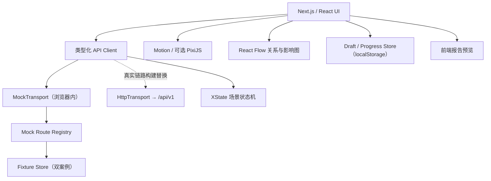

特征：

- 完全静态导出；
- 页面业务组件通过与真实链路相同的方法面调用类型化 API Client，不直接导入 Fixture；
- `MockTransport` 在浏览器内按 OpenAPI operation 返回确定性的响应、状态和错误，不发出业务 HTTP 请求；
- 不使用数据库；
- 不直接调用 DeepSeek；
- 使用预生成的 Flash/Pro 模拟结果；
- 所有模拟 AI 输出必须显示"演示模式"；
- 自定义草稿、用户选择和进度保存在独立的本地 Store；自定义正文不进入 Mock 分析路由；
- 可部署到任何静态 Web 托管。

演示链路双案例：

- **AI 海报生成网站**（快速问诊主案例）：从一句功能想法到需求简报的默认主路径展示，验证五步流程、信息覆盖槽位、未知分级、方案比较和需求简报投影；
- **Aster 科技园区访客预约与通行**（正式项目示例）：七阶段、三关口、证据追踪、冲突决策、12 章正式报告和变更预演的完整展示。

#### 3.1.1 Mock / HTTP 传输层切换边界

API Client 暴露按 OpenAPI `operationId` 生成或人工封装的稳定方法，页面组件、XState Actor 和业务 Store 只能依赖该方法面。底层传输实现按构建目标注入：

```ts
interface ApiTransport {
  request<TRequest, TResponse>(operationId: string, request: TRequest): Promise<TResponse>;
}
```

- **`MockTransport`**：只允许调用注册表中的 operation；从 `FixtureRepository` 和本地 Mock Session Store 读取响应；未注册 operation、Schema 不匹配或外部业务网络请求立即失败；
- **`HttpTransport`**：将同一 operation 映射到 `/api/v1`，由服务端执行身份、协议、权限、数据库事务、AI Job 和审计；
- Mock Route Registry 以 OpenAPI 为契约源，显式映射 `operationId → handler → allowed status`，不得另建一套字段命名或错误格式；
- Mock 可以确定性模拟 `202 + job_id`、`queued/running/succeeded/failed`、身份、协议、删除和恢复分支，但这些状态不签发真实凭证、不形成法律记录、不执行服务器副作用；
- 场景时钟、Job 结果和错误脚本必须由 Fixture 或测试场景固定，避免依赖随机数和真实时间造成不可复现；
- 自定义输入由独立 `DraftStore` 保存，不发送到 Fixture 分析 handler，不得套用示例结论；
- 传输层在构建时注入。生产构建不得通过 URL 参数、浏览器开关或运行时用户操作启用 Mock；
- 契约测试必须遍历所有已注册 Mock handler，校验请求、响应、状态码和错误体符合 OpenAPI，并验证演示链路不访问开发或生产业务 API；
- 从 Mock 切到 HTTP 时，只替换传输和持久化实现，不改写页面组件、状态机事件或业务响应类型。

### 3.2 当前真实链路：模块化单体试点架构

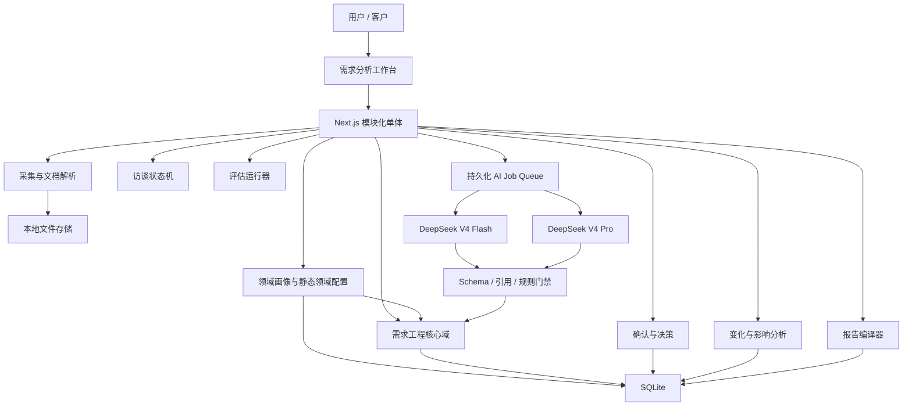

### 3.3 阶段 C：触发式演化架构

仅在触发条件出现时演化：

```text
SQLite → PostgreSQL
本地文件 → S3 兼容对象存储
Job Table → Temporal
固定双模型流水线 → 受控多 Agent
模块化单体 → 有选择的服务拆分
单机部署 → 多副本和高可用
```

---

## 4. 技术栈与选型理由

| 层 | 当前选择 | 理由 | 可替换方向 |
|---|---|---|---|
| Web | Next.js + TypeScript | 前后端统一语言；支持静态 Demo 和后续服务端 | 其他 React 全栈框架 |
| UI | React + Design Tokens | 组件化、主题和响应式 | 保持 React 契约 |
| 状态机 | XState | 对话分支、确认、回退可显式建模 | 自研状态机仅在复杂度可控时 |
| 动画 | Motion | 状态驱动动画和减少动效适配 | CSS Animation |
| 关系图 | React Flow | 目标、证据、需求和变化图 | 自研 Canvas/SVG |
| 场景层 | 可选 PixiJS | 仅用于桌面端非核心视觉层 | 不启用不影响业务 |
| 数据库 | SQLite | 单文件、零配置、低运维、事务完整性 | PostgreSQL |
| ORM | Drizzle ORM | 类型安全、迁移可见 | Prisma/SQL |
| 数据校验 | Zod + JSON Schema | 同时约束 API 和模型输出 | 标准 JSON Schema |
| 全文搜索 | SQLite FTS5 | 当前规模足够，无需向量库 | OpenSearch/pgvector |
| 文件 | 本地磁盘目录 | 单机简单、可备份 | S3 兼容存储 |
| AI | DeepSeek V4 Flash + Pro | Flash 控成本，Pro 处理高风险推理 | 通过 Provider 接口替换 |
| 任务 | SQLite 持久化任务表 | 可恢复、无新基础设施 | Temporal |
| 报告 | HTML 模板 + 浏览器 PDF | 一套布局，多种输出 | DOCX 渲染器 |
| 日志 | 结构化 JSON | 便于本地排查和未来采集 | OpenTelemetry |

### 4.1 SQLite 量级适用性分析

当前数据库设计约 30 张表，单项目预计数百至数千行。SQLite 的单库上限为 281 TB、单表约 2^64 行，结构量级完全在安全范围内。SQLite 的瓶颈不在表数量或数据规模，而在并发写入——WAL 模式支持多读一写，单写者限制在以下场景中才是真实问题：

- 多用户高频同时写入；
- 多个 AI Job Worker 并发写入结果；
- 需要多应用副本。

v1 使用持久化 Job + 单 Worker 轮询，不存在多 Worker 抢写锁的问题。AI 辅助开发场景下 SQLite 还有额外优势：迁移脚本为纯 SQL，AI 工具可直接理解和生成；单文件 `cp` 即可全量备份；零运维适合无专职 DBA 的 2-3 人团队。

当前 SQLite 适合作出以下决策：

- 演示链路：无数据库，仅 localStorage；
- 真实 HTTP 试点：SQLite + WAL + 单 Worker 写入，满足单用户/小规模封闭试点；
- 后续扩展：仅在 ADD §21.1 触发条件成立后迁移 PostgreSQL。

### 4.2 明确不直接在浏览器调用 DeepSeek

原因：

- API Key 会暴露；
- 无法统一实施敏感信息检测、最小化处理和调用审计；
- 无法可靠记录模型、提示词和输入快照；
- 无法执行统一重试、预算和质量门禁。

纯前端 Demo 只能使用静态模拟数据。真实调用必须经过服务端。

### 4.3 当前不使用向量数据库

当前数据规模和任务不需要专用向量检索。优先使用：

- 结构化关系；
- 精确证据链接；
- SQLite FTS5；
- 项目、来源、角色、时间和权限过滤。

只有当跨大量文档的语义召回成为经测量的瓶颈，才增加向量检索；向量结果只能产生候选，不能自动成为证据。

---

## 5. 静态 Fixtures 数据契约

本章保留 Demo 数据契约，业务流程与案例内容见 PRD §6。

### 5.1 Fixtures 文件清单

```text
demo/
├── cases.json                    # 案例注册表
└── cases/
    ├── ai-poster-website/         # 快速问诊主案例
    │   ├── manifest.json
    │   ├── scenario.json          # 原始想法、目标用途、候选标题
    │   ├── clarifying-qa.json     # 自适应追问与回答（六类覆盖槽位）
    │   ├── understanding.json     # 当前理解摘要与版本
    │   ├── options.json           # 方案比较（模板/AI 生成/人工辅助）
    │   ├── unknowns.json           # 阻断/非阻断未知
    │   ├── brief-simple.json      # 概述需求简报
    │   └── brief-detail-report.json # 需求分析详细报告
    └── aster-visitor-access/      # 正式项目示例
        ├── manifest.json         # 契约版本、入口、文件哈希和依赖
        ├── scenario.json
        ├── stakeholders.json
        ├── dialogue-nodes.json
        ├── evidence.json
        ├── flash-extraction.json
        ├── pro-analysis.json
        ├── conflicts.json
        ├── decisions.json
        ├── requirements.json
        ├── change-impact.json
        └── report.json
```

### 5.2 数据包边界与校验

- `cases.json` 只保存案例 ID、显示信息、数据包位置和兼容契约版本，不保存业务结论；
- 每个案例目录是独立闭包，实体 ID 必须带案例命名空间，禁止跨案例引用；
- **AI 海报案例与 Aster 案例使用独立数据边界**：AI 海报案例不引用 Aster 的提取、决策、需求或报告；Aster 案例不引用 AI 海报的简报；
- `manifest.json` 至少包含 `case_id`、`fixture_schema_version`、`entry_stage`、`files[{path, sha256}]`、`required_features`；
- 加载前校验 Schema、哈希、ID 唯一性、引用完整性、阶段节点可达性和报告引用覆盖；失败时停止载入并显示案例数据错误；
- 自定义输入只保存为独立草稿，不进入任一案例状态机，也不得复用 AI 海报或 Aster 的提取、决策、需求、简报或报告；
- Fixture 只能由 `FixtureRepository` 经 Mock Route handler 访问；页面组件、XState Actor 和业务 Store 不得直接导入业务 Fixture 文件；
- 每个 Mock handler 必须绑定一个 OpenAPI `operationId`，并返回该 operation 声明的响应信封、状态码和错误结构；
- Fixture 升级必须提高契约版本并提供兼容策略，不能依赖页面组件中的隐式默认值补齐。

---

## 6. 前端架构

### 6.1 整体定位

前端以**需求分析工具**为核心定位，**主界面优先展示分析结果**（角色、需求、证据、冲突、方案、决策、验收、变化），AI 对话作为辅助的"追问与跟进"入口，不作为主界面。

- 主路径：用户主导分析、判断和决策；AI 提供追问、归纳、比较、指出缺口和生成候选；
- 主界面：分析结果面板为主，AI 对话为辅助入口；
- 对话风格：专业风格，类似企业访谈工具（干净、结构化、高信息密度），不使用卡通角色立绘和彩色气泡；
- 角色表示：使用简单首字母头像 + 角色标签，不使用卡通人物图像；
- 对话内容：结构化呈现，证据来源链接放在每条对话底部；
- 跟进建议：提供追问建议按钮，支持用户主导信息收集。

### 6.2 三种模式的前端差异

| 模式 | 主界面 | AI 对话角色 | 复杂度渐进 |
|---|---|---|---|
| 快速问诊 | 当前理解、覆盖槽位、方案比较、需求简报投影 | 自适应追问；用户确认理解 | 默认自然语言，不暴露内部术语 |
| 正式项目 | 证据账本、Driver 地图、冲突板、决策板、范围板、报告预览 | Pro 高风险复核；发布前缺陷审计 | 进入后展示证据、版本、关口、追踪和发布状态 |
| 表达训练 | 案例介绍、追问路径、总结输入、反馈结果 | AI 扮演客户/老师/业务方 | 轻量交互原型，固定覆盖检查 |

### 6.3 桌面信息架构（正式项目主工作台）

```text
┌──────────────────────────────────────────────────────────────┐
│ 项目 / 当前阶段 / 目标 / 证据覆盖 / 冲突 / 未决责任         │
├──────────────┬────────────────────────┬──────────────────────┤
│ 角色与章节   │ 分析结果主面板         │ AI 追问与跟进面板    │
│              │ （主界面）             │ （辅助入口）         │
│ Stakeholders │ Facts / Inferences     │ 当前问题             │
│ 发言权       │ Outcomes / Drivers     │ 用户回答             │
│ 冲突状态     │ Requirements / Risks   │ AI 归纳（结构化）    │
│ 待确认事项   │ Decisions / Options    │ 证据来源链接         │
│              │ Acceptance / Changes  │ 跟进建议按钮         │
├──────────────┴────────────────────────┴──────────────────────┤
│ As-Is ── Now ── Next ── Later ── Watch 时间线               │
└──────────────────────────────────────────────────────────────┘
```

### 6.4 核心组件

- `MissionHeader`：项目目标、阶段和质量门禁；
- `StakeholderRail`：角色、权力、利益和待确认项；
- `AnalysisPanel`：分析结果主面板（Facts/Inferences/Outcomes/Drivers/Requirements/Decisions/Acceptance/Changes）；
- `FollowupPanel`：AI 追问与跟进辅助面板（当前问题、用户回答、AI 归纳、证据来源链接、跟进建议按钮）；
- `EvidenceCard`：原文、位置、说话人和时间；
- `EpistemicBadge`：Fact/Inference/Assumption/Proposal；
- `OutcomeLadder`：请求 → Job → Outcome → Capability；
- `ConflictBoard`：多方观点和待决责任；
- `DecisionPanel`：选项、收益、成本、风险、可逆性；
- `RequirementBoard`：Now/Next/Later/Watch；
- `ChangeTimeline`：触发、影响、迁移、回滚和退役；
- `ReportPreview`：按角色生成报告视图；
- `AuditDrawer`：证据、模型和人工修改历史。

### 6.5 动效原则

动效必须表达业务状态：

- 证据确认后连接到对应结论；
- 冲突产生时分支展开；
- 决策完成后分支合并并记录理由；
- 需求替代时旧节点保留但降级；
- 变化发生时影响路径逐层传播；
- 新结论无证据时显示阻断，而不是成功动画。

禁止用积分、等级或庆祝特效代替质量判断。

### 6.6 响应式

| 设备 | 布局 |
|---|---|
| 手机 | 单列分析结果；AI 追问和角色为底部抽屉 |
| 平板 | 分析结果 + AI 追问双栏 |
| 桌面 | 角色 + 分析结果 + AI 追问三栏 |
| 大屏 | 增加目标图、变化图和审计视图 |

### 6.7 无障碍与降级

- 全部核心功能可键盘完成；
- 支持屏幕阅读器和语义化区域；
- 支持 `prefers-reduced-motion`；
- 不能只依赖颜色表达状态；
- 字号缩放后不丢失操作；
- PixiJS 关闭或失败时不影响任何业务功能；
- 弱设备自动停用非核心场景动画。

---

## 7. 模块化单体后端

### 7.1 模块边界

```text
src/
├── identity/
├── projects/
├── domain-profiles/
├── domain-packs/
├── ingestion/
├── evidence/
├── stakeholders/
├── drivers/
├── jobs-outcomes/
├── requirements/
├── decisions/
├── reviews/
├── changes/
├── ai/
├── evaluation/
├── reports/
└── shared/
```

约束：

- 模块不得绕过应用接口随意修改其他模块数据；
- 跨模块引用使用稳定 ID；
- 客户端 ApiTransport，以及服务端 AI Provider、File Store、Workflow Engine 和 Report Renderer 定义适配器接口；
- 当前部署为一个应用，但边界可以支持未来拆分；
- 不为了未来拆分而引入网络调用。

### 7.2 关键模块职责

| 模块 | 职责 |
|---|---|
| `identity` | 用户身份、项目成员、角色和授权判定 |
| `projects` | 项目生命周期、阶段和风险等级 |
| `domain-profiles` | 项目形态识别、领域画像候选、术语映射和人工确认 |
| `domain-packs` | v1 只读静态配置（`general`、`software-delivery`）；动态注册、组合和扩展推迟到触发条件成立后 |
| `ingestion` | 文件上传、哈希、解析、文本标准化 |
| `evidence` | 不可变原件、精确片段、来源和敏感级别 |
| `stakeholders` | 角色、影响力、利益、责任和观点 |
| `drivers` | Goal、Outcome、Obligation、Risk、Problem、Opportunity 及其形成依据 |
| `jobs-outcomes` | 情境、Job、痛点、绕行方案、成果和指标 |
| `requirements` | 需求/承诺、规则、通用属性、约束和验收/评价 |
| `decisions` | 选项、取舍、理由、责任人和失效条件 |
| `reviews` | 接受、拒绝、修改、确认和签署 |
| `changes` | 变化事件、影响分析、迁移、回滚和退役 |
| `ai` | 模型路由、提示词、调用、解析、重试和预算 |
| `evaluation` | 公共测试包、私有集、对照实验和回归门禁 |
| `reports` | 结构化查询、模板编译、快照和导出 |

---

## 8. 领域模型

### 8.1 核心关系

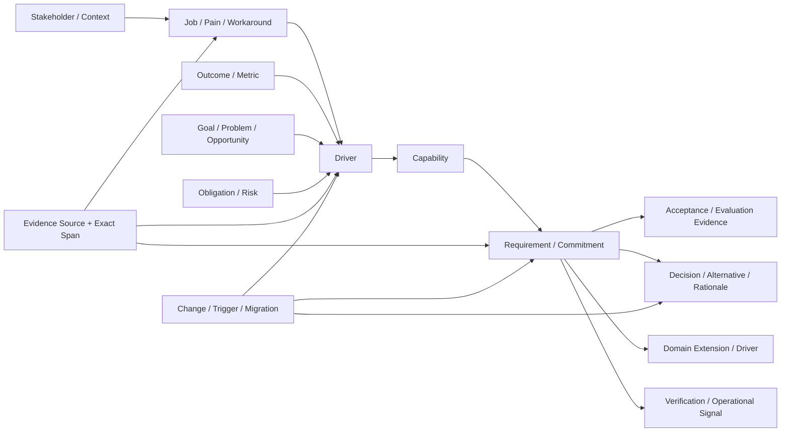

### 8.2 业务不变量

1. `Fact` 必须至少有一个有效 `EvidenceSpan`；
2. `Accepted Requirement` 必须连接至少一个已确认 Driver，或有经批准的显式例外理由；
3. `Now Requirement` 必须有验收证据、优先级和责任人；
4. 冲突未解决时，不得生成“已确认基线”；
5. AI 只能创建 Candidate/Supported，不能创建 Accepted；
6. 报告只能引用命令指定的已批准基线快照及其固定实体版本，不得用“当前行”重建历史；
7. 需求被替代时不得物理删除历史；
8. Watch 项不得自动生成当前实现任务；
9. 模型共识不能替代 Evidence 或 Decision；
10. 任何正式报告必须记录数据、模板、提示词和模型版本。
11. 领域画像和专业包只能扩展核心模型，不能改变 Evidence、Outcome、Requirement、Decision、Acceptance、Change、Trace 和 Version 的基本语义；
12. AI 只能创建 `Candidate DomainProfile` 或提出专业包建议，不能自行激活、发布或修改专业包；
13. 未命中专业包时必须回退到通用问诊流程，不得根据模型临时输出修改数据库结构；
14. 专业包新增的正式字段和结论继续服从证据、认识状态、责任、版本和报告门禁；
15. 报告必须记录 `domain_profile_id/version` 和全部领域配置版本，保证跨版本复现。

### 8.3 需求时间与演化字段

```yaml
requirement:
  id: REQ-...
  statement: ...
  provenance: explicitly_stated | derived | assumed | proposed
  horizon: now | next | later | watch
  scope_disposition: included | excluded
  commitment: committed | conditional | scenario | speculation
  stability: stable | policy-variable | experimental
  valid_from: ...
  valid_until: ...
  activation_trigger: ...
  deactivation_trigger: ...
  volatility_drivers: []
  driver_links: []
  evidence_links: []
  acceptance_links: []
  supersedes: ...
  migration_strategy: coexist | transform | replace | retire
  reversibility: high | medium | low
  owner: ...
  status: candidate | supported | reviewed | accepted | implemented | verified | superseded | retired
```

`Fact | Inference | Assumption | Proposal | Unknown | Conflict | Decision` 用于描述“关于世界的陈述和分析状态”。Requirement 是规范性陈述，不标记为 Fact；其 `provenance` 记录它是利益相关者明确提出、由 Driver/Decision 派生、基于待验证假设形成，还是候选方案。`Unknown`、`Conflict` 和 `Decision` 保存为各自实体并通过 TraceLink 关联需求。

### 8.4 混合领域架构

平台采用“统一需求工程内核 + AI 领域画像 + 受控专业包”的混合架构，而不是在每个新主题下重新生成流程、数据库或页面。

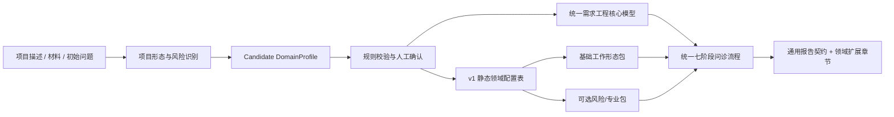

职责边界：

| 层 | 负责内容 | 不得负责 |
|---|---|---|
| 统一核心 | 证据、认识状态、角色、目标、需求/承诺、冲突、方案、决策、验收/评价、变化、追踪、版本、审批 | 不内置某一行业专属结论 |
| `DomainProfile` | 描述项目形态、领域标签、风险标记、术语映射、建议静态配置和路由风险 | 不创建业务事实，不使用模型自报置信度自动批准 |
| 专业包 | 增加领域问题、扩展字段、校验规则、报告章节、术语展示和评测用例 | 不重定义核心状态，不绕过证据和人工责任 |
| AI | 分类、提出画像候选、抽取内容、发现缺口和建议扩展 | 不运行时发明正式 Schema，不发布专业包，不自动承诺 |
| 确定性程序与人工 | 校验兼容性、确认画像、激活版本、执行门禁和审批 | 不用静默默认掩盖领域不确定性 |

内部核心术语保持稳定，页面可以通过术语映射显示目标领域更自然的名称。例如核心 `AcceptanceCriterion` 在软件项目中显示“验收标准”，在政策项目中可显示“政策评价指标”，在科研项目中可显示“验证与有效性标准”；映射只改变展示，不改变实体身份和追踪关系。

### 8.5 DomainProfile 契约

领域画像在建档后、正式项目分析开始前产生。推荐结构：

```yaml
domain_profile:
  id: DP-...
  project_id: PRJ-...
  version: 1
  work_type: general | software_delivery | policy_design | research | physical_engineering | service_process | procurement | mixed
  domain_labels: []
  risk_flags:
    regulated: false
    safety_critical: false
    privacy_sensitive: false
    financial_material: false
    vulnerable_population: false
  terminology_map: {}
  suggested_pack_ids: []
  required_human_roles: []
  routing_risk: low | medium | high | unknown
  routing_basis:
    deterministic_rule_hits: []
    evaluation_profile: ...
  rationale_evidence_links: []
  unknowns: []
  status: candidate | under_review | approved | rejected | superseded
  classifier_model: ...
  prompt_version: ...
  approved_by: ...
  approved_at: ...
```

生成和确认规则：

1. 先使用用户显式选择、项目模板和确定性关键词缩小候选，再由 AI 进行受约束分类；
2. AI 只能从注册表返回的专业包候选中选择，不接受不存在的 Pack ID；
3. `mixed`、高/未知路由风险或高风险标记必须人工确认；禁止用模型自报“置信度”自动批准；
4. 画像变化创建新版本，并触发问题集、校验规则、报告章节和既有结论的影响检查；
5. 画像理由可以是推断，但涉及领域事实时仍必须关联 EvidenceSpan；
6. 用户暂不确定时使用 `general` 继续访谈，同时保留 Unknown，不强制错误分类。

状态转换为 `candidate → under_review → approved | rejected`；已批准画像被新版本替代后进入 `superseded`。`reviewed` 是评审事件而不是稳定状态，具体动作保存在 `review_actions`。

### 8.6 v1 静态领域配置与未来专业包

v1 不建设通用专业包平台，只内置 `general` 和 `software-delivery` 两份版本化只读配置。以下完整 Pack 契约属于触发式演化目标，不进入真实 HTTP 试点默认实现：

```yaml
domain_pack:
  id: PACK-...
  version: 1.0.0
  status: draft | evaluated | released | deprecated
  compatible_core_schema: ...
  applicable_work_types: []
  terminology: {}
  required_questions: []
  optional_questions: []
  extension_schemas: []
  deterministic_validators: []
  report_sections: []
  risk_escalation_rules: []
  evaluation_suite: ...
  migration_from: ...
```

首批专业包边界：

| 专业包 | 领域扩展重点 |
|---|---|
| `software-delivery` | 系统边界、接口、数据、质量属性、架构驱动、测试、部署和运行观测 |
| `policy-design` | 法律/政策依据、适用对象、权责、执行机制、例外、申诉和效果评价 |
| `research` | 研究问题、假设、方法、样本/数据、伦理、有效性、复现和成果评价 |
| `physical-engineering` | 场地、规范、安全、材料、施工接口、检查、移交和验收 |
| `service-process` | 服务旅程、角色交接、SLA、SOP、异常、培训和运营指标 |
| `procurement` | 采购范围、供应商约束、评价准则、合同交付物、验收和退出安排 |

上表只定义未来边界。当前实现 `general` 通用回退和 Aster 所需的静态 `software-delivery`；不实现 Pack 创作、组合、动态 Schema 或在线发布。

专业包治理规则：

- 核心不变量优先于所有专业包；法律、合同或组织强制规则优先于可选专业包规则；
- 一个项目允许组合一个基础工作形态包和多个风险/专业扩展包；组合冲突必须显式阻断并由责任人处理；
- 专业包发布前必须通过 Schema 兼容、固定用例、跨领域回归、报告快照和迁移测试；
- AI 提出的临时领域字段只能进入 `candidate_extension`，经评审、建模、评测和版本发布后才能成为正式 Pack 字段；
- 包被弃用时保留旧版本以复现历史报告，并提供迁移规则，不原地改写既有项目。

### 8.7 通用回退与跨领域一致性

没有合适专业包时，系统仍使用统一核心完成：建档、资料与访谈、目标确认、证据/冲突/决策、范围与基线、报告、变化管理。通用报告明确列出“尚未应用专业领域校验”，不得伪装成已完成行业合规或专业审查。

跨领域变化不得通过复制项目解决。项目只保留一个核心事实源，专业包启停通过版本化关联实现；报告和页面按当前已确认画像投影视图。

---

## 9. 数据架构

### 9.1 三类数据必须分开

| 数据类型 | 来源 | 用途 | 能否由 AI 生成 |
|---|---|---|---:|
| 业务事实数据 | 客户材料、访谈、合同、流程、指标 | 实际需求分析 | 不可以 |
| 系统运行数据 | 项目、证据、需求、决策、调用、版本 | 追踪和运行 | 结构可以，事实内容不可以 |
| 评估数据 | 公共数据集、私有金标、合成异常 | 测试模型和提示词 | 可部分合成，但不能替代真实测试 |

公共数据集不能作为客户业务事实。AI 合成数据只能用于 Demo、异常测试、负载测试和安全测试。

### 9.2 SQLite 使用原则

- 数据库文件与应用位于同一物理设备；
- 只允许应用服务写入；
- 启用外键约束；
- 使用事务更新领域状态；
- 使用 WAL 提高读写并行性；
- 不放置在网络共享盘；
- 原始大文件存磁盘，数据库保存元数据和路径；
- 每日备份数据库与原始材料；
- 定期执行恢复演练，而不是只检查备份文件存在。

### 9.3 核心表

本节描述逻辑实体和关键字段，用于表达架构不变量；完整物理列、类型、外键、唯一约束、索引和迁移以 [数据库设计](./04-database-design.md) 为唯一维护来源。

#### 项目与来源

```text
users
- id
- display_name
- email
- status
- created_at
- updated_at

guest_sessions
- id
- session_key_digest       # HMAC-SHA-256 摘要；原始凭证只签发一次
- created_at
- last_active_at

agreement_versions
- id
- version
- status                   # draft | active | superseded | withdrawn
- change_type              # major | minor
- effective_at
- content_ref              # 协议正文的版本化引用
- superseded_by
- created_at

agreement_consents
- id
- agreement_version_id
- actor_kind               # user | guest
- actor_id                 # user_id 或 guest_session_id
- action                   # accepted | reaccepted | withdrawn
- scope                    # quick | formal | training | all
- channel                  # web | cli | api
- occurred_at
- received_at

projects
- id
- owner_id
- created_by
- name
- description
- status
- risk_level
- current_domain_profile_id
- language
- version
- created_at
- updated_at

project_members
- project_id
- user_id
- role
- status
- granted_by
- created_at

project_intakes
- id
- project_id
- original_text
- decision_intent
- selected_work_type
- source_channel
- submitted_by
- supersedes_intake_id
- created_at

# 快速问诊会话与需求简报
quick_sessions
- id
- guest_session_id         # 可空；未认领游客会话的当前所有者
- user_id                  # 可空；登录用户或认领后的当前所有者
- origin_guest_session_id  # 可空；认领后保留原游客来源
- claimed_at               # 可空；只认领指定 quick_session
- status                   # draft | clarifying | understanding_review | option_review | brief_ready | upgraded | archived
- source_kind              # custom | sample | training_fixture | internal_test
- source_case_id           # 可空，使用示例案例时记录
- original_input
- created_at
- last_active_at
- upgraded_at
- archived_at

brief_versions
- id
- quick_session_id
- version
- snapshot_json            # 结构化需求简报（事实、需求、未知、方案、完成条件）
- is_incomplete            # 是否为带缺口的未完成草稿
- blocking_unknown_count
- generated_at
- generated_by

brief_exports
- id
- brief_version_id
- view_type                # simple | exec
- export_type              # copy | download
- exported_at
- exported_by

# 升级关联
upgrade_records
- id
- quick_session_id
- brief_version_id
- target_project_id
- idempotency_key
- status                   # started | succeeded | failed
- error_category
- started_at
- completed_at

domain_profiles
- id
- project_id
- version
- work_type
- domain_labels_json
- risk_flags_json
- terminology_map_json
- suggested_pack_ids_json
- required_human_roles_json
- routing_risk
- routing_basis_json
- rationale_evidence_links_json
- unknowns_json
- status
- classifier_model
- prompt_version
- approved_by
- approved_at
- supersedes_profile_id
- created_at

domain_packs
- id
- version
- name
- status
- compatible_core_schema
- manifest_json
- manifest_hash
- evaluation_suite_id
- released_at
- deprecated_at

project_domain_packs
- project_id
- domain_pack_id
- domain_pack_version
- domain_profile_id
- activation_reason
- status
- activated_by
- activated_at
- deactivated_at

domain_entity_extensions
- id
- project_id
- entity_type
- entity_id
- domain_pack_id
- domain_pack_version
- extension_schema_id
- payload_json
- epistemic_type
- evidence_links_json
- status
- created_at
- updated_at

candidate_extensions
- id
- project_id
- proposed_key
- proposed_schema_json
- rationale
- evidence_links_json
- proposed_by_run_id
- status
- reviewed_by
- reviewed_at

# 上述两个扩展表为后续扩展候选，真实 HTTP 试点物理数据库不创建

sources
- id
- project_id
- file_name
- file_path
- normalized_path
- media_type
- source_type
- author
- captured_at
- sha256
- extracted_text_hash
- parser_version
- supersedes_source_id
- sensitivity
- extraction_status
- created_at

evidence_spans
- id
- source_id
- page
- section
- start_offset
- end_offset
- exact_text
- normalized_text
- created_at
```

#### 利益相关者、工作和成果

```text
stakeholders
- id
- project_id
- name
- role
- influence
- interest
- authority
- contact_scope
- notes
- epistemic_type
- status
- version

interview_turns
- id
- project_id
- turn_index
- role
- stakeholder_id
- speaker_label
- content
- evidence_span_id
- created_at

jobs
- id
- project_id
- stakeholder_id
- context
- job_statement
- pain
- current_workaround
- expected_progress
- epistemic_type
- status
- version

outcomes
- id
- project_id
- job_id
- description
- success_metric
- baseline
- target
- unit
- failure_condition
- horizon
- owner
- epistemic_type
- status
- version

drivers
- id
- project_id
- driver_type (goal | outcome | obligation | risk | problem | opportunity)
- statement
- status
- owner
- version
```

#### 能力、需求/承诺和验收/评价

```text
capabilities
- id
- project_id
- name
- description
- status

requirements
- id
- project_id
- requirement_key
- type
- statement
- provenance
- horizon
- scope_disposition
- commitment
- stability
- priority
- valid_from
- valid_until
- activation_trigger
- deactivation_trigger
- reversibility
- migration_strategy
- volatility_drivers
- owner
- supersedes_requirement_id
- status
- created_at
- updated_at

requirement_driver_links
- requirement_id
- driver_id
- relation
- rationale

acceptance_criteria
- id
- project_id
- requirement_id
- context
- action_or_condition
- expected_result
- measurement_method
- evidence_type
- threshold
- unit
- status
- version

verification_artifacts
- id
- project_id
- requirement_id
- acceptance_criterion_id
- artifact_type
- description
- artifact_path
- source_id
- result
- executed_at
- status

operational_signals
- id
- project_id
- requirement_id
- name
- measurement
- threshold
- unit
- observation_window
- owner
- review_cadence
- trigger_condition
- status
```

`quality_scenarios` 属于未来 `software-delivery` 扩展。v1 如需展示，使用版本化静态报告投影，不创建通用 `domain_entity_extensions` 表；它不是所有项目的核心实体。

#### 假设、未知、冲突和决策

```text
assumptions
- id
- project_id
- statement
- validation_plan
- owner
- due_at
- status

unknowns
- id
- project_id
- question
- information_value
- owner
- due_at
- status

conflicts
- id
- project_id
- description
- severity
- blocking
- owner
- status

conflict_sides
- id
- conflict_id
- label
- statement
- stance
- evidence_link_ids

conflict_options
- id
- conflict_id
- description
- benefits
- costs
- risks
- reversibility
- status

decisions
- id
- project_id
- question
- selected_option_id
- rationale
- decision_owner
- decided_at
- review_trigger
- status

future_scenarios
- id
- project_id
- name
- description
- probability_class
- activation_trigger
- leading_indicators
- horizon
- architecture_response
- status
```

#### 变化和追踪

```text
changes
- id
- project_id
- source_id
- source_type
- description
- trigger_type
- occurred_at
- severity
- status
- confirmed_by
- confirmed_at
- withdrawn_by
- withdrawn_at
- withdrawal_reason
- supersedes_change_id
- version

trace_links
- id
- project_id
- source_type
- source_id
- target_type
- target_id
- relation_type
- confidence_type
- created_by
- status
- created_at
```

#### AI、评审和报告

```text
ai_jobs
- id
- scope_kind
- project_id                 # formal_project 时非空
- quick_session_id           # quick_session 时非空
- training_attempt_id        # training_attempt 时非空
- task_type
- payload_json
- input_hash
- status
- attempts
- max_attempts
- next_run_at
- locked_by
- locked_at
- last_error
- created_by_kind
- created_by_user_id
- created_by_guest_session_id
- created_at
- updated_at

ai_runs
- id
- ai_job_id
- provider
- model
- model_revision
- thinking_mode
- reasoning_effort
- prompt_version
- domain_profile_id
- domain_profile_version
- domain_pack_versions_json
- dataset_version
- input_hash
- input_tokens
- output_tokens
- raw_audit_blob_id
- raw_audit_class
- raw_audit_expires_at
- parsed_output
- status
- started_at
- completed_at

review_actions
- id
- project_id
- entity_type
- entity_id
- action
- before_value
- after_value
- reviewer
- reason
- created_at

report_snapshots
- id
- project_id
- version
- baseline_id
- data_hash
- template_version
- core_schema_version
- report_input_schema_hash
- compiler_version
- domain_profile_id
- domain_profile_version
- domain_pack_versions_json
- prompt_versions_json
- model_versions_json
- file_blob_id
- file_sha256
- status
- generated_at
```

`ai_jobs` 必须且只能属于 `formal_project | quick_session | training_attempt` 中一个作用域，不能以可空 `project_id` 代替作用域约束。创建者同样使用用户/游客互斥外键；游客只能查询和取消仍归其所有的快速问诊或训练 Job。`ai_runs.domain_profile_id/domain_profile_version` 成对可空：正式项目在已有画像时固定版本，快速问诊、训练或“生成画像本身”的 Job 可以为空，但模型、Prompt、Schema 和实际输入哈希仍必须固定。

#### 版本、基线与未来集成

```text
requirement_versions
- id
- requirement_id
- version
- snapshot_json
- changed_by
- change_reason
- created_at

baselines
- id
- project_id
- version
- status
- approved_by
- approved_at
- data_hash

baseline_items
- baseline_id
- entity_type
- entity_id
- entity_version

prompt_versions
- id
- task_type
- version
- content_hash
- schema_version
- status
- created_at

report_templates
- id
- audience
- version
- content_hash
- status
- created_at

```

v1 不创建 outbox 表。只有出现必须可靠投递的外部消费者后，才通过 ADR 引入 outbox、重试、锁和错误状态；内部模块协作使用同进程应用服务和数据库事务。

### 9.4 追踪关系类型

```text
project_classified_by_domain_profile
domain_profile_activates_domain_pack
domain_profile_supersedes_domain_profile
domain_extension_describes_entity
evidence_supports_fact
stakeholder_performs_job
job_motivates_outcome
outcome_requires_capability
capability_realized_by_requirement
requirement_verified_by_acceptance
requirement_refined_by_quality_scenario
requirement_constrained_by_requirement
requirement_conflicts_with_requirement
decision_selects_option
decision_resolves_conflict
scenario_activates_requirement
change_impacts_entity
requirement_supersedes_requirement
requirement_verified_by_artifact
requirement_observed_by_signal
```

`requirement_refined_by_quality_scenario` 仅在启用提供该扩展 Schema 的专业包时使用；通用核心不要求所有项目创建质量场景。

### 9.5 数据保留和删除

以下为产品默认值；适用法律、合同、组织政策或有效法律保留要求更严格时，以更严格者为准。覆盖默认值时必须向有权限的用户展示实际期限和原因。完整保留期表以 PRD §10.5 为准。

| 数据类别 | 默认保留期 | 删除规则 |
|---|---|---|
| 演示链路本地草稿和事件 | 留在当前浏览器，直到用户清除或浏览器回收 | 提供"清除本地数据"；不上传服务端 |
| 未登录快速问诊/训练会话 | 最后活动后 30 天 | 到期自动删除；登录认领后转为账户数据期限 |
| 已登录快速问诊/训练会话 | 最后活动后 180 天 | 到期前提示；用户可提前删除 |
| 正式项目、材料、确认、版本和已发布报告 | 保留至 Owner 发起删除或组织政策到期 | 有效法律保留或合同义务存在时暂停删除并显示状态 |
| 含业务正文的模型调试记录 | 默认不记录；受控排障临时开启时最多 7 天 | 到期自动清除；不得作为产品埋点长期保存 |
| 产品分析原始事件 | 90 天 | 到期删除；不得含 PRD §12.5 禁止字段 |
| 去标识化汇总指标 | 13 个月 | 到期删除或重新聚合；不得反推出个人或业务正文 |
| 协议同意/撤回记录 | 最后一次处理或撤回后 2 年 | 法律要求不同则按适用期限，且保留依据可审计 |
| 服务端临时导出文件 | 24 小时 | 到期自动删除；正式报告源文件随正式项目保留 |

架构约束：

- 原始证据默认不可变；
- 逻辑删除用于需求、决策和追踪历史；
- 敏感项目允许执行物理删除，但必须同时处理原件、数据库、缓存、导出和备份策略；
- 报告快照保存生成时的数据哈希；
- 已批准基线通过 `baselines + baseline_items + requirement_versions` 固定实体版本，不能依赖当前可变行重建历史；
- 删除不能破坏仍需保留的审计关系，必须先检查法律和合同义务；
- 删除请求提交后，数据必须立即对普通用户和业务流程不可用，主存储在 30 天内物理清除；备份采用最多 35 天滚动周期并自然过期；灾难恢复若短暂恢复已删除数据，必须重放删除记录后才能恢复对外服务；
- 删除请求受理时，同时向主数据库和主数据库之外的追加式 `deletion_ledger` 写入最小记录（任务 ID、范围、目标哈希、受理时间、状态，不含业务正文）；恢复流程必须使用“数据库快照 + 晚于快照的最新删除账本”重放，不能依赖被恢复的旧数据库自行提供缺失记录；
- 删除任务必须提供按任务 ID 查询状态的服务契约，使用户能够看到 `pending/in_progress/completed/failed/cancelled`、独立的 `legal_hold` 标志及原因和失败原因；
- 用户已经复制或下载到自己设备的文件无法由平台远程收回，界面必须提前说明；
- 快速会话已升级为正式项目时，系统只删除允许删除的快速侧副本；正式项目中依法或依合同必须保留的来源快照继续保留并显示原因；
- 删除任务必须记录范围、申请人、时间、执行状态和失败原因，不记录被删除正文。

---

## 10. DeepSeek 双模型架构

### 10.1 基本策略

Flash 负责规模化、结构化和低风险工作；Pro 负责高风险推理、反例和审计。两者属于同一模型家族，能力差异不等于独立证据。

### 10.2 Flash 职责

使用 `deepseek-v4-flash`：

- 文档分段和章节识别；
- 从注册表候选中生成项目形态、风险标记和领域画像候选；
- 事实、角色、目标、约束和未知提取；
- 精确引用定位候选；
- 通用需求、承诺和约束分类；启用 `software-delivery` 包时再执行 FR/NFR 与质量属性分类；
- 术语归一化；
- 重复与相似需求候选；
- 需求表达改写候选；
- 从已确认领域模型组织报告语言。

默认模式：

```text
非思考模式
严格 JSON Schema
有限输出长度
禁止补充来源外事实
```

### 10.3 Pro 职责

使用 `deepseek-v4-pro`：

- 从功能请求追问适用的 Driver；在服务/产品场景细化 Job 和 Outcome；
- 复核混合、高/未知路由风险和高业务风险领域画像，指出配置遗漏或误配风险；
- 区分问题空间与方案空间；
- 识别隐含假设和多方冲突；
- 生成反例与替代方案；
- 分析当前专业包定义的关键属性和决策驱动；`software-delivery` 项目再展开质量属性与架构驱动；
- 分析 Now/Next/Later/Watch；
- 评估变化影响、迁移和可逆性；
- 发布前查找无证据、遗漏、矛盾和过度设计。

默认模式：

```text
思考模式 high
复杂变化、合规或架构任务使用 max
输出问题和缺陷，不直接批准需求
```

### 10.4 风险路由

模型风险路由发生在项目形态与领域画像候选之后。领域画像决定应加载哪些问题、校验器和报告扩展，但不改变模型必须遵守的证据与状态规则。

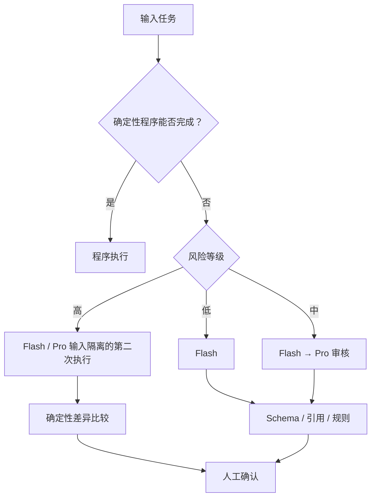

高风险触发条件来自可观察事实：

- 法律、合规、安全、隐私或资金承诺；
- 多个利益相关者意见冲突；
- 原始来源互相矛盾；
- 缺少成果或成功指标；
- 不可逆或高迁移成本决定；
- 数值、时间、容量和边界条件；
- 涉及未来场景和架构扩展；
- Flash 输出中出现无证据新增；
- 规则门禁失败或模型输出不稳定。

不得仅使用模型自报置信度触发自动接受。

### 10.5 同模型家族的输入隔离与锚定控制（Trial）

高风险任务中，Pro 不先阅读 Flash 的推理过程，只接收：

- 原始证据；
- 结构化任务；
- 评价标准；
- 必要的已确认领域上下文。

随后比较：

```text
Flash 有 + Pro 有 + 证据有效
→ 来源支持候选

Flash 有 + Pro 没有
→ 检查是否过度提取或 Pro 漏检

Pro 有 + Flash 没有
→ 只能进入 Inference / Proposal / Unknown

两者冲突
→ 进入人工确认

两者一致但没有证据
→ 仍不能成为 Fact
```

Flash 与 Pro 属于同一模型家族；输入隔离可以减少直接锚定，但不构成统计独立证据，也不能把一致性解释为正确性提升。该路由只在对照实验显示相对单模型有稳定收益后晋级为 Accepted。

### 10.6 模型调用契约

每次调用必须记录：

- `task_type`；
- `model`；
- 思考模式和强度；
- Prompt 版本；
- 输入来源和数据哈希；
- 输出 Schema 版本；
- token、耗时、重试和错误；
- 原始输出与解析输出；
- 规则门禁结果；
- 人工修改结果。

如果供应商返回独立 `reasoning_content`，默认不将其作为业务证据、需求理由或正式报告内容；审计保存结构化最终输出、输入哈希、规则结果和人工决定即可。确有调试需要时，推理内容应采用更短保留期和更严格权限。

### 10.7 单 Orchestrator + Skill Runtime

当前真实后端 AI 运行时采用单 Orchestrator Agent + 版本化 Skill Registry。该设计不推翻 ADR-009；它不是自治多 Agent，而是把固定任务节点封装为有权限边界、可审计、可停止的 Worker。

运行约束：

- 每个 `ai_job` 启动一个 Orchestrator Run；
- Orchestrator 只根据 `mode + state + task_type + domain_profile` 选择固定 AgentPlan；
- AgentPlan 只能调用 SkillRegistry 中注册的 Skill；
- Skill 分类固定为 `routing / elicitation / structuring / validation / decisioning / composition`；
- `task_type` 继续作为 API 和队列契约，内部映射到 `agent_plan_id + plan_version`；
- Skill 可以读取 DomainPack，但不得临时发明正式 Schema、激活专业包或绕过人工关口；
- Orchestrator 输出先经过 Skill 级 Schema Gate，再进入任务级业务门禁和状态机；
- AgentRun、SkillRun 和 AiRun 必须形成可追踪审计链。

完整后端运行时契约见 [07-agent-skill-backend.md](./07-agent-skill-backend.md)。

### 10.8 重试和停止

- 网络错误、429 和短暂服务错误：指数退避并加随机抖动；
- Schema 失败：允许一次受限修复；
- 引用不存在或数值被改变：直接失败，不允许 AI 自动伪造修复；
- 最大尝试次数有限；
- 禁止模型自行决定无限重试或调用另一个模型；
- 相同输入、模型、模式和 Prompt 版本可按哈希复用结果；
- 超出项目 token 预算时暂停并提示。

---

## 11. 端到端业务流程

本章保留三种产品模式的端到端业务流程架构约束。业务字段契约、人工关口规范和操作矩阵见 PRD §3、§5、§6、§13。

### 11.1 起始页架构边界

起始页回答一个问题：**"你现在希望把什么事情说清楚？"** 起始页不是任何模式的业务阶段，不计入快速问诊五步或正式项目七阶段。

起始页三类入口：

| 入口 | 模式 | 演示链路行为 | 真实 HTTP 链路行为 |
|---|---|---|---|
| 澄清一个想法 | 快速问诊（默认主按钮） | 经 ApiClient + MockTransport 载入 AI 海报案例；自定义内容进入 DraftStore | 经 ApiClient + HttpTransport 创建真实快速问诊会话（需协议同意） |
| 分析一个正式项目 | 正式项目 | 经 ApiClient + MockTransport 载入 Aster 案例；自定义内容进入 DraftStore | 通过 `/formal/new` 或快速简报升级创建正式项目地图工作台 |
| 练习需求沟通 | 表达训练 | 经 MockTransport 创建固定案例 Attempt；仅展示当前可体验范围 | 创建独立 Training Attempt；真实角色回答和反馈 Runtime 已接入，训练回合恢复和验收见 08 |

架构约束：

- 起始页固定显示模式选择，不暴露 Baseline/Driver/EpistemicType 等内部术语；
- 演示链路自定义输入只保存为本地草稿，明确提示"当前演示不会分析自定义内容"；
- 演示链路中“创建会话、同意协议、登录、删除”等通过 MockTransport 展示时只改变本地模拟状态，不得显示为真实服务端结果；
- 自定义输入不得进入 AI 海报或 Aster 案例的预生成结论；
- 真实快速问诊前必须勾选"已阅读并同意服务与数据处理协议"；未同意时不能提交真实 AI 问诊；
- 模式建议属于候选，不得阻止用户保存草稿；最终模式由用户选择；
- 重复提交不产生重复会话或项目，失败保留全部输入。

### 11.2 快速问诊端到端流程（默认主路径，P0）

快速问诊采用五步轻量步骤；步骤可以前后返回，不是严格瀑布：

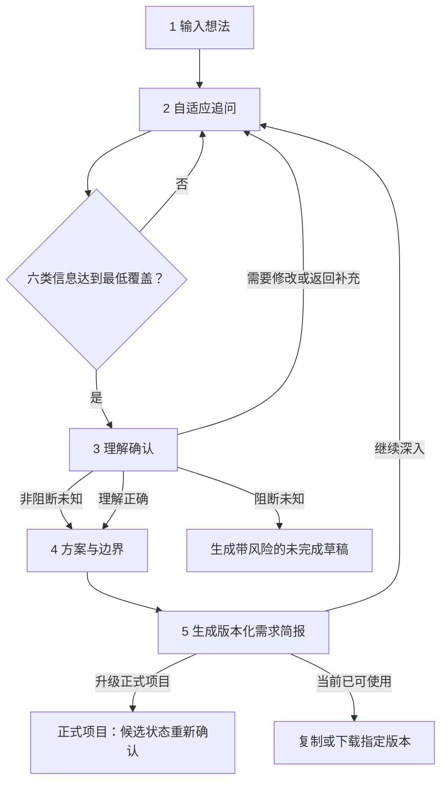

架构约束：

- **按信息覆盖推进，不按固定问题数或对话轮数完成**：六类覆盖槽位（期望结果、用户/相关对象、核心场景、范围边界、完成判断、约束与风险）达到最低条件后应允许生成简报；
- **原始输入不可变**：原样保存用户输入，修订形成新版本；
- **单一简报源与版本**：概述和详细报告必须从同一份 `brief_version` 投影，不得单独生成新的事实、需求或决策；
- **未知项分级**：阻断未知只能输出带醒目风险的未完成草稿，不给出确定性推荐；非阻断未知可以继续，但简报必须显著标记其影响；
- **用户主导方案选择**：用户可以选择与 AI 建议不同的方案，记录为"当前偏好"，保留其他方案和取舍；AI 不得反复阻止用户；
- **快速问诊不存在不可逆的"完成"终点**：`brief_ready` 表示当前版本可以使用，用户可以继续补充并产生新版本；
- **"理解正确"不产生正式 ReviewAction**：只表示当前摘要符合用户表达，不等于正式审批、已接受需求或需求基线；
- 主题变化时询问"补充还是新需求"，不静默合并。

### 11.3 正式项目端到端流程（高级模式，P1）

正式项目使用七阶段流程，三个人工关口只约束正式项目：

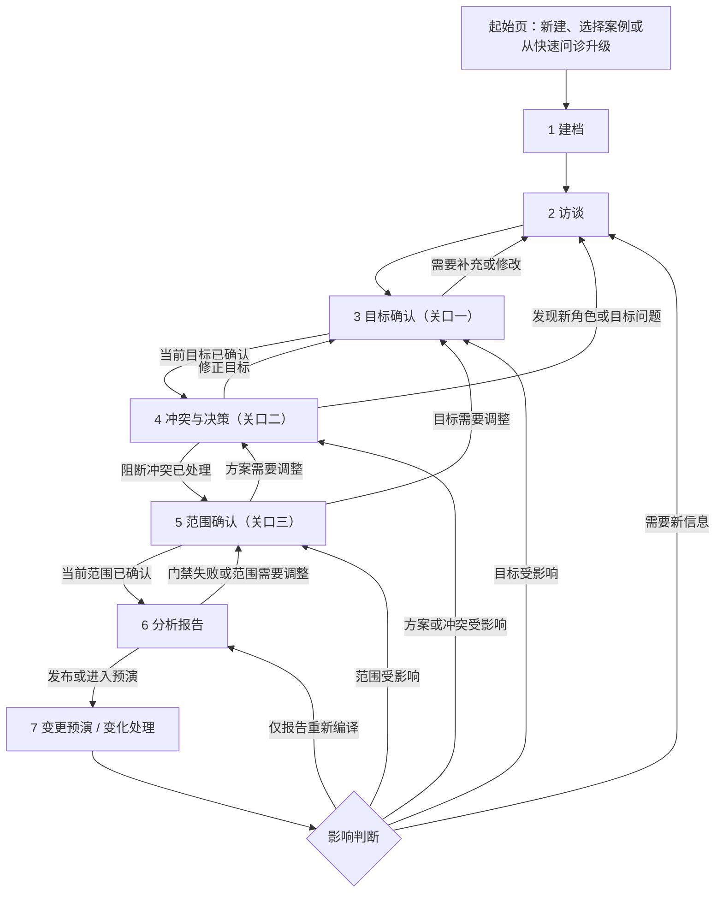

起始页不是第八阶段。七阶段是 `[H]` 信息架构，不是所有需求工作的固定方法；完成表示当前版本满足退出条件，不表示阶段永久关闭。

正式项目内部可靠性流水线（与快速问诊不共享状态）：

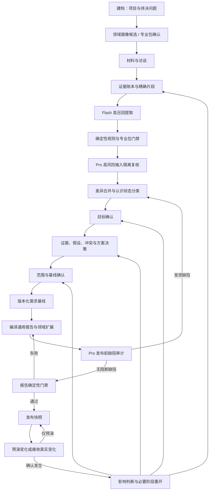

### 11.4 表达训练端到端流程（试验模式，P2）

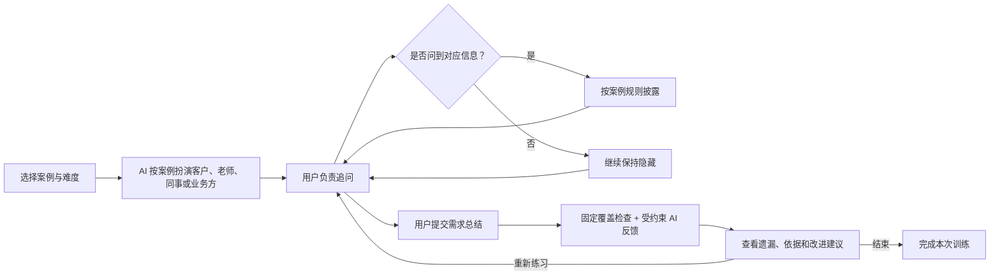

架构约束：

- 训练数据必须与真实项目隔离，AI 扮演角色时只使用案例允许披露的信息；
- 训练状态不得映射为正式项目状态，也不得产生正式 Fact、Requirement、Decision 或 ReviewAction；
- 评分由确定性覆盖检查和受约束的 AI 反馈共同形成，不宣称是权威能力认证；
- 演示链路至少提供一个轻量可交互训练原型，验证"用户追问—提交总结—查看遗漏反馈"的核心价值；真实训练 Runtime 已接入，按 08 的浏览器验收标准持续回归。

### 11.5 升级操作架构约束（快速问诊 → 正式项目）

快速问诊升级为正式项目是一个不可部分成功的业务命令，必须满足以下架构约束：

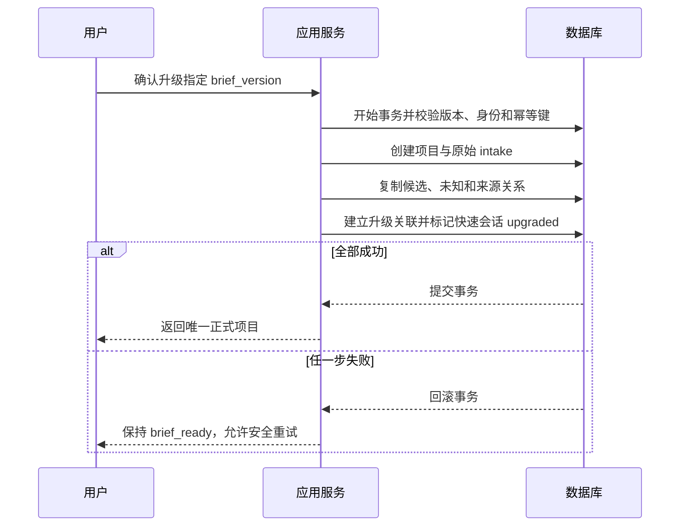

升级映射规则：

| 快速问诊内容 | 正式项目中的初始形态 |
|---|---|
| 原始输入 | 不可变 `project_intake` 原始记录 |
| 用户明确回答 | 带问答来源的候选陈述；满足证据条件前不自动成为正式 Fact |
| AI 当前理解 | `Inference` 或 `Proposal` |
| 阻断/非阻断未知 | `Unknown`，保留影响和阻断性 |
| 需求条目 | Candidate Requirement，保留 provenance |
| 方案比较 | Candidate Decision Options |
| 用户在快速模式选择的方案 | 偏好记录或候选选择，不是正式 Decision |
| 完成条件 | Candidate Acceptance Criteria |
| 需求简报 | 项目初始工作材料，不是已发布报告 |
| "理解正确"记录 | 来源审计，不是正式 ReviewAction |

架构约束：

- 全部步骤成功后才向用户显示正式项目；
- 任一步失败都不得留下用户可见的半成品项目、重复候选或错误 `upgraded` 状态；
- 失败后快速会话保持 `brief_ready`，用户输入和简报不丢失，可以安全重试；
- 使用同一幂等键重试返回首次成功结果，不创建第二个项目；
- 升级成功后，快速问诊与正式项目通过只读来源关系关联，二者后续版本分别演化；
- 若创建后发现业务错误，只能归档/纠正正式项目并保留审计，不能删除升级来源关系后伪装未发生。

### 11.6 项目创建与原始输入契约（正式项目）

项目创建是建立可追踪容器，不是一次性生成分析结论：

1. 服务端在同一事务中创建 `Draft` 项目、Owner 成员关系和不可变 `project_intake`；
2. 必填输入只有原始需求/问题和建档身份；项目名称、决策意图、用户自选工作类型、候选角色/约束和附件可以为空；
3. 一句话输入只能产生显式候选，不得直接写入正式 Stakeholder、As-Is、Constraint、Outcome、成功指标、失败条件或范围；
4. 原始输入修改通过新增 `project_intake` 并指向 `supersedes_intake_id` 实现，不覆盖历史；
5. 创建命令必须使用幂等键；相同身份、幂等键和请求体返回同一项目，请求体不同则返回幂等冲突；
6. 用户同意有效协议后默认允许调用云端 AI，不再要求用户选择数据处理方式；服务端仍执行不可配置的敏感信息检测、最小片段选择和调用审计（PRD §10、PD-003）。

### 11.7 项目形态与领域适配

建档完成后，系统生成 `Candidate DomainProfile`：

1. 从用户显式选择、项目描述和已提供的初始材料元数据识别工作形态与风险标记；尚未上传材料时先形成可修订候选；
2. 使用注册表检索兼容专业包，AI 只能在返回候选中提出建议；
3. 执行包版本兼容、组合冲突和强制风险规则；
4. `mixed`、高/未知路由风险和高风险结果进入人工确认；
5. 确认后冻结画像版本和激活包版本，作为后续问题集、校验器和报告模板输入；
6. 无法判断时批准 `general` 画像并保留 Unknown，后续获得证据可重新分类。

材料采集后可以补充或修正候选画像；正式项目开始前必须固定本次运行所使用的画像和包版本。领域适配错误不得静默处理。修改已确认画像时必须先预演对提问覆盖、扩展字段、既有结论和报告章节的影响。

### 11.8 材料采集

处理步骤：

1. 保存不可变原件；
2. 计算 SHA-256；
3. 提取文本；
4. 保留页码、章节和偏移；
5. 检测解析失败、乱码、空白扫描页和表格错位；
6. 标记敏感信息；
7. 生成 EvidenceSpan；
8. 用户抽样核对解析结果。

扫描型 PDF 或图片不假设能够直接解析：可接入 OCR 适配器，但 OCR 结果必须记录引擎版本和页面级质量状态。低质量页面不得自动生成已支持事实，只能进入人工复核或重新上传队列。

### 11.9 Flash 结构化提取

输出至少包含：

```json
{
  "facts": [],
  "stakeholders": [],
  "jobs": [],
  "outcomes": [],
  "constraints": [],
  "requirements": [],
  "assumptions": [],
  "unknowns": [],
  "conflicts": []
}
```

每个 `fact` 必须携带 EvidenceSpan；其他内容必须明确认识状态。`facts` 只是模型输出分组，不对应独立物理表：校验通过后必须映射为 Stakeholder、Job、Outcome、Driver、约束等类型化实体并设置 `epistemic_type='Fact'`；无法安全归类的候选留在分析运行结果中等待人工分类，不能进入基线或报告。

### 11.10 确定性门禁

程序检查：

- 引用文字是否真实存在；
- 引用是否属于当前项目；
- 页码和偏移是否合法；
- 数值、单位和日期是否被改变；
- JSON 是否满足 Schema；
- ID、枚举和状态是否合法；
- 是否存在完全重复项；
- 正式事实是否缺少证据；
- 需求是否缺少已确认 Driver 或验收关系。
- 领域画像引用的专业包 ID、版本和组合是否合法；
- 已启用专业包要求的字段、问题和校验器是否执行；
- 领域扩展内容是否绕过认识状态或缺少必要证据。

### 11.11 Pro 分析

Pro 回答：

- 当前项目的主要 Driver（目标、成果、义务、风险、问题或机会）是什么；
- 哪些功能只是候选方案；
- 哪些信息仍然未知；
- 哪些目标或角色存在冲突；
- 是否存在"不采纳当前方案"或"不新增建设"的更低成本选项；
- 当前应做、未来可能做和不应预建的内容；
- 哪些决定不可逆；
- 变化触发器、影响路径和迁移策略是什么。

### 11.12 人工关口执行契约（仅正式项目）

- 三个人工关口分别确认目标、证据/假设/冲突和范围；DomainProfile 审核属于建档配置，不替代三个人工关口；
- **三关口只约束正式项目模式，不约束快速问诊和表达训练**；
- 每个关口动作写入 `review_actions`，至少包含对象及版本、动作、前后值、确认身份、理由和时间；
- 动作为 `accept | modify | reject | uncertain`。`modify` 创建新版本后重新确认；`uncertain` 创建待核实项和复查条件；
- 只有项目 Owner 或被授权 Reviewer 可以执行确认状态转换，AI、Worker 和前端显示状态均不能代替服务端授权；
- 所有关口按对象版本做乐观并发检查。旧版本确认返回版本冲突，不得覆盖新修改；
- 存在未处理阻断项时可保存草稿，但不能创建已确认基线或发布报告。

### 11.13 报告生成

报告生成不是自由创作：

```text
已确认领域模型
+ 已确认 DomainProfile 与专业包版本
+ 固定报告契约
+ 目标受众
+ 模板版本
→ 确定性查询
→ 有限语言组织
→ 数字/引用/状态回查
→ 报告快照
```

### 11.14 变化处理

新证据进入后：

1. 创建 Change；
2. 提取新增、修改、冲突和失效内容；
3. 沿 TraceLink 遍历受影响实体；
4. 生成保留、修改、替代、共存或退役建议；
5. 标记迁移、回滚和再验证要求；
6. 人工确认后建立新版本；
7. 生成差异报告，不覆盖历史报告。

错误登记的真实变化在尚未进入任何新基线前可以撤回，但只能转为 `withdrawn` 并记录撤回人、时间和理由；不得物理删除变化或其影响分析。已进入新基线的变化只能通过新的纠正 Change 处理。

变化还包括领域画像或专业包版本变化。此类变化必须额外检查新增必填问题、扩展字段迁移、校验结果变化和报告章节差异。

### 11.15 演示终点与生产循环

纯前端 Demo 在"变更预演"结束，只表示完整产品能力已经展示。预演数据标记为 `scenario`，不修改已发布基线，也不进入 `Changing`。

生产环境不存在"变更预演终态"：真实变化被责任人确认为已发生后，项目从 `Released` 进入 `Changing → Reviewing`，按影响范围回到访谈、目标、冲突与决策、范围中的必要关口，再生成新基线和新报告版本。

---

## 12. 状态机

三种产品模式使用独立状态机，状态不得互相冒充或映射。状态用于约束业务转换，不要求全部直接显示给用户。

### 12.1 快速问诊状态机（默认主路径，P0）

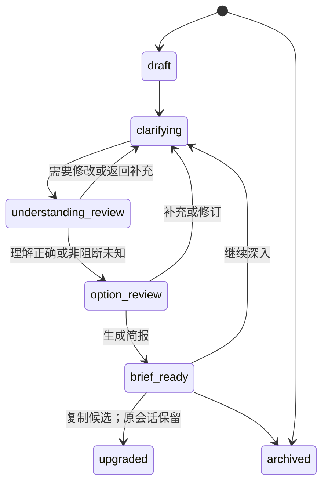

状态语义：

- `draft`：只有原始输入，尚未形成分析结论；
- `clarifying`：正在追问和补充覆盖槽位；
- `understanding_review`：等待用户检查当前理解；
- `option_review`：比较方案、难度和边界；
- `brief_ready`：已形成可使用或带缺口的需求简报；
- `upgraded`：已创建正式项目，但快速问诊记录仍可查看；
- `archived`：用户结束使用，不等同于删除。

约束：

- `understanding_review` 的"理解正确"只表示当前摘要符合用户表达，不产生正式 ReviewAction，不等于正式审批、已接受需求或需求基线；
- `brief_ready` 不是不可逆的"完成"终点，用户可以继续补充并产生新版本；
- `upgraded` 后快速会话与正式项目通过只读来源关系关联，二者后续版本分别演化；
- 快速问诊状态不得映射为正式项目状态或训练状态。

### 12.2 正式项目状态机（高级模式，P1）

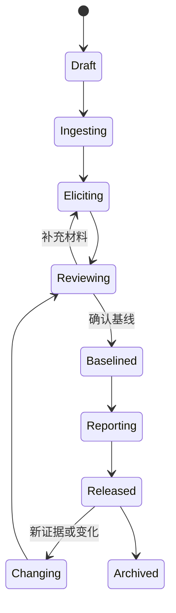

约束：

- DomainProfile 候选、审核和专业包激活发生在 Draft 内，不额外制造与业务阶段竞争的项目状态；
- 只有人工确认可以从 Reviewing 进入 Baselined；
- 存在 Blocking Conflict 时禁止进入 Baselined；
- Released 后变化必须产生新版本；
- 变更预演是只读场景视图，不是项目状态；预演结束仍为 Released；
- Archived 项目默认只读。

### 12.3 表达训练状态机（试验模式，P2）

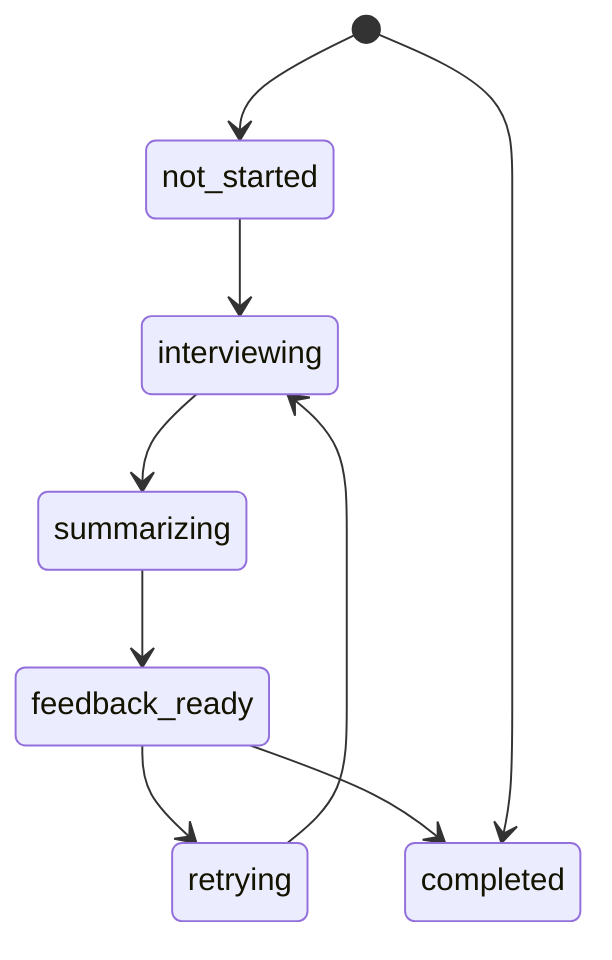

约束：

- 训练状态不得映射为正式项目状态，也不得产生正式 Fact、Requirement、Decision 或 ReviewAction；
- `feedback_ready` 后允许重新练习，保留旧反馈；
- `completed` 不代表权威能力认证。

### 12.4 需求状态（仅正式项目）

```text
candidate
→ supported
→ reviewed
→ accepted
→ implemented
→ verified
→ superseded
→ retired
```

允许回退：

- `supported → candidate`：证据失效；
- `reviewed → supported`：评审要求补充；
- `accepted → superseded`：被新需求替代；
- `implemented → accepted`：实现被回滚但需求仍有效。

AI 不能执行 `reviewed → accepted`。

### 12.5 AI Job 状态

```text
queued
→ running
→ validating
→ succeeded

running
→ retry_wait
→ running

running / validating
→ failed
→ manual_review

queued / running / retry_wait / manual_review
→ cancelled
```

服务重启时，超过锁定时限的 Running Job 回到 Retry Wait，并增加尝试计数。`cancelled` 只表示停止未完成工作，不回滚已经提交的领域事务；进入 `manual_review` 后必须由人工选择重试、接受已有结果或取消。

---

## 13. 质量保证架构

### 13.1 七道发布门禁

| 门禁 | 必须满足 |
|---|---|
| G0 领域适配 | DomainProfile 已确认；Pack ID/版本有效；组合无阻断冲突；所有适用校验器已运行 |
| G1 证据 | 正式事实有精确引用；无来源事实为 0 |
| G2 认识状态 | Fact/Inference/Assumption/Proposal 不混淆 |
| G3 Driver | 需求连接已确认 Driver，或有经批准的显式例外 |
| G4 交付 | Now 需求有验收、边界、优先级和责任人 |
| G5 变化 | 有稳定性、触发、影响、迁移和可逆性 |
| G6 报告 | 报告不新增事实，数字/状态/引用全部回查 |

### 13.2 质量目标

当前可设为硬目标：

```text
已接受事实的引用可定位率 = 100%
正式报告无来源事实 = 0
报告中不存在领域模型外的新事实 = 0
模型调用可追踪率 = 100%
报告快照可关联数据版本率 = 100%
报告快照可关联领域画像及专业包版本率 = 100%
```

暂不设置虚假的“需求完整度 100%”。完整性只能表达为“在当前已知范围内”，并必须展示 Unknown 和 Open Question。

### 13.3 Pro 审计输出

Pro 发布前只返回缺陷列表：

```json
{
  "unsupported_claims": [],
  "missing_outcomes": [],
  "unresolved_conflicts": [],
  "weak_acceptance_criteria": [],
  "hidden_assumptions": [],
  "future_overengineering": [],
  "change_path_gaps": [],
  "governance_risks": []
}
```

Pro 不直接重写正式报告，避免审计阶段引入未经确认的新事实。

### 13.4 无多 Agent 时的质量来源

```text
证据约束
+ Flash/Pro 能力差异
+ 固定任务边界
+ 确定性规则
+ 公共回归集
+ 私有真实反馈
+ 最小人工确认
```

多 Agent 是任务组织方式，不是正确性证明。

---

### 13.5 产品假设验证方案

执行摘要 §0.5 和 ADR §22 中标记为 `[H]` 或 Trial 的假设，必须在进入相应真实链路开发或扩大试点前通过形成性评估验证。以下为每个假设定义验证方法、通过线和判定逻辑。

### 13.5.0 形成性评估协议（对齐 PRD §12.4）

本节为所有假设验证的共同协议，与 PRD §12.4 保持一致：

- 每种进入试验的模式首轮至少招募 8 名目标或相邻用户；
- 记录用户背景、任务完成、用时、误操作、口头理解、输出修改量和实际用途；
- 预先固定任务和评分量表，不因结果不好临时删除失败样本；
- 快速问诊优先测试非专业用户，正式模式优先测试有项目责任经验的用户；
- 训练模式同时需要学习者和具备需求分析经验的人工复核者；
- 未达到目标时先调整定位、问题顺序和交互，不以增加文档长度替代可用性改进。

评估结果写入 ADR：通过 → 对应 ADR 从 Trial 晋级为 Accepted；不通过 → 改为 Deprecated 或 Superseded，并记录替代方案。

### 13.5.1 H1：七阶段是否易懂（仅正式项目）

**假设**：用户能够理解七个章节的信息架构，按顺序完成正式项目流程。

**验证时机**：演示链路验收前，使用 Aster 案例。

| 指标 | 方法 | 通过线 |
|---|---|---|
| 关键任务完成率 | 固定任务：从功能请求识别目标、判断事实/推断、处理冲突、确认范围、定位报告证据 | ≥80% |
| 阶段理解度 | 任务后访谈：能否用自己的话解释每个阶段做了什么 | ≥6/7 阶段理解正确 |
| 误操作率 | 记录用户是否在错误阶段尝试操作 | ≤2 次/人 |

**判定**：三项全部通过 → 七阶段从 `[H]` 晋级为 `[E]`。任一不通过 → 修订阶段名称、顺序或说明文案，重新验证。七阶段只约束正式项目模式，不约束快速问诊和训练。

### 13.5.2 H2：三关口是否以可接受成本减少错误（仅正式项目）

**假设**：三个人工关口（目标确认、证据与冲突确认、范围确认）能减少错误决策，且人力成本可接受。

**验证时机**：演示链路可用性测试先验证，真实 HTTP 试点后补充真实项目数据。

| 指标 | 方法 | 通过线 |
|---|---|---|
| 关口修改量 | 每个关口有多少比例的用户选择了"修改"或"不确定" | ≥20% 的用户至少修改一次 |
| 关口跳过意愿 | 用户是否表示"想跳过某关口" | ≤30% 用户有此意愿 |
| 关口耗时 | 每个关口平均耗时 | ≤2 分钟/关口 |
| 误确认率 | 确认后用户是否发现错误 | ≤10% |

**判定**：关口修改量 > 0（证明有用）且耗时可接受 → 保留为 `[E]`。关口修改量 = 0（关口形同虚设）→ 减少关口数量或调整内容。三关口只约束正式项目。

### 13.5.3 H3：Flash/Pro 路由是否有效

**假设**：Flash 处理低风险、Pro 处理高风险的路由策略，能在控制成本的同时保证质量。

**验证时机**：真实 HTTP 试点，需真实模型调用。

| 指标 | 方法 | 通过线 |
|---|---|---|
| 路由准确率 | 人工标注 30 个任务的风险等级，对比系统路由 | ≥85% 一致 |
| Pro 升级回报 | 对比 Pro 审核后发现的缺陷 vs Flash 未发现的 | Pro 发现 ≥1 个 Flash 遗漏的严重缺陷 |
| 成本比 | Flash 任务数 / Pro 任务数 | ≥3:1 |

**判定**：三项全部达标 → 从 Trial 晋级为 Accepted。Pro 没有发现额外缺陷 → 取消 Pro 路由，全部用 Flash。

### 13.5.4 H4：专业访谈式交互是否提升理解

**假设**：以专业访谈风格（首字母头像 + 角色标签 + 结构化对话 + 证据来源链接 + 追问建议）呈现 AI 对话，比传统表单/列表更能帮助用户理解需求，同时保持企业产品所需的专业感。

**验证时机**：演示链路验收前。

| 指标 | 方法 | 通过线 |
|---|---|---|
| 角色识别准确率 | 任务后请用户说出 6 个利益相关者及其立场 | ≥4/6 正确 |
| 专业感评分 | 5 点 Likert 量表："界面风格适合企业使用" | 均值 ≥3.5 |
| 信息密度评分 | 5 点 Likert 量表："我能快速定位关键信息" | 均值 ≥3.5 |
| 分心度 | 用户是否被动画/视觉效果分散注意力 | ≤20% 用户报告分心 |

**判定**：专业感和信息密度达标且不分心 → 保留当前专业访谈风格。用户觉得信息过载或缺乏引导 → 调整信息密度、视觉层次或追问建议呈现方式。本假设替代了原"游戏对话式交互"假设（已随 FSD 重设计废弃）。

### 13.5.5 H5：领域画像机制是否有效

**假设**：AI 自动识别项目形态（软件交付/政策/科研等）并加载对应领域配置，能提升分析质量。

**验证时机**：真实 HTTP 试点，需足够真实项目数据。

| 指标 | 方法 | 通过线 |
|---|---|---|
| 工作类型识别准确率 | 用 20 个真实项目描述测试 | ≥80% |
| 安全回退率 | 未知主题是否正确回退到 `general` | 100% |
| 专业包增量价值 | 加载 software-delivery 包后是否比 general 多发现关键问题 | ≥1 个领域特有缺陷 |

**判定**：真实 HTTP 试点后期收集足够数据后判定。当前演示链路使用静态 `software-delivery` 配置，不验证此假设。

### 13.5.6 H6：12 章 Demo 投影是否合理

**假设**：将 15 个内容块组合为 12 章 PDF 的映射能满足用户需求。

**验证时机**：演示链路验收前。

| 指标 | 方法 | 通过线 |
|---|---|---|
| 章节定位速度 | 用户能否在 30 秒内找到指定内容（如"证据追踪"） | ≥80% |
| 章节必要性 | 用户认为哪些章节不需要 | ≤2 章被标记为"不需要" |

**判定**：Demo 可用性测试中直接观察，根据反馈调整章节映射。本假设仅约束 Aster 正式项目案例；快速问诊不输出 12 章 PDF。

### 13.5.7 H7：快速问诊是否减少返工

**假设**：五步快速问诊流程能帮助普通用户把模糊想法转化为可用于沟通的需求简报，并减少后续与客户、开发者或 AI 工具沟通时的返工。

**验证时机**：真实 HTTP 试点（快速问诊里程碑），需真实快速问诊会话数据。

| 指标 | 方法 | 通过线 |
|---|---|---|
| 简报可直接使用率 | 用户反馈简报经过少量修改即可用于沟通 | ≥70% |
| 返工减少自评 | 用户对比过往经验，反馈返工是否减少 | ≥60% 认为减少 |
| 目标/方案区分正确率 | 用户能解释想取得的结果与具体功能的区别 | ≥80% |
| 重大未知识别率 | 用户能定位简报中的关键待确认项 | ≥80% |

**判定**：四项全部达标 → 快速问诊五步流程从 `[H]` 晋级为 `[E]`。任一不达标 → 调整问题顺序、覆盖槽位或简报投影，重新验证。

### 13.5.8 H8：训练模式是否促进能力迁移

**假设**：表达训练通过角色扮演和反馈，能帮助用户把在训练中学到的追问、总结和检查能力迁移到不同案例或真实场景。

**验证时机**：真实 HTTP 试点（表达训练里程碑），需版本化训练案例和后续 Attempt 数据。

| 指标 | 方法 | 通过线 |
|---|---|---|
| 同类案例覆盖提升 | 同一用户后续 Attempt 的固定量表得分减首次得分 | 平均提升 ≥10% |
| 无依据假设减少 | 用户总结中的无依据假设是否随练习减少 | ≥30% 用户明显减少 |
| 评分可理解性 | 用户是否理解评分原因 | ≥80% 用户能解释 |
| 跨案例迁移 | 用户是否能将改进迁移到不同案例 | ≥50% 用户展现迁移 |

**判定**：四项全部达标 → 训练模式从 `[H]` 晋级为 `[E]`。覆盖提升不足 → 调整案例难度梯度、披露规则或反馈结构。

### 13.5.9 H9：普通用户是否理解"想法—目标—需求—方案"的区别

**假设**：普通用户（非技术背景）能够通过快速问诊理解"我有一个想法"、"我真正想实现什么目标"、"我需要什么需求"和"我选择了什么方案"之间的区别。

**验证时机**：演示链路可用性测试，使用 AI 海报案例。

| 指标 | 方法 | 通过线 |
|---|---|---|
| 概念区分准确率 | 任务后请用户用自己的话区分想法、目标、需求和方案 | ≥70% 正确 |
| 简报结构识别 | 用户能否在简报中正确定位目标、需求和方案部分 | ≥80% |
| 误把方案当目标 | 用户是否把具体功能误当成目标 | ≤20% 误判 |

**判定**：三项全部达标 → 默认界面使用自然语言不暴露内部术语的策略有效。误判率过高 → 调整追问措辞、理解确认呈现或简报结构。

### 13.5.10 验证优先级与时机

```
演示链路验收前：
  H1 七阶段可理解性（仅正式项目）  ← 最高优先级，决定正式项目信息架构
  H4 专业访谈式交互              ← 决定前端设计方向
  H6 12 章投影（仅正式项目）       ← 决定报告结构
  H9 概念区分（快速问诊）          ← 决定默认界面措辞

真实 HTTP 试点后（有真实调用）：
  H3 Flash/Pro 路由               ← 决定成本和质量平衡
  H2 三关口成本收益（仅正式项目）   ← 需要真实项目数据
  H5 领域画像                     ← 需要多领域真实项目
  H7 快速问诊减少返工             ← 需要真实快速问诊会话
  H8 训练模式能力迁移             ← 需要版本化训练案例和后续 Attempt
```

---

## 14. 数据集与评估架构

### 14.1 四区隔离

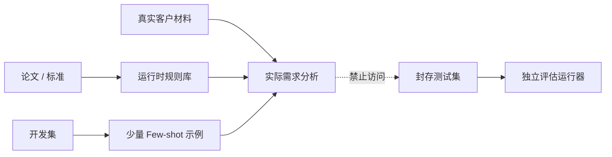

| 区域 | 用途 | 是否进入运行时 |
|---|---|---:|
| 规则知识 | 方法、分类、质量准则、追问策略 | 是 |
| 开发集 | Prompt、Schema、Few-shot 和路由开发 | 少量可以 |
| 封存测试集 | 发布回归和模型比较 | 不可以 |
| 生产数据 | 当前客户事实和使用反馈 | 是，仅限当前项目权限 |

用于最终评估的数据不能同时用于 Prompt 开发或 Few-shot，否则测试成绩失去意义。

### 14.1.1 真实 HTTP 试点评估最小集

真实 HTTP 试点中的 2-3 人团队不建设五模型配置对照和跨领域完整评估矩阵。当前只维护以下评估基础设施：

- 30–50 个固定回归案例，覆盖证据引用、Driver 识别、冲突、范围、变化和报告门禁；
- Flash-only 和 Flash→Pro 两种配置对照（不运行 Pro-only 和输入隔离复核的独立评估）；
- 按领域、风险、材料长度分层报告，不做全领域普遍化结论；
- 公共测试包只用于开发参考，不作为封存评估集（封存评估集使用 §14.4 的拆分原则逐步建立私有中文数据集）；
- 跨领域评估矩阵（§14.7）在阶段 C 触发条件成立后建设。

回归案例用于每次 Prompt、Schema 或路由变更后的自动化回归，不代表跨领域普遍有效。完整评估基础设施在阶段 C 触发条件成立后按 §14.7 的矩阵扩展。

### 14.2 公共测试包

| 数据集 | 主要用途 | 限制 |
|---|---|---|
| [PURE](https://zenodo.org/records/1414117) | 长文档解析、结构、引用和需求识别 | 大量内容无任务金标 |
| [PROMISE+](https://zenodo.org/records/12805484) | FR/NFR 和类别分类 | 不能评价成果、完整性和报告价值 |
| [QuRE](https://zenodo.org/records/16049822) | 工业需求质量缺陷 | 汽车领域偏向，主要是单条需求质量 |
| [LLMREI](https://zenodo.org/records/15016930) | 访谈错误、覆盖和结束行为 | 场景有限 |
| [RE 2025 追问工件](https://zenodo.org/records/15678031) | 追问相关性和错误类型 | 不能评价完整报告 |
| [Bristol 访谈](https://research-information.bris.ac.uk/en/datasets/trustworthy-requirements-elicitation-interview-transcripts) | 真实访谈提取和信任相关需求 | 没有唯一正确报告 |
| [StorySeek](https://huggingface.co/datasets/SoftACE/StorySeek) | 目标—角色—影响—用户故事 | 半自动构建 |
| [追踪分类数据](https://zenodo.org/record/7867845) | eTour、iTrust、SMOS、eAnci、LibEST 追踪/分类 | 多数项目较旧 |
| [ALICE](https://link.springer.com/article/10.1007/s10515-024-00452-x) | 受控自然语言显式矛盾 | 不覆盖自由文本隐含冲突 |

### 14.3 数据集具体用途

| 数据集 | 开发参考 | 封存测试 | 运行时使用 |
|---|---:|---:|---|
| PURE | 部分 | 部分完整文档 | 不作为客户业务知识 |
| PROMISE+ | 部分类别示例 | 按项目封存 | 仅少量 Few-shot |
| QuRE | 部分缺陷示例 | 大部分封存 | 使用缺陷分类规则，不检索全部案例 |
| LLMREI | 部分访谈模式 | 完整会话测试 | 使用访谈错误分类 |
| RE 2025 追问 | 少量追问示例 | 独立场景 | 使用追问方法 |
| Bristol | 极少量开发样本 | 尽量封存 | 不作为通用业务知识 |
| 追踪数据 | 部分项目 | 按完整项目封存 | 不直接给客户项目检索 |
| ALICE | 使用矛盾分类方法 | 封存需求对 | 使用形式规则，不使用测试答案 |

### 14.4 拆分原则

- 按项目、来源或领域拆分，不能只随机拆句子；
- 开发、验证和封存测试集版本固定并计算哈希；
- 封存集默认不在生产应用中加载；
- 公共数据可能已被模型训练看到，成绩只能作为能力检查；
- 必须逐步建立未公开的中文私有测试集；
- 直接翻译英文数据不能替代中文歧义、指代和组织语境测试。

### 14.5 基线与模型配置对照

每次模型、Prompt、规则或路由重大变更，至少比较：

```text
规则/模板基线（无 LLM）
Flash-only
Pro-only
Flash → Pro 审核
Flash / Pro 输入隔离复核（Trial）
```

统一记录：

- Precision、Recall、F1；
- 引用正确率和事实覆盖率；
- 无来源事实；
- 漏检、误报和拒答；
- 跨重复运行稳定性；
- 延迟、token 和费用；
- 人工修改量；
- 对下游决策或交付任务的帮助。

### 14.6 任务指标

| 任务 | 指标 |
|---|---|
| FR/NFR 分类（软件包） | Macro-F1、各类别 Recall |
| 质量缺陷 | Precision、Recall、每百条误报数 |
| 事实提取 | 引用正确率、事实覆盖率、无来源事实 |
| 矛盾 | Precision、Recall、严重冲突漏检数 |
| 追踪 | Recall@K、MAP、错误链接数 |
| 追问 | 关键未知覆盖、重复率、诱导问题率 |
| 领域画像 | Work Type 准确率、风险标记 Recall、路由风险分层校准、应升级人工但未升级数 |
| 专业包路由 | 正确包 Recall、错误激活率、未知主题安全回退率、包组合冲突漏检数 |
| 专业包内容 | 必问项覆盖、扩展 Schema 合法率、领域校验器通过/阻断正确率 |
| 报告 | 引用一致、状态一致、未决事项保留 |
| 最终有用性 | 澄清轮次、修改量、决策完成率、返工 |

### 14.7 跨领域评估矩阵

真实 HTTP 试点的发布门禁只要求 `general` 与静态 `software-delivery` 完整回归；其他形态使用少量安全回退用例，验证不会伪装成已完成专业分析。只有某领域进入正式支持范围后，才要求该领域完整回归：

| 项目形态 | 最小测试重点 |
|---|---|
| 通用/未知主题 | 不误配专业包；能够安全回退；Unknown 被保留 |
| 软件交付 | 接口、数据、质量属性、测试和运行观测完整 |
| 政策制度 | 依据、适用对象、执行、例外、申诉和效果评价完整 |
| 科研 | 问题、假设、方法、数据、伦理、有效性和复现完整 |
| 工程建设 | 规范、安全、接口、检查、移交和验收完整 |
| 服务流程 | 服务旅程、角色交接、SLA、异常和运营指标完整 |
| 采购 | 评价准则、合同交付物、验收、供应风险和退出安排完整 |
| 混合高风险 | 多包组合、规则冲突、人工升级和报告边界正确 |

评估必须同时覆盖：明确主题、含糊主题、错误自述领域、一个项目多工作形态、项目中途换领域、缺少专业包以及恶意提示注入。分类任务优先使用确定性金标；生成任务使用固定量表、领域专家抽检和报告快照差异，不以另一个模型的单次评分作为唯一结论。

### 14.8 私有反馈候选与金标治理

以下产品操作只能形成“反馈候选”，不能直接成为金标：

```text
接受
拒绝
修改
标为假设
标为无证据
确认冲突
请求补充
调整 Now/Next/Later/Watch
```

保留一部分未进入 Prompt/Few-shot 的案例作为私有封存集。禁止为了提高测试分数把封存答案放回系统提示词。

进入封存评估集前必须：

1. 去标识化并确认合法使用范围；
2. 由两名具备任务知识的标注者按固定量表独立标注；资源不足时至少由一人标注、一名责任人复核；
3. 记录分歧、仲裁结果、标注指南版本和来源；
4. 计算适合任务的标注者一致性，低一致性任务不得宣称存在唯一正确答案；
5. 以项目/来源/领域为单位封存，防止相邻句泄漏到开发集。

### 14.9 暂不微调

原因：

- 真实高质量数据不足；
- 数据分布和需求任务差异大；
- DeepSeek 模型迭代快；
- Prompt、规则和流程问题容易被误认为模型问题；
- 微调会增加数据治理、回归和部署负担。

只有当积累了稳定、合法、代表目标用户且经过人工确认的数据，并证明 Prompt/规则/检索无法达到要求时再评估微调。

### 14.10 统计与报告协议

- 真实 HTTP 试点先维护 30–50 个高价值固定案例，覆盖证据引用、Driver 识别、冲突、范围、变化和报告门禁；这用于回归，不代表跨领域普遍有效；
- 对存在随机性的模型任务每个案例重复运行，保存随机参数、模型修订和失败样本；主结果同时报告单次任务质量与跨运行稳定性；
- 比较使用相同案例的配对设计，报告样本量、均值/中位数、95% 置信区间和适合指标的效果量，不只报告“提升百分比”；
- 分类/抽取报告 Precision、Recall、F1 和每百项严重错误；生成/访谈任务使用固定量表、双人标注和分歧仲裁；
- 按领域、风险、材料长度和错误类型分层，不用总体平均掩盖高风险失败；
- 预先定义阻断失败：无来源事实、越权批准、未同意协议却发起真实 AI 调用、阻断冲突漏检、历史快照被覆盖；任何一次出现都阻止发布；
- 完整保存基线配置、模型/Prompt/Schema 版本、原始预测、人工标签和分析脚本，允许复现结论。

---

## 15. 报告架构

本章保留报告架构，正式项目报告内容契约见 PRD §6.5，报告编译规则见 PRD §6.6；快速问诊简报契约见 PRD §5.6。

### 15.1 一份真相，通用视图与领域扩展

所有报告来自同一版本化核心领域模型。受众视图回答“谁用报告做什么决定”，专业包视图回答“该项目形态还必须检查什么”，两者可以组合但不能产生第二份事实源。

通用受众视图：

| 受众 | 默认内容 | 主要决策 |
|---|---|---|
| 管理层 | 目标、价值、选项、投入、风险 | 是否做、何时做 |
| 项目/业务 | Job、Outcome、范围、路线、冲突 | 做什么、不做什么 |
| 交付/执行 | 场景、规则、异常、评价标准、依赖 | 如何执行和证明 |
| 治理/合规 | 来源、权限、控制、责任、保留 | 如何持续合规和追责 |

专业包可增加但不能强制所有项目出现的视图：

| 专业包 | 扩展视图示例 |
|---|---|
| 软件交付 | 架构驱动、接口、数据、测试、部署和运行观测 |
| 政策制度 | 依据、对象、权责、执行、例外、申诉和政策评价 |
| 科研 | 研究问题、方法、数据、伦理、有效性和复现 |
| 工程建设 | 规范、安全、专业接口、检查、移交和验收 |
| 服务流程 | 服务旅程、SLA、SOP、培训、异常和运营指标 |
| 采购 | 评价准则、合同交付物、验收、供应风险和退出 |

纯前端 Demo 可以继续使用管理层、产品/业务、架构、研发/测试、合规/运营五个标签，因为当前 Aster 案例激活 `software-delivery` 包；这不是所有主题的固定报告结构。

### 15.2 报告契约边界

面向用户的报告内容块、章节组合、缺失内容表现和验收条件以 PRD §6.5、§6.6、§11 为准。报告编译器只接收版本化 `ReportInput`，至少固定 `baseline_id`、`data_hash`、`template_version`、`core_schema_version`、`domain_profile_id/version`、领域配置版本、受众和语言。`ReportInput` 的 Schema 哈希随快照保存；模板或领域配置不能绕过该接口直接查询未入基线的候选数据。

### 15.3 编译规则

- 先执行确定性查询，再允许模型组织语言；
- 模型不得创建数据库外事实；
- 所有数字从结构化字段渲染；
- 所有引用从 EvidenceSpan 渲染；
- 所有状态、责任人和时间从命令指定的已批准基线快照读取；
- 存在阻断冲突时只能生成 Draft，不得标记 Confirmed；
- 报告携带 `data_hash`、`template_version`、`generated_at`、`report_input_schema_hash` 和 `compiler_version`；
- 报告携带 `domain_profile_id/version` 和领域配置版本清单；
- 使用模型组织语言时报告记录实际 `prompt_versions` 和 `model_versions`；未使用模型时保存空集合；
- 专业包章节只能读取对应版本验证通过的扩展字段；未启用专业包时显示适用范围声明，不生成伪专业结论；
- 版本更新生成差异报告，不覆盖旧文件。

---

## 16. API 与应用契约

本章只维护服务边界和端点目录。字段、鉴权、幂等、并发、错误响应和状态码以 [API 设计](./03-api-design.md) 为唯一维护来源。

### 16.1 主要 API

```text
POST   /api/projects
GET    /api/projects/:id
PATCH  /api/projects/:id
DELETE /api/projects/:id
GET    /api/delete-tasks/:id
POST   /api/projects/:id/intakes
GET    /api/projects/:id/members
POST   /api/projects/:id/members
PATCH  /api/projects/:id/members/:userId

POST   /api/projects/:id/analysis-runs  # task=domain_profile；实际根路径 /api/v1
GET    /api/projects/:id/domain-profile
POST   /api/projects/:id/domain-profile/reviews
GET    /api/domain-packs
GET    /api/domain-packs/:id/versions/:version
POST   /api/projects/:id/domain-packs/:packId/activations
POST   /api/projects/:id/domain-packs/:packId/deactivation-previews
POST   /api/projects/:id/domain-packs/:packId/deactivations

POST   /api/projects/:id/sources
GET    /api/projects/:id/sources
GET    /api/evidence/:id

POST   /api/projects/:id/analysis-runs
GET    /api/ai-jobs/:id
POST   /api/ai-jobs/:id/cancel

POST   /api/guest-sessions
GET    /api/guest-sessions/current
GET    /api/agreements/active
POST   /api/agreements/:versionId/accept
POST   /api/agreements/:versionId/reaccept
POST   /api/agreements/consents/:id/withdraw

POST   /api/quick-sessions
GET    /api/quick-sessions/:id
POST   /api/quick-sessions/:id/claim
POST   /api/quick-sessions/:id/messages
POST   /api/quick-sessions/:id/understanding-review
POST   /api/quick-sessions/:id/briefs
DELETE /api/quick-sessions/:id

GET    /api/training-cases
POST   /api/training-attempts
POST   /api/training-attempts/:id/questions
POST   /api/events

GET    /api/projects/:id/outcomes
PATCH  /api/outcomes/:id
GET    /api/projects/:id/drivers
POST   /api/projects/:id/drivers
PATCH  /api/drivers/:id
GET    /api/projects/:id/requirements
PATCH  /api/requirements/:id
GET    /api/requirements/:id/acceptance-criteria
POST   /api/requirements/:id/acceptance-criteria
POST   /api/requirements/:id/verification-artifacts
GET    /api/requirements/:id/operational-signals
GET    /api/projects/:id/future-scenarios
POST   /api/projects/:id/future-scenarios
PATCH  /api/future-scenarios/:id

POST   /api/outcomes/:id/reviews
POST   /api/drivers/:id/reviews
POST   /api/requirements/:id/reviews
POST   /api/conflicts/:id/reviews
POST   /api/projects/:id/gates/:gate/reviews
GET    /api/projects/:id/conflicts
POST   /api/conflicts/:id/resolve
POST   /api/projects/:id/baselines
POST   /api/baselines/:id/approve

POST   /api/projects/:id/change-previews
GET    /api/change-previews/:id/impact
POST   /api/projects/:id/changes
GET    /api/changes/:id/impact
POST   /api/changes/:id/confirm
POST   /api/changes/:id/withdraw

POST   /api/projects/:id/reports
GET    /api/reports/:id
POST   /api/reports/:id/releases
GET    /api/reports/:id/file

```

### 16.2 异步交互

长 AI 任务：

1. API 创建 Job 并立即返回 Job ID；
2. Worker 从 SQLite 领取；
3. v1 页面使用有限频率轮询获取状态；
4. 完成后页面拉取结构化结果；
5. 刷新页面不会丢失任务；
6. 重复提交使用幂等键避免重复费用。

SSE 只有在轮询成为实测瓶颈且补齐持久化事件 ID、顺序、保留期和断线恢复契约后才引入。

### 16.3 错误契约

错误必须区分：

```text
VALIDATION_ERROR
EVIDENCE_NOT_FOUND
MODEL_SCHEMA_ERROR
MODEL_RATE_LIMITED
MODEL_UNAVAILABLE
TOKEN_BUDGET_EXCEEDED
SENSITIVE_DATA_BLOCKED
AUTHENTICATION_REQUIRED
FORBIDDEN
VERSION_CONFLICT
IDEMPOTENCY_CONFLICT
BLOCKING_CONFLICT
REPORT_GATE_FAILED
JOB_RETRY_EXHAUSTED
```

不能向用户统一显示“AI 失败，请重试”，否则无法判断是数据、规则、模型还是责任问题。

---

## 17. 安全、隐私与治理

本章保留安全治理架构，身份与权限的分阶段需求见 PRD §10。

### 17.1 信任边界

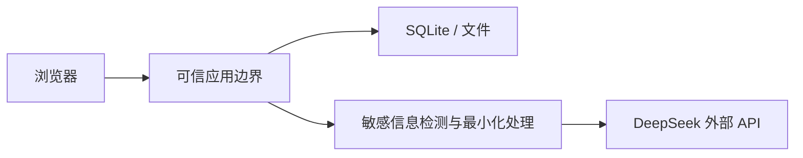

DeepSeek 被视为外部数据处理方，不属于本地可信存储边界。

### 17.2 云端 AI 调用与数据最小化

用户同意有效协议后，产品默认允许按协议将完成任务所需内容发送给云端 AI（PRD §10、PD-003）。产品不提供“禁止出站”“仅脱敏后发送”等额外选择，也不在 Source 或 Project 上维护出站策略字段。服务端统一执行以下不可配置的安全措施：

- 发送前检测 API Key、密码、私钥、访问令牌和证件号等高风险内容；命中时只移除或掩码命中值，并向用户说明该片段未发送，不能通过界面关闭检测；
- 姓名、电话、邮箱等个人数据按协议和实现规则进行必要处理，不暴露为项目级配置；
- 只选择完成当前任务所需的最小片段，不将整个项目无差别塞入模型上下文；
- 保存实际发送内容的哈希、模型调用状态和必要审计信息，不保存秘密明文；
- 未同意、同意已撤回或重大协议版本尚未重新同意时，不得创建新的外部模型调用；
- 用户仍应确认其有权提交访谈和材料，协议同意不能替代来源合法性责任。

### 17.3 凭据

- DeepSeek API Key 只存在服务端密钥环境；
- 不写入前端、SQLite、源代码或日志；
- 不允许浏览器直接调用模型；
- 支持轮换和失效；
- 日志中的请求头必须脱敏。

### 17.4 身份、成员与授权

- 演示链路只使用虚构数据和本地进度；可以演示登录和游客界面状态，但它们不签发真实 Cookie/令牌，不得显示或叙述为已完成真实身份认证；
- 真实项目 API 需要身份认证，项目访问还需有效 `project_members` 关系；本地 demo 可使用受控 guest bridge，但不得作为生产策略；
- 最小角色为 `Owner`、`Editor`、`Reviewer`、`Viewer`、`Exporter`。一个成员可拥有多个能力，授权按命令检查，不能只依赖页面按钮隐藏；
- `Owner` 管理成员；`Editor` 编辑项目内容；`Reviewer` 执行人工关口；`Viewer` 只读；`Exporter` 生成或下载导出物；敏感信息检测和最小化处理不是角色可配置项；
- 单用户部署仍创建真实用户和 Reviewer 记录，不能用固定字符串代替审计身份；
- 项目 ID 不构成授权。任何读取、修改、确认、导出和 AI 调用均验证成员能力；越权尝试写入安全审计；
- 未实现租户隔离前不声明多租户能力；外网开放必须使用 HTTPS、可靠会话保护和安全 Cookie。

#### 游客身份与认领（真实 HTTP 链路）

- 游客在同一浏览器中同意协议后，可以完成真实快速问诊、恢复当前会话、复制和下载当前简报，不要求先注册；
- 游客由高熵随机凭证标识；原始凭证只签发一次，服务端只保存 `HMAC-SHA-256(server_pepper, token)` 摘要。认证凭证不得复用为产品埋点会话 ID；清除凭证、换浏览器或换设备后，系统不承诺恢复未绑定账户的游客数据；
- 跨设备历史、长期保存、升级正式项目和团队协作必须登录；正式项目不能归属于游客身份；
- 游客登录后可以认领指定的当前快速问诊会话，而不是整个浏览器游客身份。**认领必须同时验证登录身份和该快速会话所属游客凭证，原子、幂等地保持 `quick_session.id`、版本、问答、简报和协议来源不变，并把保留期切换为账户数据期限**；
- 账户已有其他会话时分别保留，不静默合并内容；
- 认领失败时继续保留游客会话及其凭证，允许安全重试，不得产生半绑定状态；
- 认领只改变指定 `quick_session` 的当前所有者；同一游客身份下其他快速问诊和训练记录不被连带认领；历史协议记录通过 `origin_guest_session_id` 与账户会话关联，但不改写原操作身份。

### 17.5 协议同意记录架构

真实 AI 使用以有效协议同意为前提。架构约束：

- 协议版本必须版本化，标记为"重大更新"或"非重大更新"，并记录生效时间；
- 协议正文属于单独法律任务，本架构不定义具体文本，但协议版本和状态属于产品必需数据，存储在 `agreement_versions` 和 `agreement_consents` 表；
- **首次使用真实 AI 前必须勾选"已阅读并同意服务与数据处理协议"**；未同意时不能提交真实 AI 问诊；
- 用户同意后，系统默认可以按已同意协议调用云端 AI，不再显示额外的数据处理方式选项；
- **重大更新生效后，用户下一次发起新的真实 AI 调用前必须重新同意**；页面保留其输入并说明变化，不得把继续浏览视为同意；
- 非重大更新可以通知用户，既有有效同意继续有效；判断标准和审批责任由法律任务定义，产品不能自行把重大更新降级；
- 重新同意形成新记录，不覆盖旧版本记录，也不追溯改变旧处理行为的合法性状态；
- **撤回后立即阻止新的模型调用，并取消尚未发送给模型供应商的排队任务**；
- 已经发送的进行中调用可能无法撤回。系统必须明确提示，允许其结束并按既定保留策略处理结果，但不得自动发起后续模型调用；
- 撤回同意不等于删除数据。用户需要单独发起删除；删除按照 §9.5 执行；
- 同意记录至少保存协议 ID、版本、适用范围、用户/会话标识、同意时间、撤回时间和同意渠道；
- 游客登录后历史同意记录与账户关联但不改写原操作身份；
- 协议同意/撤回记录默认保留 2 年（法律要求不同则按适用期限）。

### 17.6 日志最小化

- 默认不记录完整原文和模型完整 Prompt；
- 调试日志必须可配置且有保留期；
- 错误日志使用 Evidence ID、Job ID 和 Run ID；
- AI 原始输入输出放在受控审计存储，而不是普通日志；
- 导出报告不包含内部 Prompt 和模型推理内容。

---

## 18. 可靠性、备份与可观测性

### 18.1 初始服务目标

以下目标是真实 HTTP 试点及其后续实现的最低产品验收线，不是对外 SLA。测量必须区分演示、测试、试点和生产环境，并报告样本量与 P50/P75/P95，不能只报告平均值。完整非功能目标以 PRD §11.6 为准。

#### 参考负载

- 快速问诊：初始输入不超过 10,000 字、累计不超过 50 轮问答；
- 正式项目：不超过 50 个材料、2,000 个证据片段、1,000 个结构化分析对象和 15 个报告内容块；
- 超出参考负载时可以进入异步处理，但必须在提交前提示限制，不得静默截断。

#### 质量维度与冻结目标

| 质量维度 | 冻结目标 | 用户可见行为 |
|---|---|---|
| 页面体验 | 核心页面 LCP P75 ≤ 2.5 秒、INP P75 ≤ 200 毫秒、CLS P75 ≤ 0.1 | 超过目标仍可完成操作，不以骨架屏永久替代真实内容 |
| 非 AI 操作 | 保存、切换步骤和查询确认 P95 ≤ 1 秒 | 超过 1 秒显示进行中状态，禁止重复提交 |
| AI 任务反馈 | 提交后 1 秒内返回任务确认，3 秒内显示进度或等待说明 | 可以取消、离开并恢复；不得用伪进度冒充模型已完成 |
| 首份快速简报 | 参考负载下 P50 ≤ 10 秒、P95 ≤ 30 秒 | 超时保留输入和最后稳定结果，允许重试或稍后恢复 |
| 正式报告编译 | 参考负载下 P95 ≤ 60 秒 | 异步展示阶段、失败原因和上次成功版本 |
| 会话恢复 | 应用加载完成后 P95 ≤ 2 秒恢复最后稳定状态 | 恢复失败时不载入其他案例或旧用户数据 |
| 可用性 | 试点月度可用性目标 ≥ 99.5%，排除提前公告的维护窗口 | 故障期间展示状态和恢复动作，不伪装成功 |
| 浏览器与设备 | 支持 Chrome、Edge、Firefox、Safari 最近两个主版本，以及当前主流 iOS Safari、Android Chrome；最小 390 CSS px | 不支持环境明确提示；手机可完成快速问诊主路径 |
| 无障碍 | 以 WCAG 2.2 AA 为发布目标 | 键盘、焦点、语义、对比度、错误提示和文本替代通过自动与人工检查 |
| 预算或限额 | 每个环境可配置模型调用上限 | 达到上限时保留工作并明确说明，不能静默降级为模拟结果或产生未授权费用 |

#### 基础服务指标

| 指标 | 当前目标 |
|---|---|
| 已接受事实引用可定位 | 100% |
| 模型调用可追踪 | 100% |
| 报告快照可关联数据版本 | 100% |
| 报告快照可关联领域画像及专业包版本 | 100% |
| AI Job 服务重启可恢复 | 是 |
| 数据备份 | 每日 |
| 初始 RPO | 不超过 24 小时 |
| 初始 RTO | 不超过 4 小时 |
| UI 长任务阻塞 | 不允许 |
| 项目 token 预算 | 可配置 |

页面性能按真实用户监测的 P75 判断；AI 和报告时延按服务端已完成任务的 P50/P95 判断，同时单独报告超时和失败率。合成测试用于回归，不能替代真实用户数据。真实 HTTP 试点样本不足时以受控参考负载测试准入，并在样本充分后切换为真实用户指标。

RPO/RTO 是当前建议值，应在真实风险和成本评估后调整。

### 18.2 备份

备份必须包含：

- SQLite 一致性快照；
- 原始来源文件；
- 导出报告；
- Prompt、Schema 和模板版本；
- 必要配置，不包含明文 API Key。

恢复演练检查：

- 数据库能打开并通过完整性检查；
- 原始文件哈希一致；
- TraceLink 未断裂；
- 报告快照能定位到数据版本；
- Pending/Retry Job 能安全恢复或取消。

### 18.3 可观测性

#### 系统运行指标

最少指标：

```text
ai_job_total{task,status,model}
ai_job_duration
ai_input_tokens / ai_output_tokens
ai_cost_by_project
schema_failure_total
evidence_validation_failure_total
unsupported_claim_total
human_accept / reject / modify
report_gate_failure_total
backup_last_success
```

结构化日志必须包含：`project_id`、`job_id`、`run_id`、`task_type`、`model`、`prompt_version`，但不能包含敏感原文。

#### 产品埋点契约

埋点用于验证产品流程和假设，不作为业务事实、需求证据、员工绩效或训练认证依据。业务审计日志与产品分析事件必须分开存储和授权。完整埋点契约以 PRD §12.5 为准。

**公共事件字段**：

| 字段 | 必填 | 说明 |
|---|---:|---|
| `event_id` | 是 | 客户端或服务端生成的唯一事件 ID，用于去重 |
| `event_name` | 是 | 来自注册表的稳定名称 |
| `event_schema_version` | 是 | 事件字段契约版本 |
| `occurred_at` | 是 | UTC 事件发生时间 |
| `received_at` | 真实 HTTP 链路起 | 服务端接收时间，用于识别离线补发和时钟异常 |
| `environment` | 是 | `demo`、`development`、`test`、`pilot`、`production` |
| `app_version` | 是 | 产生事件的应用版本 |
| `mode` | 是 | `quick`、`formal`、`training`；起始页事件可为 `entry` |
| `source_kind` | 是 | `custom`、`sample`、`training_fixture`、`internal_test` |
| `analytics_session_id` | 是 | 对应 PRD 逻辑字段 `session_key` 的非秘密分析会话 ID；不得使用游客认证凭证 |
| `actor_key` | 否 | 匿名或假名化用户键；不得使用邮箱、电话或姓名 |
| `stage` | 否 | 当前业务步骤或正式项目章节 |
| `experiment_id` | 否 | 产品实验标识；没有实验时不传 |

**禁止字段**：任何事件都不得包含原始需求文本、用户回答正文、材料片段、文件名、Prompt、模型完整输入输出、姓名、邮箱、电话、证件信息或协议正文。需要分析内容质量时使用受控评估集和人工量表。

每个事件还携带受版本化 Schema 约束的 `attributes`。Schema 注册表按 `event_name + event_schema_version` 定义所需字段，例如 `action`、`rating`、`result`、`brief_version`、`elapsed_ms`；未知字段和缺少必填字段都拒绝接收。公共事件结构不得用开放 JSON 绕过禁止字段规则。

**最小事件注册表**（P0/P1/P2 优先级见 PRD §12.5）：

- P0：`mode_selected`、`agreement_action`、`identity_action`、`quick_session_started`、`coverage_slot_changed`、`question_interaction`、`understanding_reviewed`、`topic_change_resolved`、`option_preference_recorded`、`brief_generated`、`brief_viewed`、`brief_exported`、`brief_usefulness_feedback`、`quick_session_abandoned`、`upgrade_result`、`error_presented`、`recovery_action`；
- P1：`formal_stage_entered`、`formal_gate_action`、`report_result`、`change_action`；
- P2：`training_attempt_started`、`training_question_asked`、`training_summary_submitted`、`training_feedback_viewed`、`training_attempt_completed`。

演示链路使用内存或 `localStorage` 本地事件接收器，并允许测试人员导出不含业务正文的事件 JSON；不接入第三方分析平台。真实 HTTP 链路建设服务端事件入口和最小 SQL 报表。

**数据质量规则**：

- `event_id` 全局去重；同一业务命令重试不得重复计入成功指标；
- 事件必须携带 Schema 版本，未知版本进入隔离而不是静默解析；
- Demo、内部测试、样例、自定义真实会话分层统计，默认产品指标排除 `internal_test`；
- 客户端时间与服务端接收时间差异超阈值时标记时钟异常；
- 指标必须同时展示分子、分母、观察窗、样本量和过滤条件；
- 事件 Schema 变更需要兼容期和回归测试，不允许直接复用旧事件名改变语义；
- 埋点失败不得阻断用户主流程，离线补发要去重并设置上限；
- 原始事件和汇总指标分别执行 §9.5 的保留期；撤回同意不新增 AI 事件，删除请求完成后分析系统不得继续保留可关联到该用户的明细事件。

---

## 19. 性能与成本策略

### 19.1 前端预算

- 首屏业务信息优先于非核心动画；
- PixiJS 和大型图谱按需加载；
- 手机端默认降低场景复杂度；
- 动画不得阻塞输入和确认；
- 长列表虚拟化；
- 大关系图分层加载，不一次渲染整个项目。

### 19.2 AI 成本控制

- Flash 作为默认；
- Pro 按风险触发；
- 输入按证据范围最小化；
- 相同任务和输入使用哈希缓存；
- 每项目设置软、硬 token 预算；
- 报告编译不重复分析已确认事实；
- 超预算时优先保留证据提取和关键风险任务，暂停低价值润色。

### 19.3 1M 上下文的使用原则

大上下文用于处理无法安全拆开的长依赖材料，不作为默认记忆机制。即使单次可以容纳整个项目，也必须保留：

- EvidenceSpan；
- 结构化领域模型；
- 版本；
- 人工确认；
- 差异和变化关系。

### 19.4 架构质量属性场景

| 质量属性 | 刺激与环境 | 期望响应 |
|---|---|---|
| 可审计性 | 用户点击报告中的事实 | 定位到原始文件、页码、片段、模型运行和确认记录 |
| 数据完整性 | 模型返回不存在的引用 | 门禁拒绝写入 Fact，并记录失败原因 |
| 可恢复性 | AI 调用期间应用重启 | Job 从持久化状态重试或转人工，不重复产生已提交副作用 |
| 可修改性 | DeepSeek API 或模型名变化 | 只修改 AI Provider/路由适配层，领域模型和报告不变 |
| 可演化性 | 新政策使需求失效 | 创建 Change，沿 TraceLink 输出影响和迁移，不覆盖历史基线 |
| 性能 | Pro 分析耗时较长 | API 立即返回 Job ID，UI 保持可操作并展示可恢复状态 |
| 成本可控 | 项目接近 token 硬预算 | 停止低价值任务，保留关键证据和风险任务，要求确认后继续 |
| 安全性 | 用户材料包含密钥或其他高风险秘密 | 自动移除或掩码命中值，只发送必要片段；记录检测结果但不记录秘密正文 |
| 无障碍 | 用户启用减少动效或只用键盘 | 关闭非核心动画，所有确认和图关系有等价文本操作 |
| 可迁移性 | SQLite 达到并发/高可用边界 | 通过 Repository 和版本化迁移切换 PostgreSQL，不改变业务 ID |

---

## 20. 实施路线

本章实施路线对齐 PRD §14 的里程碑 0–4；阶段准入标准见 PRD §16，形成性评估协议见 §13.5。ADD 通过以下映射说明每个里程碑对应的架构交付物和约束。

### 20.1 里程碑 0：双案例纯前端叙事验证

按 PRD §14.1 与 PRD §16.1 交付：

- 三模式起始页及清晰可用/未开放状态；
- **AI 海报生成网站**快速问诊预生成案例（五步流程、六类覆盖槽位、阻断/非阻断未知、方案比较和概述/详细报告两种投影）；
- **Aster 七阶段正式项目案例**（七阶段、三关口、证据追踪、冲突决策、12 章正式报告和变更预演）；
- 自定义输入只保存本地草稿，不进入任一案例预生成结论；
- 一个轻量可交互表达训练回合，验证"用户追问—提交总结—查看遗漏反馈"核心价值；
- demo 内容来源提示在页面和导出物中可见；
- 桌面、平板和手机主路径，刷新恢复和 Fixture 完整性校验；
- 与真实 HTTP 链路共用方法面的类型化 API Client、Mock Route Registry、MockTransport 和隔离 FixtureRepository；
- Mock handler 的 OpenAPI 契约测试，以及演示链路无外部业务网络请求测试；
- P0 事件契约和本地事件接收器；测试人员可导出不含业务正文的事件 JSON。

架构约束：

- 不调用真实模型、不持有 API Key、不创建生产事实；
- 页面和状态机不直接读取 Fixture；真实 HTTP 链路仅替换 `MockTransport` 为 `HttpTransport`，不重写业务调用面；
- Mock 身份、协议、Job 和删除状态只用于交互演示，不形成真实凭证、法律记录、数据库事务或服务器删除；
- 双案例使用独立数据边界，禁止跨案例引用；
- 通过只证明形成性叙事和交互目标达到预设阈值，不证明模型质量或流程普适性。

### 20.2 里程碑 1：真实快速问诊试点

按 PRD §14.2 与 PRD §16.2 交付：

- 自定义输入创建真实问诊会话；
- 自适应追问、理解确认和待确认项；
- 目标/方案分离和轻量可行性说明；
- 概述和详细报告需求简报；
- **游客真实问诊、登录、会话认领和跨设备账户历史**（架构约束见 §17.4）；
- **协议首次同意、重大更新重新同意、撤回、服务端模型调用、失败恢复和成本记录**（架构约束见 §17.5）；
- 快速/训练数据到期清理、用户删除、临时导出清理和保留状态展示（分层保留策略见 §9.5）；
- §18.1 中适用于快速问诊的性能、兼容性、可用性和无障碍测量；
- P0 服务端事件入口、去重和最小 SQL 指标报表（埋点契约见 §18.3）；
- 用户反馈与形成性评估（协议见 §13.5）。

架构约束：

- 优先验证原始产品价值，不要求同时完成全部正式项目能力；
- 升级操作原子且可安全重试（ADR-022）；
- AI 不能把无来源推测写成用户明确表达。

### 20.3 里程碑 2：正式项目封闭试点

按 PRD §14.3 与 PRD §16.3 交付：

- 身份、项目成员和权限（§17）；
- 材料上传、解析、EvidenceSpan 和协议同意关联；
- 访谈、三关口、冲突决策、范围版本和基线；
- 编译式正式报告、PDF 发布和历史快照；
- 变化预演、真实变化确认和必要阶段重开；
- 正式项目删除、法律保留状态、备份过期和删除重放验证；
- 参考负载下正式报告性能和恢复验证（§18.1）；
- `general` 与静态 `software-delivery` 配置。

架构约束：

- PRD-GATE-001、PRD-REPORT-001、PRD-AGREEMENT-001、PRD-RETENTION-001、PRD-NFR-001、PRD-RISK-001 和 PRD-AUTH-001 通过端到端测试；
- 数据库约束、迁移、报告发布恢复和备份恢复通过；
- 无来源事实、阻断冲突和无权限确认均被服务端拒绝；
- OpenAPI、数据库枚举和实现保持一致；
- 已发布报告可以从固定版本输入复现。

### 20.4 里程碑 3：表达训练试验

按 PRD §14.4 交付：

- 版本化训练案例；
- 角色信息逐步披露；
- 用户提问和总结；
- 透明量表、确定性覆盖检查和 AI 反馈；
- 重练与学习效果评估。

架构约束：

- 训练数据与真实项目隔离，不产生正式 Fact/Requirement/Decision；
- 训练评分不得写入真实项目状态（§0.6、ADR-019）；
- 训练状态机独立，不与快速问诊或正式项目状态互相冒充。

### 20.5 里程碑 4：生产硬化

按 PRD §14.5 交付：

- 契约、权限和关键失败路径端到端测试；
- 备份恢复、发布恢复和数据删除；
- 安全威胁模型、会话保护、上传安全和依赖治理；
- 性能、成本、可观测性和模型回归；
- 达到真实触发条件后再考虑 PostgreSQL、工作流引擎、对象存储、向量检索或多 Agent（触发条件见 §21）。

### 20.6 与原 ADD 技术里程碑的对应关系

为保留历史技术视图，原 ADD 的里程碑编号对应关系如下：

| 原 ADD 里程碑 | 当前对应 PRD 里程碑 | 主要差异 |
|---|---|---|
| 原 20.1 纯前端叙事验证 | PRD 里程碑 0 | 新增双案例、快速问诊默认主路径和表达训练轻量原型 |
| 原 20.2 可信数据骨架 | 并入 PRD 里程碑 1 和 2 | 快速问诊数据骨架在里程碑 1，正式项目数据骨架在里程碑 2 |
| 原 20.3 Flash 主流程 | 并入 PRD 里程碑 1 和 2 | Flash 主流程在里程碑 1 启用，正式项目高风险任务在里程碑 2 |
| 原 20.4 Pro 高风险分析 | 并入 PRD 里程碑 2 | Pro 高风险分析与正式项目试点同步 |
| 原 20.5 评估与生产硬化 | PRD 里程碑 4 | 评估贯穿所有里程碑，生产硬化独立 |

---

## 21. 未来演化与触发条件

### 21.1 SQLite → PostgreSQL

触发任一实际问题后评估：

- 多租户；
- 多用户高频同时写入；
- 需要多应用副本；
- 需要高可用和自动故障转移；
- 需要复杂行级权限；
- SQLite 单写者经测量成为瓶颈。

迁移准备：

- 稳定 ID；
- Repository 接口；
- 标准 SQL 优先；
- 大文件不写入数据库；
- Schema 迁移脚本版本化；
- 避免业务逻辑依赖 SQLite 特有实现。

### 21.2 Job Table → Temporal

触发条件：

- 流程持续数天或数周；
- 大量等待不同角色审批；
- 外部 API、通知和定时器明显增加；
- 取消、超时、补偿和重试逻辑开始分散；
- 重启后必须精确恢复复杂步骤；
- 自研工作流恢复代码接近或超过业务流程复杂度。

当前通过 `WorkflowEngine` 接口和明确状态机保留迁移能力。

### 21.3 固定双模型 → 受控多 Agent

触发条件：

- 公开和私有评估证明多 Agent 稳定优于固定流水线；
- Agent 使用不同专业模型、工具或数据权限；
- 有明确仲裁和停止机制；
- 存在真正可并行的复杂任务；
- 可以约束循环、预算、工具和写权限。

第一步不是自由对话 Agent，而是将固定任务节点封装为有权限边界的 Worker。

### 21.4 模块化单体 → 微服务

触发条件：

- 出现多个独立团队；
- AI Worker 需要独立扩容；
- 文件解析影响主应用稳定性；
- 模型访问需要独立安全区域；
- 某模块需要独立发布或 SLA。

建议拆分顺序：

```text
文档解析 Worker
→ AI Worker
→ 报告导出 Worker
→ 检索服务
```

### 21.5 检索演化

```text
结构化查询 + FTS5
→ PostgreSQL Full Text
→ 权限过滤后的向量候选召回
→ 混合检索和重排
```

任何阶段的检索结果都只是候选；EvidenceSpan 才是可审计证据。

### 21.6 通用流程 → 新专业包

新领域默认进入 `general`，只有同时出现以下条件才建设正式专业包：

- 已出现多个真实项目或明确的目标用户需求，通用流程反复遗漏同类关键问题；
- 能获得具有责任能力的领域评审者；
- 能定义稳定的扩展 Schema、确定性校验器和报告用途；
- 有合法、代表性用例可建立开发集和封存回归集；
- 预期收益高于包的版本、迁移、评测和维护成本。

建设顺序固定为：问题清单与术语映射 → Candidate Extension → Schema/校验器 → 报告扩展 → 评测集 → `evaluated` → 人工发布 `released`。在发布前，真实项目继续使用通用核心并明确专业校验缺口。

---

## 22. 架构决策记录（ADR 摘要）

| ADR | 决策 | 状态 | 取舍 |
|---|---|---|---|
| ADR-001 | 当前采用模块化单体 | Accepted | 牺牲独立扩容，换取低运维和可调试性 |
| ADR-002 | 当前采用 SQLite | Accepted | 牺牲高并发写入，换取零配置和单文件恢复 |
| ADR-003 | Flash 默认、Pro 风险升级 | Trial | 假设能以可接受成本改善质量；需用任务级对照确认 |
| ADR-004 | 高风险任务使用同家族模型输入隔离复核 | Trial | 可能降低直接锚定，但不提供统计独立证据 |
| ADR-005 | AI 不能自动接受需求 | Accepted | 保留最小人工责任，避免伪承诺 |
| ADR-006 | 报告从领域模型编译 | Accepted | 限制自由生成，换取一致性和可复现性 |
| ADR-007 | 当前不使用向量数据库 | Accepted | 牺牲大规模语义召回，换取证据边界清晰 |
| ADR-008 | 当前不使用 Temporal | Accepted | 牺牲复杂长流程恢复，换取基础设施简单 |
| ADR-009 | 当前不使用自治多 Agent | Accepted | 牺牲自由探索，换取可测试、可停止和可追踪 |
| ADR-010 | 公共测试集与运行时隔离 | Accepted | 减少 Few-shot 数据，保留评估有效性 |
| ADR-011 | 纯前端 Demo 使用预生成 AI | Accepted | 不展示真实推理，换取零后端和零密钥风险 |
| ADR-012 | 先做双案例（AI 海报 + Aster） | Accepted | 减少案例广度，同时保证快速问诊主路径和正式项目完整叙事深度 |
| ADR-013 | 采用统一 Driver 核心 + v1 静态领域配置 | Trial | 先验证 general/software-delivery；不预先建设通用专业包平台 |
| ADR-014 | AI 只提出 Candidate DomainProfile | Trial | 候选机制合理，但跨领域路由效果必须评估 |
| ADR-015 | 七章节作为正式项目（高级模式）的信息架构 | Trial | 七阶段只约束正式项目；默认主路径为快速问诊五步；允许任意必要阶段回退，并按理解度/完成率裁剪 |
| ADR-016 | 变更预演是 Demo 终点而非业务终态 | Accepted | 保持演示叙事完整，同时不破坏 Released → Changing → Reviewing 的生产循环 |
| ADR-017 | 三个人工关口作为 v1 默认值（仅正式项目） | Trial | 人工责任不可省略，但关口数量与位置需评估成本收益；三关口只约束正式项目，不约束快速问诊和训练 |
| ADR-018 | 快速问诊为默认主路径，输出需求简报（非基线） | Accepted | 降低普通用户使用门槛；"理解正确"不等于正式审批，不产生 ReviewAction |
| ADR-019 | 三种模式使用独立状态机，不互通冒充 | Accepted | 保证快速/正式/训练三种模式的状态、数据和责任隔离；共享统一核心实体但实例状态空间不同 |
| ADR-020 | 真实 AI 使用以有效协议同意为前提 | Accepted | 满足合规要求；首次和重大更新需主动同意；撤回阻止新调用并取消未发送任务 |
| ADR-021 | 游客可完成同浏览器快速问诊；跨设备和正式项目必须登录 | Accepted | 降低首次使用门槛；认领原子幂等保留原会话 ID、版本和协议记录 |
| ADR-022 | 升级操作不可部分成功，使用幂等键可安全重试 | Accepted | 保证快速问诊升级正式项目的原子性；失败不产生半成品项目或重复候选 |
| ADR-023 | 演示链路与真实 HTTP 链路共用 ApiClient，按构建目标注入 MockTransport / HttpTransport | Accepted | 增加 Mock handler 与契约测试维护成本，换取页面调用复用、可控演示和链路切换低风险；生产构建禁止运行时切回 Mock |

---

## 23. 主要风险与缓解

| 风险 | 影响 | 缓解 |
|---|---|---|
| Flash/Pro 共同幻觉 | 错误结论看似得到共识 | 证据门禁、输入隔离复核、无证据不升级；不把一致视为独立证据 |
| 公共测试污染 | 高估模型泛化 | 项目级拆分、私有中文封存集 |
| 无专职人工 | 冲突和价值无人负责 | 三个最小确认关口，阻断自动接受 |
| SQLite 文件损坏/丢失 | 项目和审计不可用 | WAL、事务、每日备份、恢复演练 |
| 浏览器暴露密钥 | API 被滥用和数据泄露 | 真实调用只走服务端 |
| 报告自由生成 | 新增无证据事实 | 编译式报告和 Pro 只审计不重写 |
| Demo 被误认为真实 AI | 错误期待 | demo 内容来源提示和预生成说明 |
| 动效影响可用性 | 企业用户无法高效操作 | 状态驱动、减少动效、完整降级 |
| 为未来过度设计 | 当前复杂度和维护成本上升 | Watch 不生成任务；触发式升级 |
| 敏感信息进入模型输入 | 合规和商业风险 | 有效协议前置、不可配置的秘密检测与掩码、最小片段、调用审计 |
| 模型 API 变化 | 调用失败或行为漂移 | Provider 接口、模型回归、版本记录 |
| 无穷重试/成本失控 | 费用和任务堆积 | 尝试上限、预算、幂等和人工队列 |
| 领域画像误判 | 加载错误问题、校验和报告章节 | 注册表候选约束、置信度、风险升级、人工确认和安全回退 |
| AI 临时发明领域结构 | 数据与报告不可复现 | Candidate Extension 隔离；正式字段必须进入评审、评测和版本化 Pack |
| 专业包组合或版本漂移 | 同一项目规则冲突、历史报告无法复现 | 兼容性门禁、组合冲突检查、固定版本、迁移测试和旧版保留 |
| 软件术语污染非软件项目 | 用户理解错误、分析结构失真 | 核心语义稳定、展示术语映射、按专业包渲染视图、跨领域回归 |

---

### 23.5 PRD ID 追踪表

本表对齐 PRD §15 的 32 个可追踪产品需求 ID，标注每个 ID 在 ADD 中的主要实现位置。追踪链遵循 `00-index.md §4`：PRD ID → ADD 模块/不变量 → API 命令 → 数据库实体 → FSD 页面 → 验收用例。下表只覆盖 PRD → ADD 这一层，下游追踪由 API、数据库设计和 FSD 各自维护。

| PRD ID | 产品需求 | 优先级 | ADD 实现位置 | 关联 ADR |
|---|---|---:|---|---|
| PRD-POS-001 | 产品以"模糊想法澄清"为默认价值 | P0 | §0.1 最终架构选择、§2.1 当前范围 | ADR-018 |
| PRD-MODE-001 | 三种模式清晰分离 | P0 | §0.6 三种产品模式与架构对应、§12 状态机 | ADR-019 |
| PRD-ENTRY-001 | 保留独立起始页 | P0 | §11.1 起始页架构边界 | — |
| PRD-INTAKE-001 | 原始输入不可被系统候选替代 | P0 | §9 核心表 `projects`、§11.2 步骤一 | — |
| PRD-QUICK-001 | 支持五步快速问诊 | P0 | §11.2 快速问诊端到端流程、§12.1 快速问诊状态机 | ADR-018 |
| PRD-QUICK-002 | 快速问诊输出可用于真实沟通 | P0 | §9 核心表 `brief_versions`、`brief_exports`、§11.2 步骤五 | — |
| PRD-COVERAGE-001 | 按信息覆盖而非固定轮数推进 | P0 | §11.2 步骤二、§18.3 `coverage_slot_changed` 事件 | — |
| PRD-UNKNOWN-001 | 未知项区分阻断与非阻断 | P0 | §1.3 认识状态、§11.2 未知分级 | — |
| PRD-TOPIC-001 | 主题变化不污染当前简报 | P0 | §11.2 步骤二、§18.3 `topic_change_resolved` 事件 | — |
| PRD-STATE-001 | 三种模式独立状态机 | P0 | §12 状态机（§12.1/§12.2/§12.3） | ADR-019 |
| PRD-UPGRADE-001 | 快速问诊可安全升级正式项目 | P1 | §11.5 升级操作架构约束 | ADR-022 |
| PRD-UPGRADE-002 | 升级命令原子且可重试 | P1 | §11.5 升级操作架构约束、§9 `upgrade_records` | ADR-022 |
| PRD-CASE-001 | 每个 Demo 案例独立数据包 | P0 | §5 Fixtures 数据契约、§5.2 数据包边界 | — |
| PRD-FLOW-001 | 七阶段可理解且支持回退 | P1 | §11.3 正式项目端到端流程、§12.2 正式项目状态机 | ADR-015 |
| PRD-GATE-001 | 正式关口不可由 AI 代替 | P1 | §2.3 最小人工责任、§11.3 关口约束 | ADR-005、ADR-017 |
| PRD-EPI-001 | 事实/推断/假设/未知来源不混淆 | P0 | §1.3 认识状态、§9 `evidence_spans` 与带 `epistemic_type` 的类型化实体；Fact 不是独立表 | — |
| PRD-SCOPE-001 | 现状/时间承诺/范围处置分开 | P1 | §1.4 时间模型、§9 核心表 `requirements.horizon`、`scope_disposition` | — |
| PRD-REPORT-001 | 正式报告由固定版本编译 | P1 | §3.1 报告编译器、§9 `report_snapshots` | ADR-006 |
| PRD-CHANGE-001 | 预演和真实变化分离 | P1 | §11.3 变更预演、§9 `changes` | ADR-016 |
| PRD-TRAIN-001 | 训练使用透明量表和独立案例 | P2 | §0.6、§12.3 表达训练状态机、§5 Fixtures | ADR-019 |
| PRD-IDENTITY-001 | 游客可完成快速问诊 | P0 | §17.4 游客身份与认领、§9 `guest_sessions` | ADR-021 |
| PRD-AGREEMENT-001 | 真实 AI 以有效协议为前提 | P0 | §17.5 协议同意记录架构、§9 `agreement_versions`、`agreement_consents` | ADR-020 |
| PRD-RETENTION-001 | 各类数据明确生命周期 | P0 | §9.5 数据保留和删除 | — |
| PRD-NFR-001 | 关键流程达到冻结目标 | P0 | §18.1 初始服务目标、§18.2 | — |
| PRD-RISK-001 | 高风险专业结论需要责任角色 | P1 | §2.3 最小人工责任、§9 核心表 `review_actions` | — |
| PRD-PREFERENCE-001 | 非推荐方案只记录为偏好 | P0 | §11.2 步骤四、§9 `option_preferences` | — |
| PRD-SHARE-001 | 首期导出不产生公开访问面 | P0 | §2.4 非目标、§11.2 步骤五、§9 `brief_exports` | — |
| PRD-TASK-001 | 待办不会自动通过 | P1 | §2.3 最小人工责任、§11.3 正式项目流程、§11.12 人工关口执行契约 | — |
| PRD-AUTH-001 | 正式试点具备最小授权 | P1 | §17 身份与授权、§9 `project_members`、`capabilities` | — |
| PRD-USABILITY-001 | 渐进披露复杂度 | P0 | §6 前端架构、§3.3 渐进式复杂度（PRD） | — |
| PRD-ACTION-001 | 关键操作具有前置/成功/失败契约 | P0 | §11 端到端流程、§13 质量保证架构 | — |
| PRD-ANALYTICS-001 | 产品埋点可验证且不复制正文 | P0 | §18.3 产品埋点契约 | — |

追踪表维护规则：

- 新增 PRD ID 时，必须在同一变更中补充本表对应行；
- ID 退役或合并时，保留行但标注"Deprecated"并指向替代 ID；
- 本表只标注主要实现位置，详细字段、约束和索引由数据库设计文档维护；
- 当 ADD 章节重组时，同步更新本表的章节引用。

---

## 24. 完整性与一致性检查清单

### 24.1 架构边界

- [x] Demo 与生产调用边界明确；
- [x] 当前架构与未来架构触发条件分离；
- [x] 模块化单体不依赖微服务通信；
- [x] SQLite 不放在网络共享盘；
- [x] 浏览器不持有 DeepSeek API Key；
- [x] 向量检索不是证据来源。
- [x] 三种产品模式（快速问诊/正式项目/表达训练）使用独立状态机，不互通冒充（ADR-019）；
- [x] 快速问诊为默认主路径，输出需求简报非基线（ADR-018）；
- [x] 三关口只约束正式项目，不约束快速问诊和训练（ADR-017）；
- [x] 起始页不计入业务阶段，三类入口边界明确（§11.1）。

### 24.2 AI 分工

- [x] Flash 和 Pro 职责不重复为两个"最终裁判"；
- [x] 中风险审核与高风险输入隔离复核已区分，且标记为 Trial；
- [x] 双模型一致不等于事实；
- [x] Pro 审计不能直接重写正式报告；
- [x] AI 不能执行 Accepted 状态转换；
- [x] 重试、预算和停止条件明确。
- [x] 真实 AI 使用以有效协议同意为前提；撤回阻止新调用并取消未发送任务（ADR-020）；
- [x] 快速问诊中的"理解正确"不产生正式 ReviewAction，不等于正式审批或基线。

### 24.3 数据和状态

- [x] Fact 必须关联 EvidenceSpan；
- [x] 项目、需求和 AI Job 状态机相互不冲突；
- [x] 需求被替代后保留历史；
- [x] 变化产生新版本，不覆盖 Released 报告；
- [x] 报告快照包含数据和模板版本；
- [x] 评估数据与生产数据隔离。
- [x] 项目原始输入不可变保存，候选信息与正式事实分离；
- [x] 真实 AI 调用以有效协议同意为前置，不存在项目级或来源级出站策略；服务端统一执行不可配置的敏感信息检测、最小化处理和审计（PRD §10、PD-003）；
- [x] 用户、项目成员、角色和关口确认身份有逻辑数据模型。
- [x] 快速问诊状态机 `draft → clarifying → understanding_review → option_review → brief_ready → upgraded/archived` 独立于正式项目状态机（§12.1）；
- [x] 表达训练状态机 `not_started → interviewing → summarizing → feedback_ready → retrying/completed` 独立于其他模式（§12.3）；
- [x] 升级操作原子且可安全重试，使用幂等键；失败完全回滚，不产生半成品项目（ADR-022、§11.5）；
- [x] 游客会话、协议同意、快速问诊、简报版本、简报导出和升级记录均有独立核心表（§9.3）。

### 24.4 需求工程完整性

- [x] 覆盖 As-Is、Now、Next、Later、Watch；
- [x] 覆盖 Stakeholder、Job、Outcome、Capability、Requirement；
- [x] 覆盖方案、决策、理由和可逆性；
- [x] 覆盖验收、运行观测和下游追踪；
- [x] 覆盖变化触发、影响、迁移、回滚和退役；
- [x] 覆盖 Unknown、Assumption 和 Conflict。
- [x] 快速问诊覆盖六类信息槽位（期望结果、用户/相关对象、核心场景、范围边界、完成判断、约束与风险）；
- [x] 未知项区分阻断与非阻断，阻断未知不能绕过正式关口或生成确定性推荐；
- [x] 非推荐方案只记录为用户当前偏好，不生成正式 Decision；
- [x] 概述和详细报告从同一份 `brief_version` 投影，不单独生成新事实。

### 24.5 跨领域适配

- [x] 统一核心实体、状态和七阶段流程不随主题改变；
- [x] DomainProfile 契约、状态、版本和人工确认责任明确；
- [x] 专业包只扩展核心，不绕过证据、决策、验收、变化和报告门禁；
- [x] AI 不能自行创建、激活或发布正式专业包；
- [x] 未知主题可以安全回退到通用流程；
- [x] 专业包组合、版本、迁移、报告和评测要求明确；
- [x] 变更预演与生产变化循环语义分离。
- [x] 七阶段只约束正式项目模式；快速问诊和训练不强制七阶段（ADR-015）。

### 24.6 工程质量

- [x] 覆盖安全、隐私、凭据、协议同意和云端 AI 数据最小化；
- [x] 覆盖备份、恢复、任务重试和幂等；
- [x] 覆盖成本、性能和移动端降级；
- [x] 覆盖无障碍和减少动效；
- [x] 覆盖公共评估、私有评估和测试污染；
- [x] 覆盖 PostgreSQL、Temporal、多 Agent 和微服务演化路径。
- [x] API 详细契约与物理数据库设计有独立唯一维护来源；
- [x] Fixtures 使用案例注册表、独立数据包、版本、哈希和引用完整性校验；
- [x] 创建、评审、报告和真实变化命令具有幂等与乐观并发边界。
- [x] 双案例（AI 海报 + Aster）使用独立数据边界，禁止跨案例引用（§5.2）；
- [x] P75/P95 非功能目标已定义并可在参考负载下测量（§18.1）；
- [x] 产品埋点契约覆盖 P0/P1/P2 事件，禁止字段明确，数据质量规则完整（§18.3）。

### 24.7 身份、协议与数据生命周期

- [x] 游客可完成同浏览器快速问诊；跨设备和正式项目必须登录（ADR-021、§17.4）；
- [x] 会话认领原子幂等，保留原会话 ID、版本和协议记录；
- [x] 协议版本化存储，首次和重大更新需主动同意，撤回阻止新调用（ADR-020、§17.5）；
- [x] 9 类数据分层保留（30 天到 2 年），删除任务、法律保留、备份过期和删除重放均可测试（§9.5）；
- [x] 撤回同意不新增 AI 事件，删除请求完成后分析系统不继续保留可关联明细事件。

### 24.8 追踪与可审计

- [x] PRD ID 追踪表覆盖 32 个产品需求 ID（§23.5）；
- [x] 每个模型调用、人工修改和报告版本可追踪；
- [x] 变化可沿证据、目标、需求、决策和验收关系进行影响分析；
- [x] 报告不能新增领域数据中不存在的事实；
- [x] 未知、假设和冲突不能被报告隐藏。

---

## 25. 最终判断

当前最合理的建设顺序是：

```text
历史演示链路验证产品价值（AI 海报 + Aster）
→ 真实快速问诊链路（已进入当前实现：自定义输入、AI 追问、方案和需求简报）
→ 正式项目首期链路（已进入当前实现：建档/升级、需求地图、正式指导报告投影）
→ 表达训练真实链路（当前阶段：角色扮演、隐藏案例信息、总结反馈、训练审计和浏览器验收）
→ 生产硬化（契约、权限、失败路径端到端测试）
→ 真实触发条件出现后再演化基础设施
```

这套架构的核心产品不是"AI 写报告"或"为每个话题临时生成模板"，而是一条可跨领域复用、可追责的决策链：

```text
证据
→ Driver（目标、成果、义务、风险、问题或机会）
→ 候选能力和方案
→ 有理由的需求与决策
→ 可观察的验收
→ 可控制的变化和迁移
```

Flash、Pro、数据库、前端和未来工作流技术都服务于这条链，不能反过来让技术能力定义客户需要什么。

三种产品模式共享这条决策链，但使用不同的交互复杂度、责任强度和输出正式性：

- **快速问诊（默认主路径）**：五步轻量流程，输出需求简报（非基线），普通用户可完成；"理解正确"不等于正式审批；
- **正式项目（高级模式）**：当前首期用左侧对话 + 需求地图工作台承接建档和升级；完整基线、发布、变更与三关口仍作为后续正式治理能力；
- **表达训练（试验模式）**：角色扮演练习，输出训练反馈，数据与真实项目隔离；当前真实 Runtime 已接入，继续按浏览器验收标准精修。

对用户，v1 默认以快速问诊五步呈现问诊；正式项目首期以需求地图承载复杂结构，七个章节只作为后续正式治理的信息架构候选（`[H]`），不是固定方法论。对系统，Driver 核心保证不同来源的需求可追踪；v1 只正式支持 general 与静态 software-delivery，其他主题安全回退且不宣称完成专业审查。

v1.5 当前实现补充已对齐 PRD v2.3 冻结基线，覆盖三种产品模式、独立状态机、协议同意、游客身份、升级原子性、分层保留策略、P75/P95 非功能目标、产品埋点契约和 PRD ID 追踪表。下游 API、OpenAPI、数据库设计、FSD、交互流程和 Agent/Skill 文档已基于当前实现同步修订。

---

## 26. 主要官方与数据资源

- [Nuseibeh & Easterbrook：Requirements Engineering—A Roadmap](https://www.cs.toronto.edu/~sme/papers/2000/ICSE2000.pdf)
- [Aurum & Wohlin：The fundamental nature of requirements engineering activities as a decision-making process](https://www.wohlin.eu/ist03.pdf)
- [Horkoff 等：Goal-oriented requirements engineering survey](https://www.cs.toronto.edu/~jenhork/Papers/RE2016_Survey.pdf)
- [Thew & Sutcliffe：Value-based requirements engineering](https://link.springer.com/article/10.1007/s00766-017-0273-y)
- [Dasanayake 等：Requirements volatility and software architecture](https://arxiv.org/abs/1904.08164)
- [Norheim 等：Challenges in applying LLMs to RE tasks](https://www.cambridge.org/core/journals/design-science/article/challenges-in-applying-large-language-models-to-requirements-engineering-tasks/1FC7666F0A0B4E7091D2D4B2D46321B5)
- [ALICE：Formal logic + LLM contradiction detection](https://link.springer.com/article/10.1007/s10515-024-00452-x)
- [DeepSeek V4 模型与价格](https://api-docs.deepseek.com/quick_start/pricing?article_id=article_1779470751466_8)
- [DeepSeek V4 官方发布说明](https://api-docs.deepseek.com/zh-cn/news/news260424)
- [SQLite 官方介绍](https://www.sqlite.org/about.html)
- [SQLite 适用场景](https://www.sqlite.org/whentouse.html)
- [Next.js Static Export](https://nextjs.org/docs/app/guides/static-exports)
- [XState](https://stately.ai/docs/xstate)
- [Motion for React](https://motion.dev/docs/react)
- [React Flow](https://reactflow.dev/learn)
- [Temporal 官方架构说明](https://docs.temporal.io/temporal)
- [IREB CPRE Foundation Level](https://cpre.ireb.org/en/concept/foundationlevel)
- [SWEBOK](https://www.computer.org/education/bodies-of-knowledge/software-engineering/resources/)
- [PURE](https://zenodo.org/records/1414117)
- [PROMISE+](https://zenodo.org/records/12805484)
- [QuRE](https://zenodo.org/records/16049822)
- [LLMREI](https://zenodo.org/records/15016930)
- [Requirements Elicitation Follow-Up Question Generation](https://zenodo.org/records/15678031)
- [Zoonk 开源仓库：统一课程结构、请求路由和分阶段生成的实现参考](https://github.com/zoonk/zoonk)
